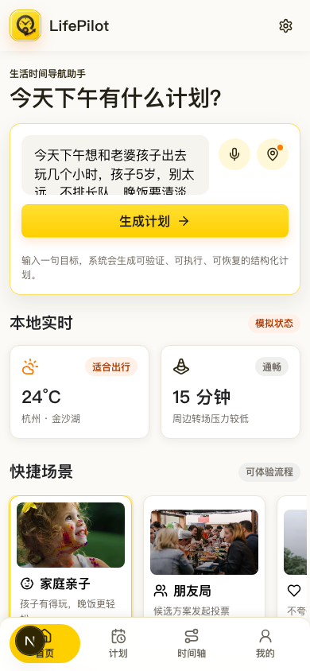
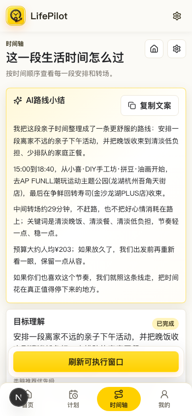
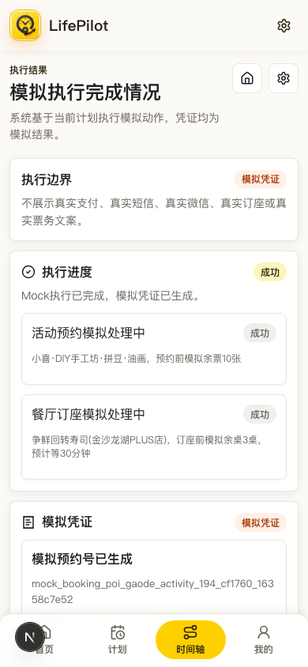
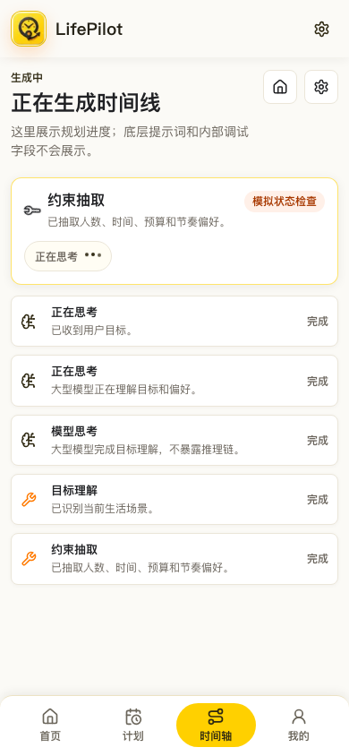
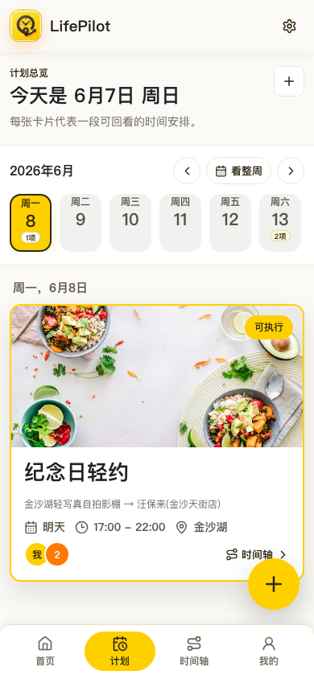
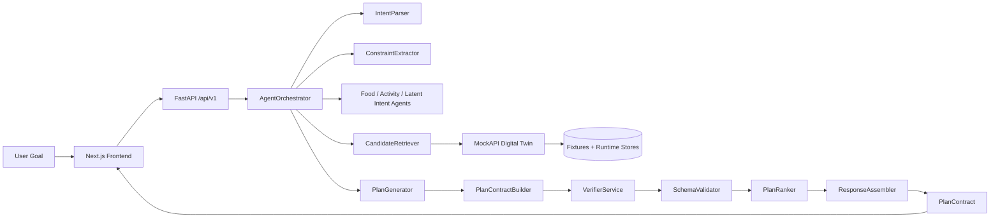
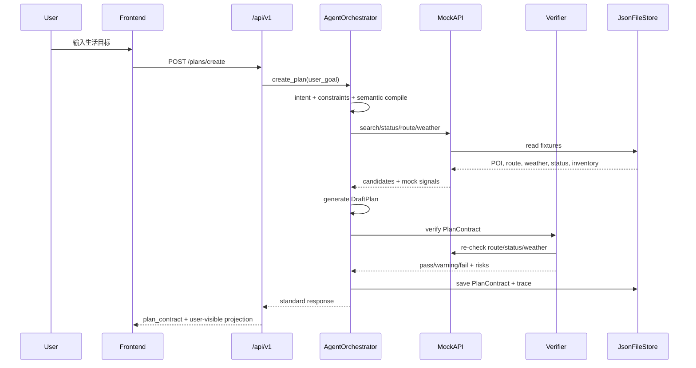

# LifePilot

> 把一句生活目标，落成一条可验证、可协同、可恢复的本地生活时间线。

LifePilot 是一个面向本地生活场景的时间导航 Agent。它不只回答“去哪儿”，而是把用户一句模糊目标转成一段可以出发的安排：理解意图、筛选地点、检查路线和余位、生成时间线、支持朋友投票、模拟执行，并在资源不可用时生成可追溯的新版本。

本仓库是比赛提交版，评审入口建议从本文档、`SUBMISSION.md`、`start.sh` 和 `scripts/verify_submission.sh` 开始。项目默认使用杭州下沙 / 金沙湖 / 高教园区的 Mock 数字孪生数据，可在无外部模型、无真实商家调用的情况下完整复现核心链路。

<p align="center">
  
</p>

<p align="center">
  <strong>LifePilot: Local Life, Planned Like a Flight.</strong>
</p>

<p align="center">
  <a href="#一键运行"></a>
  <a href="#验证方式"></a>
  <a href="#mock-边界"></a>
  <a href="#核心契约"></a>
</p>

## Demo 截图

以下截图来自本地真实运行的 Demo 页面，展示了从一句目标到计划生成、再到模拟执行的完整体验。

| 首页输入 | 计划详情 | 模拟执行 |
|---|---|---|
|  |  |  |

| 生成进度 | 计划总览 |
|---|---|
|  |  |

## 评审速览

| 评审关注点 | LifePilot 的回答 |
|---|---|
| 不是普通推荐列表 | 输出的是按时间排序的 `PlanContract`，包含目标理解、节点、路线、预算、风险、备选和执行动作。 |
| 可验证 | `VerifierService` 会检查预算、余位、排队、天气、路线和可执行窗口，前端只展示校验后的结果。 |
| 可协同 | 朋友局会生成候选方案、投票页和最终共识方案，而不是只给一个人拍脑袋推荐。 |
| 可恢复 | 执行窗口过期、餐厅满座、活动满员时生成版本化 Recovery，保留 `original`、`replacement`、`diff`、`updated_plan_id`。 |
| 数据可信边界清楚 | POI、路线、天气、库存、状态、凭证都是 Mock 数字孪生或模拟能力，页面和文档明确标注，不伪装成真实履约。 |
| 工程可评审 | `/api/v1` 契约、Schema 文档、Mock 数据校验、P0 回归、前端 lint/typecheck、提交清洁检查都有脚本入口。 |

## 一句话示例

用户输入：

```text
今天下午想和老婆孩子出去玩几个小时，孩子5岁，别太远，不排长队，晚饭要清淡一点。
```

LifePilot 会生成：

- 家庭亲子场景识别：人数、孩子年龄、低排队、近距离、清淡晚饭。
- 下午时间窗口：活动、转场、晚饭按顺序排成时间线。
- 地点组合：亲子活动 + 低负担正餐 + 路线转场。
- 可执行性检查：余位、排队、天气、路线、预算、窗口有效期。
- 备选方案：资源不可用或窗口过期时可替换节点。
- 模拟执行：生成模拟预约号、订座号和可复制消息。
- 反馈记忆：低敏偏好可以确认进入 LifeMemory，高敏信息不会自动进入普通页面。

## 核心创新

### 1. 从“地点推荐”升级为“生活时间导航”

本地生活服务的真实难点不是找到一个地点，而是把一段生活目标拆成可以执行的时间线。LifePilot 将“去哪儿吃饭”“去哪儿玩”“怎么安排朋友局”统一成时间导航问题：先确认约束，再排节点，再校验可行性。

### 2. Contract-first 的 Agent 输出

所有用户可见计划都落到 `PlanContract`，前端不消费内部 `DraftPlan` 或 `PlanBuildCandidate`。这让计划可以被校验、存储、投票、执行和恢复，也让评审可以沿着固定契约检查每一步。

### 3. Mock 数字孪生，而不是静态假数据

项目内置稳定 fixture 和规则引擎，覆盖 POI、路线、天气、状态、库存、排队、口碑、失败场景。它不是简单写死文案，而是用可复现的 MockAPI 模拟本地生活系统中不断变化的外部状态。

### 4. Verifier 闸门

LLM 或规则链路不能直接决定“可执行”。预算、余位、排队、天气、路线和窗口统一经过 `VerifierService`，前端只展示经过校验的计划和检查摘要。

### 5. 版本化 Recovery

失败不是简单报错。LifePilot 会在执行受阻时生成新的计划版本，保留原节点、替换节点、差异摘要和 `updated_plan_id`，避免悄悄覆盖旧计划。

### 6. 朋友局共识

多人场景中，系统会生成候选方案和投票页，收集预算、步行、排队和自由意见，再压缩成最终共识计划。

## 架构设计



### 模块分层

| 层 | 目录 | 职责 |
|---|---|---|
| API Layer | `backend/app/api` | `/api/v1` 业务路由、标准响应、上下文和幂等入口。 |
| Orchestration Layer | `backend/app/services/agent_orchestrator.py` | 串联意图、约束、候选、生成、构建、校验、排序和解释。 |
| Intelligence Layer | `backend/app/services/*_agent.py` | 语义解释、候选批评、计划批评、解释生成。 |
| Rule Layer | `backend/app/rules` | 标签权威表、推荐策略、POI 特征、排序权重。 |
| Digital Twin Layer | `backend/app/services/mock_api_service.py` | Mock 状态、库存、路线、天气、口碑和执行动作。 |
| Contract Layer | `backend/app/services/plan_contract_builder.py`、`schema_validator.py` | 内部草案到 `PlanContract` 的边界和校验。 |
| UI Layer | `frontend/app`、`frontend/components` | 普通用户体验、计划展示、投票、执行、反馈、记忆。 |
| ViewModel Layer | `frontend/lib/view-models.ts` | 把机器标签、状态和工具摘要转成用户可读信息。 |

## 数据链路



## 核心契约

`PlanContract` 是系统的核心边界。内部可以有草案、候选、批评和修复策略，但只要要展示给用户、保存为计划、投票或执行，就必须经过：

```text
DraftPlan
  -> PlanContractBuilder
  -> VerifierService
  -> SchemaValidator
  -> PlanRanker
  -> ResponseAssembler
  -> PlanContract
```

这个设计让系统具备三个比赛 Demo 很重要的特性：

- 可审计：评委可以追踪字段和状态来源。
- 可演进：内部 Agent 能替换，外部 API 契约保持稳定。
- 可恢复：旧计划不被覆盖，新计划用版本化 Recovery 连接。

## 功能清单

| 能力 | 状态 | 说明 |
|---|---:|---|
| 自然语言建计划 | 已实现 | 家庭亲子、朋友局、纪念日、单人散心等场景。 |
| 候选检索与排序 | 已实现 | 结合标签、POI 特征、路线、预算、排队、状态。 |
| Verifier 可执行性校验 | 已实现 | 预算、天气、余位、排队、路线、窗口。 |
| 朋友投票与共识 | 已实现 | 候选方案、投票页、finalize 成最终计划。 |
| 模拟执行 | 已实现 | 活动预约、餐厅订座、订单、消息均为模拟结果。 |
| Recovery | 已实现 | 窗口过期、资源不足、风险变化时生成新版本。 |
| LifeMemory | 已实现 | 反馈生成候选记忆，用户确认或忽略，高敏内容过滤。 |
| 模型设置 | 已实现 | DeepSeek / Qwen OpenAI-compatible，凭证脱敏。 |
| Mock 数据工厂 | 已实现 | 高德候选池、Qwen 数据生成、规则评测工具。 |

## 一键运行

```bash
cd /Users/shiyunqi/Desktop/美团黑客松_LifePilot/lifepilot
bash start.sh
```

默认启动：

- 后端：`http://127.0.0.1:8010`
- 前端：`http://127.0.0.1:3000`
- 默认关闭外部模型：`DEEPSEEK_ENABLED=false`、`QWEN_ENABLED=false`

如果端口被占用，可以指定端口：

```bash
BACKEND_PORT=8011 FRONTEND_PORT=3001 bash start.sh
```

## 验证方式

比赛评审建议先跑聚合验证：

```bash
bash scripts/verify_submission.sh
```

该脚本会执行：

1. `scripts/contract_scan.py`
2. `scripts/validate_mock_data.py`
3. `scripts/run_backend_p0_tests.py`
4. `frontend npm run verify`
5. `frontend npm audit`

提交前清洁检查：

```bash
bash scripts/check_submission_clean.sh
```

这个检查会阻断 `node_modules`、`.next`、runtime、日志、缓存、venv、报告等本地噪音，避免线上提交包显得不专业。

## 目录导览

```text
backend/                         FastAPI 后端，业务 API 均在 /api/v1 下
backend/app/api                  路由层，主业务入口和 MockAPI 入口
backend/app/services             Agent 编排、MockAPI、Verifier、Executor、Recovery 等服务
backend/app/rules                推荐语义、规则策略、POI 特征和排序权重
backend/app/schemas              请求体与内部结构 schema
backend/app/storage              JSON 文件存储封装
backend/data/fixtures            稳定 Mock source：POI、路线、状态、库存、天气
frontend/app                     首页、计划页、投票页、执行页、反馈页、记忆页、设置页
frontend/components              UI 组件和计划展示卡片
frontend/lib                     API client、幂等、trace、view-model mapper
frontend/types                   前端契约类型和 ViewModel 类型
scripts                          验证、启动、清洁检查和 smoke runner
tests                            后端核心测试
tools                            高德/Qwen 数据工厂和规则评测工具
docs                             产品、Schema、API、Agent 工作流和验收设计文档
agent_docs                       代码地图、当前状态、维护规则和审计材料
```

## 标签体系

标签权威来源是 `backend/app/rules/recommendation_taxonomy.py`。

| 概念 | 用途 |
|---|---|
| `machine_tag` | 规则、检索、排序和测试中的稳定机器标签。 |
| `display_label` | 普通用户页面展示的中文标签。 |
| `rule_keyword` | 从用户输入或 POI 文本中识别标签。 |
| `raw_poi_tag` | 高德或 Mock 数据源证据，不等同于 machine tag。 |

前端 `frontend/lib/view-models.ts` 只做 fallback 展示映射。后端已经输出中文标签时，前端不重新定义业务含义。

## Mock 边界

本项目是比赛 Demo，Mock 边界是设计的一部分，不是隐藏缺陷。

即使 POI 参考真实区域和真实地点，以下内容仍是模拟能力：

- 餐厅余桌、排队、活动余票
- 路线估算、天气窗口、口碑信号
- 订座、预约、订单、消息发送
- 凭证号、执行状态、失败场景

LifePilot 不会把模拟结果描述成真实支付、真实订座、真实短信、真实微信或真实票务成功。普通用户页不展示 Prompt、API Key、模型推理链、`failure_injection` 等底层调试信息。

## 评审推荐路径

1. 先看首页：输入一句自然语言目标。
2. 生成计划：观察目标理解、时间线、预算、风险、备选和可行性检查摘要。
3. 朋友局：发起投票，提交偏好，再生成共识方案。
4. 模拟执行：查看模拟预约、订座、消息和凭证。
5. Recovery：触发窗口刷新或资源失败，观察新计划版本和差异摘要。
6. 反馈记忆：提交低打扰反馈，确认或忽略候选记忆。
7. 跑验证脚本：确认契约、Mock 数据、P0 回归和前端检查均可复现。

## 后续可扩展方向

- 接入真实商家状态和履约平台前，保持 Verifier 闸门不变。
- 用更完整的 JSON Schema 或生成模型增强 `SchemaValidator`。
- 扩展基准评测器，把不同生活场景转成可量化质量门禁。
- 为 `CandidateRetriever` 引入更强的 learned reranker，同时保留规则解释。
- 增加通用 trace 深链和执行记录读取 API，提升可观测性。

## Slogan

```text
LifePilot
Local Life, Planned Like a Flight.

把生活目标交给我，把可出发的时间线还给你。
```
