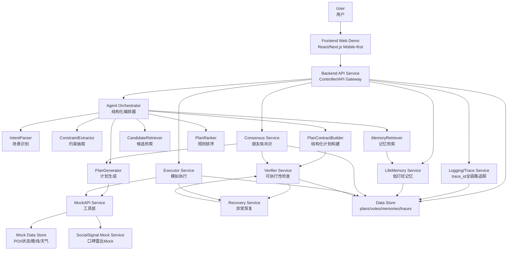
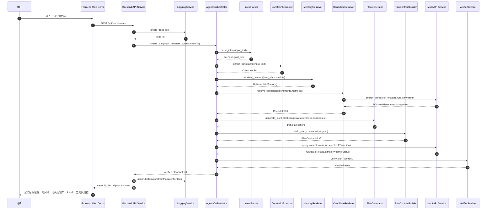
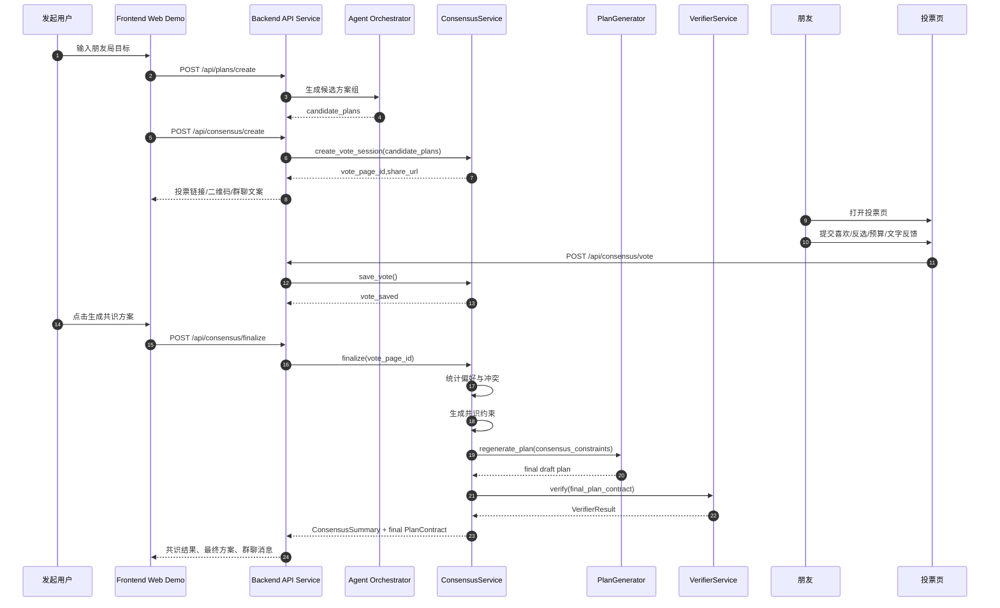
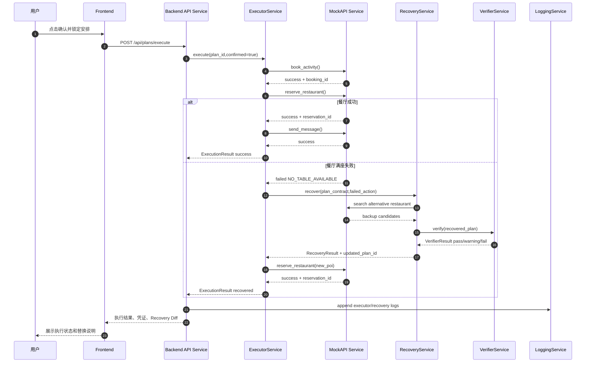
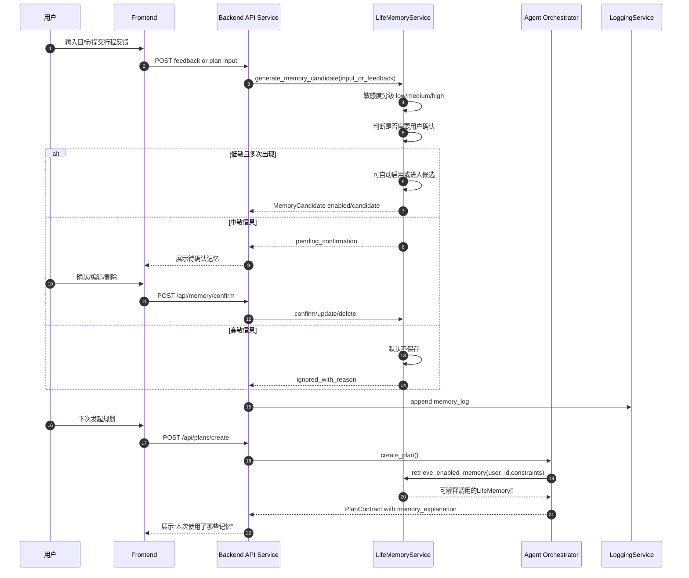
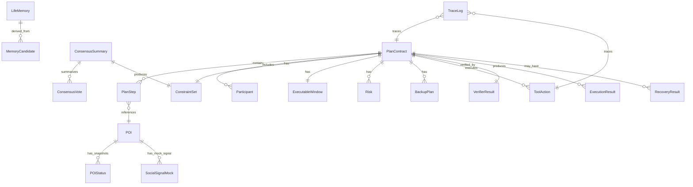
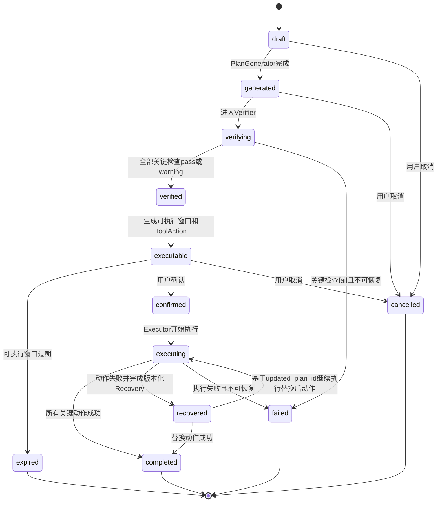
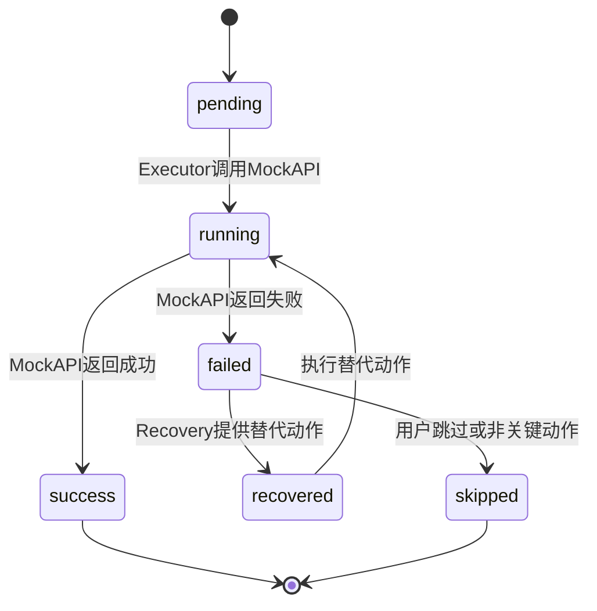
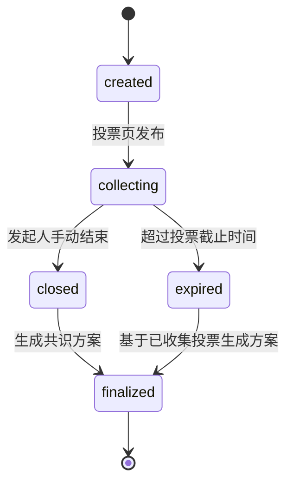
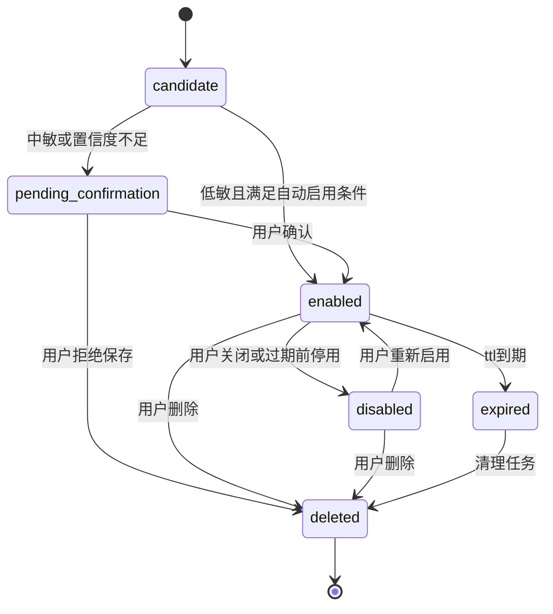

# 02_system_architecture.md

## 1.文档信息

| 项目   | 内容                                                                        |
| ---- | ------------------------------------------------------------------------- |
| 文档名称 | 02_system_architecture.md                                                 |
| 项目名称 | LifePilot                                                                 |
| 产品定位 | 生活时间导航Agent                                                               |
| 文档版本 | v0.1                                                                      |
| 面向读者 | 前端、后端、算法/Agent、Mock数据、测试、评委                                               |
| 关联文档 | 00_project_vision.md、01_prd.md                                            |
| 架构目标 | 将LifePilot从产品需求落成可运行、可验证、可恢复、可扩展的系统架构                                     |
| 当前范围 | 比赛Demo阶段，优先完成P0闭环，不做全城真实覆盖、不做真实支付、不做真实短信/微信发送、不做真实第三方爬取、不做复杂原生App、不做大模型训练 |

### 1.1技术假设

为保证6月7日前完成可运行Demo，当前架构采用轻量、可演示、易联调方案。

| 层级     | Demo阶段建议                                        |
| ------ | ----------------------------------------------- |
| 前端     | React/Next.js Web Demo，移动端优先适配                  |
| 后端     | Backend API Service，可使用Node.js或Python FastAPI实现 |
| Agent层 | LLM Orchestrator+规则模块+MockAPI工具层                |
| 数据存储   | Demo阶段使用JSON文件或SQLite，后续可扩展PostgreSQL           |
| Mock区域 | 固定一个数字孪生区域，例如杭州下沙/金沙湖/高教园区                      |
| 日志追踪   | trace_id贯穿计划生成、工具调用、验证、执行、恢复、反馈全链路              |

### 1.2架构边界

LifePilot不是推荐列表系统，而是生活时间导航系统。架构设计必须围绕：

```text
用户一句话
→结构化PlanContract
→MockAPI状态查询
→Verifier验证
→可执行窗口
→用户确认
→Executor模拟执行
→失败Recovery
→低打扰反馈
→LifeMemory候选更新
```

系统核心不是“LLM自由聊天”，而是“PlanContract驱动的Agent闭环”。

---

## 2.架构设计目标

LifePilot系统架构要解决的问题是：如何把一句模糊的生活目标，稳定转化为一段当前可执行、可解释、可恢复、可确认的本地生活时间线。

### 2.1支撑一句话到PlanContract

系统需要支持用户输入自然语言目标后，自动完成：

1.场景识别；
2.参与人识别；
3.约束抽取；
4.候选POI和餐厅检索；
5.时间线生成；
6.工具动作生成；
7.风险和PlanB生成；
8.PlanContract结构化输出。

PlanContract是系统内部唯一权威计划对象。前端渲染、Verifier检查、Executor执行、Recovery修复都必须基于PlanContract，而不是直接基于大模型自然语言回答。

### 2.2支撑工具调用与可执行性验证

普通推荐只回答“哪里不错”，LifePilot必须回答“现在能不能成行”。

因此系统必须支持：

* POI搜索；
* 餐厅状态查询；
* 活动票务查询；
* 路线时间估计；
* 天气风险查询；
* 排队状态查询；
* 可执行窗口计算；
* Verifier硬约束检查。

LLM不能直接编造“有位”“可预约”“不堵车”等状态。所有可执行状态必须来自MockAPI或规则计算。

### 2.3支撑朋友局投票与共识生成

朋友局不是单人推荐问题，而是多人偏好压缩问题。

系统需要支持：

* 创建候选方案组；
* 创建轻量投票页；
* 收集喜欢、反选、预算、步行、排队、文字反馈；
* 将投票反馈转化为共识约束；
* 重新生成最终PlanContract；
* 对最终方案重新Verifier；
* 生成可复制群聊消息。

### 2.4支撑执行失败后的Recovery

本地生活计划具有动态不确定性。用户确认后，仍可能出现餐厅满座、活动不可预约、天气变化、路线时间变长等问题。

系统必须支持：

* Executor执行失败识别；
* Recovery局部替换节点；
* 保留原始目标和核心约束；
* 重新调用MockAPI；
* 重新Verifier；
* 生成Recovery Diff；
* 前端展示替换原因和影响。

Recovery不是重新生成一个完全无关的新计划，而是像导航改道一样，对当前生活时间线做局部修复。

### 2.5支撑LifeMemory低打扰、可审计、用户可控

LifeMemory用于提升下一次规划质量，但不能被设计成不可见画像系统。

系统需要支持：

* MemoryCandidate生成；
* 敏感度分级；
* 中敏记忆用户确认；
* 高敏信息默认不保存；
* 记忆来源可见；
* 用户可查看、编辑、删除；
* 关闭个性化后不调用长期记忆；
* 每次调用记忆时可解释。

### 2.6支撑Mock能力边界清晰

Demo阶段的MockAPI不是偷懒，而是对真实工具层的抽象。架构必须明确：

* 小红书/抖音/点评等口碑能力只做Mock或可扩展能力；
* 不承诺真实爬取；
* 不做真实支付；
* 不做真实短信/微信发送；
* 不伪装真实授权数据；
* 所有Mock状态可以支持Verifier和Recovery演示。

### 2.7支撑P0快速交付与P1/P2扩展

P0必须小而完整，优先完成三个垂直闭环：

1.家庭亲子主链路；
2.执行与Recovery；
3.朋友局共识；
4.LifeMemory P0最小候选闭环与P1完整闭环预留。

P1/P2只在架构上预留接口，不进入P0强依赖。

---

## 3.架构总览

### 3.1整体系统架构图



### 3.2分层职责

| 分层                        | 组成                                                                | 核心职责                           | P0要求                     |
| ------------------------- | ----------------------------------------------------------------- | ------------------------------ | ------------------------ |
| Presentation Layer        | Frontend Web Demo                                                 | 输入、计划渲染、投票、执行结果、反馈、Debug展示     | 移动端可演示，页面闭环顺滑            |
| API Layer                 | Backend API Service                                               | 接口路由、参数校验、trace_id创建、状态聚合、错误包装 | 所有前端请求走统一API             |
| Agent Orchestration Layer | Agent Orchestrator、IntentParser、ConstraintExtractor、PlanGenerator | 将自然语言目标编排为结构化计划生成流程            | LLM只参与理解、候选、解释，不直接决定真实状态 |
| Domain Service Layer      | Plan Service、Verifier、Recovery、Executor、Consensus、LifeMemory      | 领域逻辑、状态机、执行、恢复、记忆管理            | P0主闭环必须稳定                |
| Tool/Mock Layer           | MockAPI、SocialSignalMock                                          | 模拟POI、餐厅、路线、天气、票务、口碑、执行动作      | 明确标注Mock，支持失败注入          |
| Data Layer                | JSON/SQLite，后续PostgreSQL                                          | 存储计划、投票、记忆、日志、Mock数据           | Demo阶段可文件化，字段稳定          |
| Observability Layer       | Logging/Trace Service                                             | trace_id串联输入、工具、验证、恢复、执行、反馈    | 支持前端工具调用链和开发Debug        |

### 3.3推荐代码目录结构

```text
lifepilot/
├── frontend/
│   ├── app/
│   │   ├── page.tsx
│   │   ├── plans/[planId]/page.tsx
│   │   ├── vote/[votePageId]/page.tsx
│   │   ├── consensus/[sessionId]/page.tsx
│   │   ├── execution/[executionId]/page.tsx
│   │   └── memory/page.tsx
│   ├── components/
│   │   ├── PlanTimeline.tsx
│   │   ├── ExecutableWindowCard.tsx
│   │   ├── ToolTracePanel.tsx
│   │   ├── RecoveryDiffCard.tsx
│   │   └── VoteCard.tsx
│   └── lib/api.ts
├── backend/
│   ├── controllers/
│   ├── orchestrator/
│   ├── services/
│   │   ├── plan_service.py
│   │   ├── verifier_service.py
│   │   ├── recovery_service.py
│   │   ├── executor_service.py
│   │   ├── consensus_service.py
│   │   ├── memory_service.py
│   │   └── logging_service.py
│   ├── mock_api/
│   │   ├── poi_mock.py
│   │   ├── route_mock.py
│   │   ├── restaurant_mock.py
│   │   ├── weather_mock.py
│   │   └── social_signal_mock.py
│   ├── schemas/
│   │   ├── plan_contract_schema.json
│   │   ├── vote_schema.json
│   │   └── memory_schema.json
│   └── data/
│       ├── mock_pois.json
│       ├── mock_status.json
│       ├── mock_social_signals.json
│       ├── plans.json
│       ├── votes.json
│       ├── memories.json
│       └── traces.json
└── docs/
    ├── 00_project_vision.md
    ├── 01_prd.md
    └── 02_system_architecture.md
```

---

## 4.核心运行链路

### 4.1主链路：一句话生成生活时间计划



### 4.2朋友局共识链路



### 4.3确认执行与异常恢复链路



### 4.4LifeMemory链路

该链路描述完整能力形态。P0只要求生成并展示MemoryCandidate，以及确认/忽略接口或按钮预留；管理页、删除、关闭个性化和下次规划读取长期记忆属于P1完整闭环。



---

## 5.模块划分与职责

| 模块                             | 职责                                   | 输入                                   | 输出                                  | 是否P0        | 依赖模块                                                            | 失败时处理策略                            |
| ------------------------------ | ------------------------------------ | ------------------------------------ | ----------------------------------- | ----------- | --------------------------------------------------------------- | ---------------------------------- |
| Frontend Web Demo              | 承载用户输入、计划展示、投票、执行结果、反馈、LifeMemory管理  | 用户操作、API响应                           | 页面状态、用户确认、投票、反馈                     | 是           | Backend API Service                                             | 展示错误态、重试按钮、保留已生成内容                 |
| API Gateway/Backend Controller | 统一接收前端请求，创建trace_id，参数校验，调用服务，包装响应   | HTTP请求                               | 标准JSON响应                            | 是           | LoggingService、各Domain Service                                  | 返回业务错误码，不暴露底层异常                    |
| Agent Orchestrator             | 编排一句话到PlanContract的完整链路，约束LLM调用边界    | input_text、user_context、trace_id     | PlanContract                        | 是           | IntentParser、ConstraintExtractor、PlanGenerator、Verifier、MockAPI | 如果LLM失败，降级到场景模板                    |
| IntentParser                   | 识别场景和目标类型，如朋友局、家庭亲子、纪念日              | input_text                           | scenario、intent、goal_type           | 是           | LLM或规则关键词                                                       | 低置信度时返回needs_clarification或默认城市轻探索 |
| ConstraintExtractor            | 抽取时间、人数、预算、距离、饮食、步行、排队、情绪目标          | input_text、scenario                  | ConstraintSet                       | 是           | IntentParser、规则词典、LLM                                           | 缺失字段填默认值并标记assumption              |
| MemoryRetriever                | 检索可用于当前规划的LifeMemory                 | user_id、ConstraintSet                | LifeMemory[]、memory_explanation     | P1基础，P0可弱化  | LifeMemoryService                                               | 记忆不可用时不阻断计划                        |
| CandidateRetriever             | 检索POI、餐厅、路线、活动候选                     | ConstraintSet、Memory、location        | CandidateSet                        | 是           | MockAPIService、SocialSignalMockService                          | 无结果时扩大半径或切换模板                      |
| PlanGenerator                  | 生成候选生活时间线，不直接决定可执行状态                 | intent、constraints、candidates、memory | DraftPlan[]                         | 是           | LLM、规则模板、CandidateRetriever                                     | 失败时使用固定Demo模板                      |
| PlanContractBuilder            | 将DraftPlan规范化为PlanContract           | DraftPlan、tool status                | PlanContract                        | 是           | PlanGenerator、SchemaValidator                                   | 字段缺失时补默认值或返回schema_error           |
| PlanRanker                     | 对多个候选PlanContract排序                  | PlanContract[]、ConstraintSet         | ranked plans                        | 是，规则版       | VerifierResult、规则权重                                             | 排序失败时按硬约束通过数排序                     |
| VerifierService                | 检查时间、营业、距离、预算、余位、排队、天气、同行人约束、工具动作完整性 | PlanContract、POIStatus               | VerifierResult                      | 是           | MockAPIService、规则引擎                                             | fail触发Recovery或阻断执行                |
| RecoveryService                | 对失败计划进行局部修复，生成Recovery Diff          | PlanContract、failed_check/action     | RecoveryResult、updated_plan_id、新PlanContract | 是           | Verifier、MockAPI、CandidateRetriever                             | 恢复失败时展示可人工选择的PlanB                 |
| ExecutorService                | 用户确认后模拟执行预约、排号、订票、下单、发消息             | plan_id、ToolAction[]                 | ExecutionResult                     | 是           | MockAPIService、RecoveryService                                  | 单动作失败触发Recovery；不可恢复则标记failed      |
| MockAPIService                 | 模拟POI搜索、状态查询、路线、天气、预约、订座、消息等工具能力     | tool request                         | tool response                       | 是           | Mock Data Store                                                 | 返回标准error_code，支持失败注入              |
| ConsensusService               | 创建投票、收集投票、统计偏好、生成共识约束和最终方案           | candidate_plans、votes                | ConsensusSummary、final PlanContract | 是           | PlanGenerator、Verifier、Data Store                               | 投票不足时使用发起人偏好+已有投票                  |
| LifeMemoryService              | 生成、确认、查询、删除记忆；控制敏感度和可用状态             | 用户输入/反馈、用户操作                         | MemoryCandidate、LifeMemory[]        | P1，P0可做最小闭环 | Data Store、LoggingService                                       | 不可用时系统继续无记忆规划                      |
| SocialSignalMockService        | 返回POI的Mock口碑摘要、风险标签                  | poi_id                               | SocialSignalMock                    | P1          | mock_social_signals.json                                        | 缺失时不展示口碑卡，不影响主流程                   |
| BenchmarkEvaluator             | 对样例集评估意图、约束、计划、工具、恢复、隐私合规            | benchmark_samples                    | metrics report                      | P1          | Agent Pipeline、Verifier                                         | 不影响线上Demo                          |
| LoggingService                 | 记录trace_id下的输入、意图、约束、工具、验证、恢复、执行、反馈  | trace events                         | TraceLog                            | 是           | Data Store                                                      | 日志失败不阻断业务，但控制台报警                   |

---

## 6.领域模型设计

### 6.1领域模型关系图



### 6.2核心领域模型表

| 模型                    | 作用              | 关键字段                                                                                                                                                              | 字段设计原因                                  | 优先级      | 是否持久化             |
| --------------------- | --------------- | ----------------------------------------------------------------------------------------------------------------------------------------------------------------- | --------------------------------------- | -------- | ----------------- |
| PlanContract          | 生活时间计划的核心结构化对象  | plan_id、trace_id、user_goal、participants、time_window、constraints、timeline、budget、executable_window、risks、backup_plans、tool_actions、messages、verifier_result、status | 统一前端渲染、Verifier检查、Executor执行、Recovery修复 | P0       | 是                 |
| PlanStep              | 计划中的时间线节点       | step_id、type、title、start_time、end_time、poi_id、transport_mode、estimated_minutes、booking_required                                                                   | LifePilot围绕时间线而非地点列表组织                  | P0       | 是                 |
| Participant           | 参与人及其约束         | role、display_name、age、constraints、preference_tags                                                                                                                 | 支撑家庭、朋友局、纪念日等多方约束                       | P0       | 是，或嵌入PlanContract |
| ConstraintSet         | 用户目标和系统共识后的约束集合 | scenario、party_size、budget_max、distance_preference、walking_tolerance、queue_tolerance、dietary_preference、emotion_goal、weather_sensitive                            | 让LLM输出转为可验证规则                           | P0       | 是                 |
| ExecutableWindow      | 当前方案可执行窗口       | window_minutes、confidence、expire_at、reasons、risk_factors、lockable_resources                                                                                       | 表达“现在能不能成行”                             | P0       | 是                 |
| Risk                  | 风险提示            | risk_id、type、level、description、related_step_id、recovery_plan_id                                                                                                   | 支撑PlanB和用户解释                            | P0       | 是                 |
| BackupPlan/LifeOption | 已准备的备选生活分支      | plan_id、trigger、replace_step_id、new_poi_id、description、expected_diff                                                                                              | 失败时像导航改道一样恢复                            | P0       | 是                 |
| ToolAction            | 可执行动作           | action_id、type、target_poi_id、payload、status、depends_on、retry_count                                                                                                | Executor的最小执行单元                         | P0       | 是                 |
| ExecutionResult       | 执行结果            | execution_id、plan_id、action_results、status、vouchers、failed_actions、recovery_results                                                                               | 展示预约号、排队号、消息发送结果                        | P0       | 是                 |
| VerifierResult        | 验证结果            | status、score、checks、failed_checks、warnings、required_recovery、suggestions                                                                                          | 让计划从“看起来合理”变成“可执行”                      | P0       | 是                 |
| RecoveryResult        | 恢复结果            | recovery_id、trigger、original_step_id、original_poi、new_poi、changes、verifier_result、user_explanation                                                                | 前端展示替换前后差异                              | P0       | 是                 |
| POI                   | 地点/活动/餐厅基础数据    | poi_id、name、category、tags、location、price_per_person、rating、opening_hours、suitable_scenarios、risk_tags                                                             | Mock数字孪生区域基础数据                          | P0       | 是                 |
| POIStatus             | 动态状态快照          | poi_id、available、available_tables、queue_minutes、ticket_available、booking_available、risk_level、updated_at                                                          | 支撑Verifier和可执行窗口                        | P0       | 是                 |
| ConsensusVote         | 单个朋友投票          | vote_id、vote_page_id、participant、liked_plan_ids、disliked_plan_ids、budget_max、walking_tolerance、queue_tolerance、free_text、submitted_at                             | 将群聊反馈结构化                                | P0       | 是                 |
| ConsensusSummary      | 共识统计结果          | session_id、support_count、oppose_count、conflicts、consensus_constraints、explanation、final_plan_id                                                                   | 将多人偏好压缩成最终约束                            | P0       | 是                 |
| LifeMemory            | 已启用或待确认的长期记忆    | memory_id、user_id、content、memory_type、source、confidence、sensitivity、ttl_days、user_visible、user_confirmed、enabled                                                  | 支撑低打扰、可审计、用户可控                          | P1，P0最小版 | 是                 |
| MemoryCandidate       | 待处理记忆候选         | candidate_id、content、source、confidence、sensitivity、requires_confirmation、status、created_at                                                                        | 避免偷偷写入画像                                | P1，P0最小版 | 是                 |
| SocialSignalMock      | 口碑雷达Mock        | poi_id、summary、positive_tags、negative_tags、source_type、confidence、is_mock                                                                                         | 展示可扩展能力，不承诺真实爬取                         | P1       | 是                 |
| TraceLog              | 全链路日志           | trace_id、event_type、module、payload、level、created_at、visible_to_user                                                                                               | 支撑调试和评委理解工具链                            | P0       | 是                 |

### 6.3PlanContract最小Schema示例

```json
{
  "plan_id": "plan_0001",
  "trace_id": "trace_0001",
  "status": "verified",
  "user_goal": {
    "raw_text": "今天下午想和老婆孩子出去玩几个小时，老婆最近减脂，孩子5岁，别太远",
    "scenario": "family_parent_child",
    "goal_summary": "安排一段不远、不赶、适合5岁孩子且兼顾低卡饮食的家庭亲子下午"
  },
  "participants": [],
  "time_window": {},
  "constraints": {},
  "timeline": [],
  "budget": {},
  "executable_window": {},
  "risks": [],
  "backup_plans": [],
  "tool_actions": [],
  "messages": {},
  "verifier_result": {},
  "created_at": "2026-05-20T13:00:00+08:00",
  "updated_at": "2026-05-20T13:00:10+08:00"
}
```

---

## 7.状态机设计

### 7.1PlanContract状态机



| 状态         | 进入条件                 | 退出条件                     |
| ---------- | -------------------- | ------------------------ |
| draft      | 创建plan_id后，计划尚未完整    | PlanGenerator输出DraftPlan |
| generated  | 已生成初步计划，但未验证         | 进入Verifier               |
| verifying  | Verifier正在检查         | 输出pass/warning/fail      |
| verified   | 关键检查通过，可展示给用户        | 生成ExecutableWindow       |
| executable | 有可执行窗口和可执行ToolAction | 用户确认、窗口过期或取消             |
| expired    | 可执行窗口失效              | 重新验证或重新生成                |
| confirmed  | 用户确认锁定               | Executor开始执行             |
| executing  | Executor执行工具动作       | 完成、失败或恢复                 |
| recovered  | 原计划完成版本交接，RecoveryResult.updated_plan_id指向新的完整PlanContract | 基于updated_plan_id对应的新计划重新执行替换后动作 |

P0采用版本化Recovery：原PlanContract不被原地覆盖；原`plan_id`进入`recovered`状态并记录RecoveryResult；新的`plan_id`如`plan_20260520_0001_r1`承载恢复后的完整PlanContract，Executor继续执行新计划中的替换ToolAction。
| completed  | 关键动作执行成功             | 流程结束，进入反馈                |
| failed     | 验证/执行/恢复失败且不可继续      | 展示失败原因，可重试               |
| cancelled  | 用户主动取消               | 流程结束                     |

### 7.2ToolAction状态机



| 状态        | 说明                 |
| --------- | ------------------ |
| pending   | 已生成但未执行            |
| running   | 正在调用MockAPI        |
| success   | 执行成功，有凭证或结果        |
| failed    | 执行失败，有标准error_code |
| recovered | 已生成替代动作            |
| skipped   | 非关键动作被跳过           |

### 7.3ConsensusVote状态机



| 状态         | 进入条件                | 退出条件               |
| ---------- | ------------------- | ------------------ |
| created    | 生成候选方案和vote_page_id | 分享页可访问             |
| collecting | 接收朋友投票              | 手动结束或超时            |
| closed     | 停止接收新投票             | ConsensusService汇总 |
| finalized  | 生成最终PlanContract    | 用户确认执行             |
| expired    | 投票超时                | 用已有投票降级生成          |

### 7.4LifeMemory状态机



| 状态                   | 说明              |
| -------------------- | --------------- |
| candidate            | 从输入或反馈中抽取出的候选记忆 |
| pending_confirmation | 需要用户确认，不默认强使用   |
| enabled              | 可用于后续规划         |
| disabled             | 用户关闭或个性化停用      |
| deleted              | 用户删除，不再使用       |
| expired              | 超过有效期，默认不再使用    |

---

## 8.API分层设计

### 8.1接口设计原则

1.前端只调用Backend API Service，不直接调用Agent内部模块。
2.所有写操作必须带trace_id或由后端创建trace_id。
3.PlanContract字段结构必须稳定，便于前端组件复用。
4.工具状态和执行状态必须可追踪。
5.Mock接口必须与真实工具接口形态相似，便于后续替换。
6.接口失败必须返回业务错误码，不返回底层堆栈。

### 8.2计划接口

| 接口                      | 调用方      | 被调用方                           | 核心输入                                  | 核心输出                                | 是否P0 | 幂等性要求                  | 失败处理                         |
| ----------------------- | -------- | ------------------------------ | ------------------------------------- | ----------------------------------- | ---- | ---------------------- | ---------------------------- |
| POST /api/plans/create  | 前端首页     | Backend API→Agent Orchestrator | user_id、input_text、location           | trace_id、plan_id、PlanContract       | 是    | 非幂等；重复点击需前端防抖          | 解析失败返回PLAN_CREATE_FAILED，可重试 |
| POST /api/plans/verify  | 前端/后端内部  | VerifierService                | plan_id或PlanContract                  | VerifierResult、当前PlanContract状态 | 是    | 幂等，同一状态输入结果一致          | fail触发Recovery或提示不可执行        |
| POST /api/plans/execute | 计划结果页    | ExecutorService                | plan_id、confirmed                     | ExecutionResult                     | 是    | 需idempotency_key避免重复预约 | 单动作失败触发Recovery              |
| POST /api/plans/recover | 执行页/后端内部 | RecoveryService                | plan_id、failed_step/action、error_code | RecoveryResult、updated_plan_id、新PlanContract | 是    | 对同一failed_action幂等     | 恢复失败返回RECOVERY_FAILED        |

### 8.3共识接口

| 接口                           | 调用方   | 被调用方                                    | 核心输入                                                     | 核心输出                                | 是否P0 | 幂等性要求                  | 失败处理          |
| ---------------------------- | ----- | --------------------------------------- | -------------------------------------------------------- | ----------------------------------- | ---- | ---------------------- | ------------- |
| POST /api/consensus/create   | 计划结果页 | ConsensusService                        | candidate_plans、expire_at                                | vote_page_id、share_url              | 是    | 同一plan_group可复用session | 创建失败提示重试      |
| POST /api/consensus/vote     | 投票页   | ConsensusService                        | vote_page_id、participant、liked/disliked、budget、free_text | success、vote_id                     | 是    | 同一participant可更新投票     | 保存失败提示稍后重试    |
| POST /api/consensus/finalize | 共识页   | ConsensusService→PlanGenerator→Verifier | vote_page_id                                             | ConsensusSummary、final PlanContract | 是    | finalize后重复调用返回同结果     | 投票不足降级为已有投票方案 |

### 8.4LifeMemory接口

| 接口                       | 调用方           | 被调用方              | 核心输入                               | 核心输出                           | 是否P0     | 幂等性要求           | 失败处理      |
| ------------------------ | ------------- | ----------------- | ---------------------------------- | ------------------------------ | -------- | --------------- | --------- |
| GET /api/memory/list     | LifeMemory管理页 | LifeMemoryService | user_id                            | LifeMemory[]、MemoryCandidate[] | P1，P0最小版 | 幂等              | 不可用时展示空状态 |
| POST /api/memory/confirm | 反馈页/记忆页       | LifeMemoryService | candidate_id、action、edited_content | updated LifeMemory             | P1，P0最小版 | 同一candidate确认一次 | 失败不影响主计划  |
| POST /api/memory/delete  | 记忆页           | LifeMemoryService | memory_id                          | success                        | P1，P0最小版 | 幂等删除            | 失败提示重试    |

### 8.5MockAPI接口

| 接口                                | 调用方                | 被调用方                    | 核心输入                           | 核心输出                                 | 是否P0 | 幂等性要求            | 失败处理                         |
| --------------------------------- | ------------------ | ----------------------- | ------------------------------ | ------------------------------------ | ---- | ---------------- | ---------------------------- |
| GET /api/mock/poi/search          | CandidateRetriever | MockAPIService          | area、category、tags、scenario    | POI[]                                | 是    | 幂等               | 无结果时扩大半径/放宽标签                |
| GET /api/mock/restaurant/status   | Verifier/Executor  | MockAPIService          | poi_id、party_size、arrival_time | POIStatus                            | 是    | 状态查询可随时间变化       | 返回UNKNOWN_STATUS时降级为warning  |
| GET /api/mock/route/estimate      | Verifier           | MockAPIService          | origin、destination、mode、time   | route_minutes、distance、traffic_level | 是    | 同输入短时间内稳定        | 查询失败则使用默认路线时间并warning        |
| GET /api/mock/social-signal       | 前端/Agent           | SocialSignalMockService | poi_id                         | SocialSignalMock                     | P1   | 幂等               | 缺失时不展示                       |
| POST /api/mock/activity/book      | Executor           | MockAPIService          | poi_id、party_size、time         | success、booking_id或error_code        | 是    | 需idempotency_key | 失败触发Recovery                 |
| POST /api/mock/restaurant/reserve | Executor           | MockAPIService          | poi_id、party_size、arrival_time | success、reservation_id或error_code    | 是    | 需idempotency_key | NO_TABLE_AVAILABLE触发Recovery |
| POST /api/mock/order/create       | Executor           | MockAPIService          | poi_id、items                   | order_id                             | P0可选 | 需idempotency_key | 失败可跳过或提示                     |
| POST /api/mock/message/send       | Executor           | MockAPIService          | target、content                 | success、message_id                   | 是    | 需idempotency_key | 失败不阻断主行程                     |

### 8.6标准响应格式

```json
{
  "success": true,
  "trace_id": "trace_0001",
  "data": {},
  "error": null
}
```

失败响应：

```json
{
  "success": false,
  "trace_id": "trace_0001",
  "data": null,
  "error": {
    "code": "NO_TABLE_AVAILABLE",
    "message": "当前时间段4人位已满",
    "user_message": "原餐厅已满，我会尝试为你切换到备选餐厅。",
    "recoverable": true
  }
}
```

---

## 9.数据存储设计

### 9.1Demo阶段：JSON文件或SQLite

Demo阶段优先使用JSON文件或SQLite。目标是开发快、可控、便于演示失败注入。

| 文件                       | 存储内容                           | 说明                                          |
| ------------------------ | ------------------------------ | ------------------------------------------- |
| mock_pois.json           | POI基础数据                        | 餐厅、活动、展览、公园、书店、商场等                          |
| mock_status.json         | POI动态状态                        | 余位、排队、票务、营业、天气、失败注入配置                       |
| mock_social_signals.json | 社交口碑Mock                       | summary、positive_tags、negative_tags、is_mock |
| plans.json               | PlanContract                   | 每次计划生成后的结构化计划                               |
| votes.json               | ConsensusSession和ConsensusVote | 投票页、投票记录、共识结果                               |
| memories.json            | LifeMemory和MemoryCandidate     | 记忆候选、确认状态、敏感度                               |
| traces.json              | TraceLog                       | 每个trace_id的全链路日志                            |

#### 9.1.1mock_status.json示例

```json
{
  "poi_light_food_003": {
    "available_tables": 2,
    "queue_minutes": 12,
    "reservation_available": true,
    "risk_level": "medium",
    "failure_injection": {
      "on_execute": "NO_TABLE_AVAILABLE",
      "enabled": true
    }
  }
}
```

### 9.2可扩展阶段：数据库表设计

后续可迁移到PostgreSQL。P0不要求完整实现，只需字段映射清晰。

#### users

| 字段                      | 类型       | 说明      |
| ----------------------- | -------- | ------- |
| user_id                 | string   | 用户ID    |
| display_name            | string   | 显示名     |
| personalization_enabled | boolean  | 是否启用个性化 |
| created_at              | datetime | 创建时间    |

#### plans

| 字段                 | 类型       | 说明             |
| ------------------ | -------- | -------------- |
| plan_id            | string   | 计划ID           |
| trace_id           | string   | 追踪ID           |
| user_id            | string   | 用户ID           |
| scenario           | string   | 场景             |
| status             | string   | PlanContract状态 |
| raw_input          | text     | 用户原始输入         |
| plan_contract_json | json     | 完整PlanContract |
| created_at         | datetime | 创建时间           |
| updated_at         | datetime | 更新时间           |

#### plan_steps

| 字段         | 类型       | 说明                                    |
| ---------- | -------- | ------------------------------------- |
| step_id    | string   | 节点ID                                  |
| plan_id    | string   | 计划ID                                  |
| poi_id     | string   | 关联POI                                 |
| type       | string   | transport/activity/restaurant/message |
| title      | string   | 节点标题                                  |
| start_time | datetime | 开始时间                                  |
| end_time   | datetime | 结束时间                                  |
| status     | string   | 节点状态                                  |

#### poi

| 字段               | 类型     | 说明    |
| ---------------- | ------ | ----- |
| poi_id           | string | POIID |
| name             | string | 名称    |
| category         | string | 类目    |
| area             | string | 区域    |
| tags             | json   | 标签    |
| location         | json   | 经纬度   |
| price_per_person | number | 人均    |
| opening_hours    | json   | 营业时间  |

#### poi_status_snapshots

| 字段                | 类型       | 说明    |
| ----------------- | -------- | ----- |
| snapshot_id       | string   | 快照ID  |
| poi_id            | string   | POIID |
| available         | boolean  | 是否可用  |
| available_tables  | number   | 剩余桌数  |
| queue_minutes     | number   | 排队分钟  |
| ticket_available  | boolean  | 是否有票  |
| booking_available | boolean  | 是否可预约 |
| risk_level        | string   | 风险等级  |
| created_at        | datetime | 快照时间  |

#### tool_actions

| 字段            | 类型     | 说明                                                       |
| ------------- | ------ | -------------------------------------------------------- |
| action_id     | string | 动作ID                                                     |
| plan_id       | string | 计划ID                                                     |
| type          | string | book_activity/reserve_restaurant/order_item/send_message |
| target_poi_id | string | 目标POI                                                    |
| payload_json  | json   | 请求参数                                                     |
| status        | string | 状态                                                       |
| result_json   | json   | 返回结果                                                     |
| error_code    | string | 错误码                                                      |

#### execution_results

| 字段           | 类型       | 说明                       |
| ------------ | -------- | ------------------------ |
| execution_id | string   | 执行ID                     |
| plan_id      | string   | 计划ID                     |
| trace_id     | string   | 追踪ID                     |
| status       | string   | success/recovered/failed |
| result_json  | json     | 执行详情                     |
| created_at   | datetime | 创建时间                     |

#### consensus_sessions

| 字段              | 类型     | 说明                                          |
| --------------- | ------ | ------------------------------------------- |
| session_id      | string | 共识会话ID                                      |
| plan_group_id   | string | 候选计划组ID                                     |
| creator_user_id | string | 发起用户                                        |
| status          | string | created/collecting/closed/finalized/expired |
| share_url       | string | 分享链接                                        |
| summary_json    | json   | 共识摘要                                        |
| final_plan_id   | string | 最终计划ID                                      |

#### consensus_votes

| 字段                | 类型       | 说明     |
| ----------------- | -------- | ------ |
| vote_id           | string   | 投票ID   |
| session_id        | string   | 共识会话ID |
| participant_name  | string   | 昵称     |
| liked_plan_ids    | json     | 喜欢方案   |
| disliked_plan_ids | json     | 反选方案   |
| budget_max        | number   | 预算     |
| walking_tolerance | string   | 步行容忍   |
| queue_tolerance   | string   | 排队容忍   |
| free_text         | text     | 文本反馈   |
| submitted_at      | datetime | 提交时间   |

#### life_memories

| 字段          | 类型       | 说明                                                              |
| ----------- | -------- | --------------------------------------------------------------- |
| memory_id   | string   | 记忆ID                                                            |
| user_id     | string   | 用户ID                                                            |
| content     | text     | 记忆内容                                                            |
| memory_type | string   | preference/participant/goal/feedback                            |
| source_json | json     | 来源                                                              |
| confidence  | number   | 置信度                                                             |
| sensitivity | string   | low/medium/high                                                 |
| status      | string   | candidate/pending_confirmation/enabled/disabled/deleted/expired |
| ttl_days    | number   | 有效期                                                             |
| created_at  | datetime | 创建时间                                                            |

#### trace_logs

| 字段              | 类型       | 说明                                           |
| --------------- | -------- | -------------------------------------------- |
| log_id          | string   | 日志ID                                         |
| trace_id        | string   | 追踪ID                                         |
| module          | string   | 模块名                                          |
| event_type      | string   | input/intent/tool/verifier/recovery/executor |
| level           | string   | info/warning/error                           |
| payload_json    | json     | 日志内容                                         |
| visible_to_user | boolean  | 是否可展示给用户                                     |
| created_at      | datetime | 创建时间                                         |

---

## 10.MockAPI与数字孪生区域设计

### 10.1设计原则

Demo阶段固定一个区域做高质量模拟，例如杭州下沙/金沙湖/高教园区。MockAPI的目标不是伪装真实覆盖，而是为LifePilot演示“生活时间导航Agent如何接入真实工具层”提供抽象。

必须明确：

1.Demo阶段是Mock，不承诺真实爬取和真实交易；
2.固定区域深做，不做全城泛覆盖；
3.Mock状态必须能支持Verifier和Recovery；
4.Mock数据必须支持失败注入；
5.SocialSignalRadar必须标注Mock；
6.所有执行结果都是模拟凭证。

### 10.2POI Mock数据组织

POI按生活时间线所需类型组织，而不是按传统地点列表组织。

| 类别               | 示例                   | 用途         |
| ---------------- | -------------------- | ---------- |
| activity         | 亲子科学空间、轻展览、桌游馆、儿童书店  | 时间线活动节点    |
| restaurant       | 轻食、家庭餐厅、安静约会餐厅、低预算餐厅 | 用餐节点       |
| walk_spot        | 湖边步道、商场室内动线、合照点      | 散步/转场/情绪节奏 |
| service          | 蛋糕、鲜花、停车点            | 纪念日细节      |
| transport_anchor | 家、地铁口、商场入口           | 路线估计起终点    |

POI字段必须包含：

```json
{
  "poi_id": "poi_light_food_003",
  "name": "轻盈厨房",
  "category": "restaurant",
  "area": "金沙湖",
  "tags": ["low_calorie", "family_friendly", "quiet"],
  "suitable_scenarios": ["family_parent_child", "anniversary_emotion"],
  "price_per_person": 60,
  "opening_hours": {
    "weekday": "10:00-21:30",
    "weekend": "10:00-22:00"
  },
  "risk_tags": ["limited_tables"]
}
```

### 10.3餐厅状态模拟

餐厅状态用于Verifier和Executor。

| 字段                     | 说明         |
| ---------------------- | ---------- |
| available_tables       | 剩余桌数       |
| queue_minutes          | 当前排队时间     |
| reservation_available  | 是否可订座      |
| capacity_by_party_size | 不同人数可用情况   |
| peak_time_risk         | 高峰风险       |
| failure_injection      | 执行阶段是否强制失败 |

餐厅满座失败注入：

```json
{
  "poi_id": "poi_light_food_003",
  "query_status": {
    "available_tables": 2,
    "reservation_available": true
  },
  "execute_status": {
    "reserve_restaurant": {
      "success": false,
      "error_code": "NO_TABLE_AVAILABLE",
      "message": "当前时间段4人位已满"
    }
  }
}
```

这样可以演示：计划生成时窗口有效，但用户确认执行时状态变化，触发Recovery。

### 10.4活动票务模拟

活动票务用于亲子、展览、桌游等活动节点。

| 字段                | 说明     |
| ----------------- | ------ |
| ticket_available  | 是否有票   |
| remaining_tickets | 剩余票数   |
| booking_required  | 是否需要预约 |
| age_suitable      | 适合年龄   |
| indoor            | 是否室内   |
| duration_minutes  | 建议游玩时长 |
| failure_injection | 预约失败配置 |

活动不可预约失败示例：

```json
{
  "poi_id": "poi_child_science_001",
  "execute_status": {
    "book_activity": {
      "success": false,
      "error_code": "ACTIVITY_FULL",
      "message": "当前场次预约已满"
    }
  }
}
```

### 10.5路线时间模拟

路线估计用于检查时间线是否可行。

| 输入                 | 输出                  |
| ------------------ | ------------------- |
| origin_poi_id      | 起点                  |
| destination_poi_id | 终点                  |
| transport_mode     | taxi/walk/subway    |
| departure_time     | 出发时间                |
| distance_km        | 距离                  |
| duration_minutes   | 时长                  |
| traffic_level      | smooth/medium/heavy |
| confidence         | 置信度                 |

路线时间可按固定矩阵模拟：

```json
{
  "poi_child_science_001->poi_light_food_003": {
    "taxi": {
      "duration_minutes": 12,
      "distance_km": 3.1,
      "traffic_level": "smooth"
    },
    "walk": {
      "duration_minutes": 32,
      "distance_km": 2.4,
      "traffic_level": "none"
    }
  }
}
```

### 10.6天气风险模拟

天气风险用于户外活动和PlanB切换。

| 字段                 | 说明       |
| ------------------ | -------- |
| area               | 区域       |
| time_range         | 时间段      |
| weather            | 晴/阴/雨    |
| rain_probability   | 降雨概率     |
| outdoor_risk_level | 户外风险     |
| suggested_recovery | 建议室内替代方案 |

示例：

```json
{
  "area": "金沙湖",
  "time_range": "2026-05-20 15:00-18:00",
  "weather": "cloudy",
  "rain_probability": 0.35,
  "outdoor_risk_level": "medium",
  "suggested_recovery": "indoor_activity"
}
```

### 10.7SocialSignalRadar Mock

SocialSignalRadar只作为Mock能力。

字段：

```json
{
  "poi_id": "poi_exhibition_001",
  "summary": "适合拍照，下午光线好，但周末15点后人流增加。",
  "positive_tags": ["适合拍照", "环境舒服", "轻松"],
  "negative_tags": ["周末人多", "部分区域排队"],
  "source_type": "mock_social_signal",
  "confidence": 0.72,
  "is_mock": true
}
```

前端必须展示：

```text
口碑雷达Mock：基于模拟社交反馈生成，用于展示可扩展能力。
```

### 10.8失败场景注入

P0至少支持以下失败注入：

| 场景     | error_code            | 触发阶段              | Recovery策略    |
| ------ | --------------------- | ----------------- | ------------- |
| 餐厅满座   | NO_TABLE_AVAILABLE    | Executor          | 替换同区域、同饮食约束餐厅 |
| 活动不可预约 | ACTIVITY_FULL         | Executor          | 替换同类型活动或调整时间  |
| 路线变长   | ROUTE_DELAY           | Verifier/Executor | 压缩活动时长或换近POI  |
| 天气变化   | WEATHER_RISK_HIGH     | Verifier          | 户外改室内         |
| 预算超限   | BUDGET_EXCEEDED       | Verifier          | 降低餐厅/活动价格     |
| 投票冲突   | CONSENSUS_CONFLICT    | Consensus         | 生成折中约束        |
| 口碑缺失   | SOCIAL_SIGNAL_MISSING | SocialSignalMock  | 不展示口碑卡        |
| 记忆不可用  | MEMORY_UNAVAILABLE    | MemoryRetriever   | 无记忆规划         |

---

## 11.Agent Orchestrator设计

### 11.1定位

Agent Orchestrator不是自由聊天机器人，而是结构化编排器。它负责调度LLM、规则模块、MockAPI、Verifier和Recovery，最终输出可执行的PlanContract。

LLM可以参与：

* 场景理解；
* 约束抽取；
* 候选方案生成；
* 用户解释生成；
* 群聊消息生成；
* 反馈问题生成。

LLM不能直接决定：

* 餐厅是否有位；
* 活动是否可预约；
* 路线是否不堵；
* 预算是否满足；
* 是否通过Verifier；
* 是否完成真实执行。

这些必须由MockAPI、规则和Verifier接管。

### 11.2输入输出

输入：

```json
{
  "input_text": "今天下午想和老婆孩子出去玩几个小时，老婆最近减脂，孩子5岁，别太远",
  "user_context": {
    "user_id": "demo_user",
    "location": {
      "city": "杭州",
      "area": "下沙"
    },
    "time_now": "2026-05-20T13:00:00+08:00",
    "personalization_enabled": true
  }
}
```

输出：

```json
{
  "trace_id": "trace_0001",
  "plan_id": "plan_0001",
  "plan_contract": {}
}
```

### 11.3编排步骤

| 步骤 | 模块                   | 是否允许LLM参与 | 是否必须工具/规则接管 | 说明           |
| -- | -------------------- | --------- | ----------- | ------------ |
| 1  | 创建trace_id           | 否         | 是           | Backend创建    |
| 2  | IntentParser         | 是         | 规则兜底        | 识别朋友局/家庭/纪念日 |
| 3  | ConstraintExtractor  | 是         | 规则校验        | 抽取结构化约束      |
| 4  | MemoryRetriever      | 否         | 是           | 只检索enabled记忆 |
| 5  | CandidateRetriever   | 否         | 是           | 从MockAPI取候选  |
| 6  | PlanGenerator        | 是         | 规则约束        | 生成候选时间线      |
| 7  | PlanContractBuilder  | 否         | 是           | Schema规范化    |
| 8  | MockAPI状态查询          | 否         | 是           | 查询状态，不允许编造   |
| 9  | Verifier             | 否         | 是           | 硬约束检查        |
| 10 | Recovery             | 可辅助生成解释   | 是           | 局部替换和重新验证    |
| 11 | ExplanationGenerator | 是         | 敏感词/隐私规则校验  | 生成用户解释       |
| 12 | Logging              | 否         | 是           | 全链路记录        |

### 11.4伪代码

```python
def create_plan(input_text: str, user_context: dict) -> dict:
    trace_id = logging_service.create_trace(user_context["user_id"])

    try:
        logging_service.append(trace_id, "input_log", {
            "input_text": input_text,
            "location": user_context.get("location")
        })

        intent = intent_parser.parse(input_text)
        logging_service.append(trace_id, "intent_log", intent)

        constraints = constraint_extractor.extract(
            input_text=input_text,
            scenario=intent["scenario"],
            user_context=user_context
        )
        logging_service.append(trace_id, "constraint_log", constraints)

        memories = []
        if user_context.get("personalization_enabled"):
            memories = memory_service.retrieve_enabled(
                user_id=user_context["user_id"],
                constraints=constraints
            )
        logging_service.append(trace_id, "memory_log", {
            "used_memory_ids": [m["memory_id"] for m in memories]
        })

        candidates = candidate_retriever.retrieve(
            constraints=constraints,
            memories=memories,
            location=user_context["location"]
        )
        logging_service.append(trace_id, "poi_log", {
            "candidate_count": len(candidates)
        })

        draft_plans = plan_generator.generate(
            intent=intent,
            constraints=constraints,
            memories=memories,
            candidates=candidates
        )

        plan_contracts = []
        for draft in draft_plans:
            plan = plan_contract_builder.build(
                draft_plan=draft,
                trace_id=trace_id,
                user_goal=input_text
            )

            status_snapshots = mock_api_service.query_status_for_plan(plan)
            plan = plan_contract_builder.attach_status(plan, status_snapshots)

            verifier_result = verifier_service.check(plan)
            plan["verifier_result"] = verifier_result

            if verifier_result["status"] == "fail":
                recovery_result = recovery_service.repair(
                    plan_contract=plan,
                    verifier_result=verifier_result
                )
                if recovery_result["status"] == "success":
                    original_plan = mark_recovered(plan, recovery_result)
                    updated_plan_id = recovery_result["updated_plan_id"]
                    plan = plan_service.get_plan(updated_plan_id)
                    plan["recovery_results"] = [recovery_result]
                    plan["verifier_result"] = verifier_service.check(plan)

            plan_contracts.append(plan)

        best_plan = plan_ranker.rank(plan_contracts)[0]
        best_plan = plan_contract_builder.finalize(best_plan)

        logging_service.append(trace_id, "verifier_log", best_plan["verifier_result"])

        return {
            "trace_id": trace_id,
            "plan_id": best_plan["plan_id"],
            "plan_contract": best_plan
        }

    except Exception as e:
        logging_service.append(trace_id, "error_log", {
            "module": "AgentOrchestrator",
            "error": str(e)
        })
        return fallback_template_plan(input_text, user_context, trace_id)
```

### 11.5防止LLM编造可执行状态

必须采用以下机制：

1.LLM输出只允许包含“候选计划”和“解释文案”；
2.所有POI必须来自CandidateRetriever返回的候选池；
3.所有余位、票务、排队、路线、天气必须来自MockAPI；
4.PlanContractBuilder对LLM输出做Schema校验；
5.Verifier对每个关键节点做硬约束检查；
6.Executor只执行ToolAction，不执行自然语言描述；
7.前端展示“工具调用链”，让评委看到状态来源；
8.底层Prompt不展示给用户，只展示可审计的工具结果。

---

## 12.Verifier-Recovery架构

### 12.1为什么Verifier-Recovery是关键

LifePilot不是普通推荐系统，因为它不是给用户一堆地点，而是导航一段生活时间。

Verifier和Recovery的作用是：

```text
推荐系统：这个地方不错
LifePilot：这个下午现在可以这样过，如果中途失败，我会像导航改道一样修复
```

Verifier让计划从“看起来合理”变成“当前可执行”；Recovery让计划从“一次性生成”变成“可恢复导航”。

### 12.2Verifier输入输出

输入：

```json
{
  "plan_contract": {},
  "status_snapshots": {},
  "constraints": {},
  "trace_id": "trace_0001"
}
```

输出：

```json
{
  "status": "warning",
  "score": 0.82,
  "checks": [
    {
      "name": "restaurant_capacity",
      "status": "warning",
      "message": "4人位剩余较少",
      "related_step_id": "s3"
    }
  ],
  "failed_checks": [],
  "warnings": ["restaurant_capacity_medium_risk"],
  "required_recovery": false
}
```

### 12.3Verifier检查项

| 检查项                     | 说明            | pass        | warning | fail      |
| ----------------------- | ------------- | ----------- | ------- | --------- |
| time_feasibility        | 时间线不重叠，转场时间足够 | 所有节点时间合理    | 转场余量少   | 时间冲突或无法到达 |
| opening_hours           | POI在计划时间内营业   | 全部营业        | 临近打烊    | 计划时间不营业   |
| distance_constraint     | 距离符合用户偏好      | 总通勤在阈值内     | 接近阈值    | 明显超过      |
| budget_constraint       | 预算满足          | 低于预算        | 接近预算    | 超预算       |
| restaurant_capacity     | 餐厅余位/排队       | 余位充足        | 余位紧张    | 无位或不可订    |
| activity_ticket         | 活动余票/预约       | 可预约         | 票量紧张    | 无票/不可预约   |
| weather_risk            | 户外天气风险        | 低风险         | 中风险     | 高风险且无室内替代 |
| participant_constraints | 同行人约束         | 满足孩子/低卡/步行等 | 部分弱满足   | 冲突        |
| tool_action_integrity   | 关键节点是否有动作     | 动作完整        | 非关键动作缺失 | 关键动作缺失    |
| executable_window       | 窗口是否有效        | 窗口充足        | 窗口较短    | 已过期       |

P0至少实现前8类检查。

### 12.4pass/warning/fail处理策略

| 状态      | 系统处理                  | 前端展示             |
| ------- | --------------------- | ---------------- |
| pass    | 计划可展示，可执行             | 展示绿色/稳定状态        |
| warning | 计划可展示，但提示风险并保留PlanB   | 展示“需要注意”“建议保留备选” |
| fail    | 不允许直接执行，必须Recovery或阻断 | 展示失败原因和恢复尝试      |

### 12.5Recovery触发条件

* Verifier返回fail；
* Executor执行ToolAction失败；
* 可执行窗口过期；
* 投票结果生成强冲突；
* 用户在反馈中显式要求替换；
* MockAPI返回可恢复error_code。

### 12.6Recovery局部替换原则

1.优先替换失败节点，不整体推翻；
2.保留原始用户目标；
3.保留已成功执行动作；
4.保留时间线节奏；
5.替换后预算、距离、排队、同行人约束不能更差太多；
6.替换后必须重新Verifier；
7.必须生成Recovery Diff给前端。

### 12.7Recovery Diff结构

```json
{
  "recovery_id": "rec_0001",
  "trigger": "NO_TABLE_AVAILABLE",
  "original": {
    "step_id": "s3",
    "poi_id": "poi_light_food_003",
    "poi_name": "轻盈厨房"
  },
  "replacement": {
    "step_id": "s3",
    "poi_id": "poi_light_food_007",
    "poi_name": "谷物星球轻食"
  },
  "diff": {
    "route_extra_minutes": 4,
    "budget_delta": 0,
    "queue_delta_minutes": -8,
    "diet_match": "same",
    "distance_change": "slightly_farther"
  },
  "user_explanation": "原餐厅4人位已满，已切换到同区域低卡轻食餐厅，路线增加4分钟，预算基本不变。",
  "verifier_result": {
    "status": "pass"
  }
}
```

### 12.8餐厅满座恢复示例

```text
触发：reserve_restaurant返回NO_TABLE_AVAILABLE
策略：
1.读取失败step的饮食标签：low_calorie、family_friendly；
2.在同区域搜索候选餐厅；
3.过滤营业时间、预算、人均、余位；
4.估算从上一节点到新餐厅的路线；
5.重新计算后续时间线；
6.调用Verifier；
7.生成Recovery Diff；
8.继续执行reserve_restaurant(new_poi)。
```

### 12.9活动不可预约恢复示例

```text
触发：book_activity返回ACTIVITY_FULL
策略：
1.读取失败活动类型：child_friendly、indoor、duration约90分钟；
2.优先搜索同类型活动；
3.若没有同类型，则缩短活动并替换为儿童书店/室内互动空间；
4.重新估算路线和预算；
5.重新Verifier；
6.前端展示“活动已满，已切换为同区域室内亲子备选”。
```

---

## 13.前后端协作架构

### 13.1页面与接口关系

| 页面            | 依赖接口                                                                  | 使用数据模型                                                       | 关键状态                                  | loading/error/success处理   | 优先级      |
| ------------- | --------------------------------------------------------------------- | ------------------------------------------------------------ | ------------------------------------- | ------------------------- | -------- |
| 首页/一句话输入页     | POST /api/plans/create                                                | UserGoal、PlanContract摘要                                      | idle、submitting、error                 | 提交中禁用按钮；失败可重试；成功跳转生成中/结果页 | P0       |
| 计划生成中页面       | POST /api/plans/create返回过程或轮询trace                                    | TraceLog、PlanProgress                                        | pending、running、success、failed        | 展示理解目标、检索地点、检查余位、准备PlanB  | P0       |
| 计划结果页         | GET plan或create响应；POST /api/plans/execute；POST /api/consensus/create  | PlanContract、VerifierResult、ExecutableWindow、Risk、BackupPlan | verified、executable、expired、confirmed | 可执行窗口过期提示重新验证；确认后进入执行页    | P0       |
| 朋友投票页         | POST /api/consensus/vote                                              | ConsensusVote、CandidatePlan                                  | collecting、submitted、closed、expired   | 投票提交中防重复；成功展示已提交          | P0       |
| 共识结果页         | POST /api/consensus/finalize                                          | ConsensusSummary、PlanContract                                | finalizing、verified、failed            | 投票不足时提示基于已有反馈生成           | P0       |
| 执行结果页         | POST /api/plans/execute；POST /api/plans/recover                       | ExecutionResult、ToolAction、RecoveryResult                    | executing、success、recovered、failed    | 展示动作级状态；失败展示Recovery Diff | P0       |
| 低打扰反馈页        | POST feedback；POST /api/memory/confirm                                | MemoryCandidate                                              | idle、submitted、skipped                | 最多2个问题；可跳过                | P1，P0最小版 |
| LifeMemory管理页 | GET /api/memory/list；POST /api/memory/confirm；POST /api/memory/delete | LifeMemory、MemoryCandidate                                   | loading、empty、loaded、error            | 不可用时展示空状态，不影响规划           | P1       |

### 13.2前端渲染PlanContract原则

前端不应该自行推断计划逻辑，只负责渲染PlanContract。

| 前端组件                  | 对应字段                               |
| --------------------- | ---------------------------------- |
| GoalUnderstandingCard | user_goal、participants、constraints |
| PlanTimeline          | timeline                           |
| ExecutableWindowCard  | executable_window                  |
| BudgetCard            | budget                             |
| RiskAndPlanBCard      | risks、backup_plans                 |
| ToolTracePanel        | tool_actions、trace_logs            |
| VerifierPanel         | verifier_result                    |
| RecoveryDiffCard      | recovery_result                    |
| MessageCard           | messages                           |

### 13.3前端状态同步

1.创建计划后，以plan_id作为页面主状态；
2.trace_id用于展示工具调用链和Debug；
3.执行时以execution_id追踪动作状态；
4.投票以vote_page_id或session_id追踪；
5.恢复后后端返回`updated_plan_id`和新的完整PlanContract，前端跳转或替换为新计划数据；
6.所有页面刷新后可通过plan_id/session_id恢复状态。

### 13.4前端错误显示原则

用户侧展示：

* 发生了什么；
* 是否已恢复；
* 用户能做什么。

不展示：

* 底层Prompt；
* LLM原始异常；
* 敏感内部日志；
* 第三方Mock伪装成真实数据。

---

## 14.日志、Trace与可观测性

### 14.1trace_id贯穿规则

每次用户发起计划生成时，Backend API Service创建trace_id。

trace_id必须贯穿：

```text
input_log
→intent_log
→constraint_log
→memory_log
→poi_log
→tool_log
→verifier_log
→recovery_log
→executor_log
→feedback_log
```

### 14.2日志类型

| 日志             | 内容                   | 用户可见    | Debug可见  |
| -------------- | -------------------- | ------- | -------- |
| input_log      | 用户原始输入、位置区域          | 部分可见    | 可见       |
| intent_log     | 场景分类、置信度             | 摘要可见    | 可见       |
| constraint_log | 抽取约束                 | 摘要可见    | 可见       |
| memory_log     | 调用哪些记忆               | 轻量解释可见  | 可见       |
| poi_log        | 检索POI数量和候选           | 部分可见    | 可见       |
| tool_log       | MockAPI调用与结果         | 工具调用链可见 | 可见       |
| verifier_log   | 检查项pass/warning/fail | 摘要可见    | 完整可见     |
| recovery_log   | 失败原因、替换方案            | 可见      | 完整可见     |
| executor_log   | 预约、排号、订票、消息结果        | 可见      | 完整可见     |
| feedback_log   | 用户反馈和记忆候选            | 用户自己的可见 | 可见，但注意脱敏 |

### 14.3用户页面展示什么

用户页面展示“Agent正在帮你做的事”：

```text
已理解目标：家庭亲子、低卡饮食、距离敏感
已检索：亲子活动候选12个
已检查：轻食餐厅4人位剩余2桌
已估算：总通勤约42分钟
已准备：餐厅满座PlanB
```

### 14.4Debug面板展示什么

面向开发和评委的Debug面板可展示：

* PlanContract JSON；
* VerifierResult JSON；
* MockAPI Response；
* Recovery Diff；
* ToolAction状态；
* trace_id完整事件列表。

### 14.5不应该展示什么

* 底层Prompt；
* API Key；
* LLM原始推理内容；
* 未脱敏用户隐私；
* 高敏MemoryCandidate；
* 伪装真实第三方平台数据；
* 真实支付或真实短信发送暗示。

### 14.6可观测性价值

对评委：

* 证明LifePilot不是“生成一段文案”；
* 证明系统有工具调用链；
* 证明计划经过Verifier；
* 证明失败会Recovery。

对开发：

* 快速定位意图解析失败；
* 快速定位MockAPI无数据；
* 快速定位Verifier失败项；
* 快速复现Recovery链路；
* 快速对比不同场景PlanContract质量。

---

## 15.隐私与安全架构

### 15.1总体原则

LifeMemory必须始终使用以下表达：

```text
低打扰、可审计、用户可控
```

系统不得表达为“偷偷画像”“悄悄了解你”“自动推断你的全部偏好”。

### 15.2数据最小化原则

1.只记录与生活规划直接相关的信息；
2.只记录必要字段；
3.不保存与当前规划无关的高敏推断；
4.不从单次输入过度泛化；
5.过期记忆自动停用；
6.关闭个性化后，不调用长期LifeMemory。

### 15.3LifeMemory敏感度分级

| 敏感度 | 示例                  | 处理方式                       |
| --- | ------------------- | -------------------------- |
| 低   | 不喜欢排队、偏好近距离、朋友局预算敏感 | 可进入候选，低风险多次出现可启用           |
| 中   | 孩子年龄、配偶近期减脂、备考阶段    | 需要用户确认后启用                  |
| 高   | 健康诊断、收入、婚姻状态、精确住址   | 默认不保存，除非用户明确要求且Demo阶段不建议支持 |

### 15.4用户可查看、编辑、删除

LifeMemory管理页必须支持：

* 查看记忆内容；
* 查看来源；
* 查看敏感度；
* 查看置信度；
* 确认待确认记忆；
* 编辑记忆；
* 删除记忆；
* 关闭个性化。

### 15.5关闭个性化后的系统行为

关闭个性化后：

1.不读取enabled LifeMemory；
2.不写入长期LifeMemory；
3.仍可使用当前会话上下文完成规划；
4.计划生成能力不阻断；
5.前端提示“本次未使用长期记忆”。

### 15.6SocialSignalRadar安全边界

必须标注：

```text
口碑雷达Mock：基于模拟社交反馈生成，用于展示可扩展能力。
```

禁止表达：

* 已实时抓取小红书；
* 已实时抓取抖音；
* 已接入点评真实评价；
* 全网口碑实时监控。

### 15.7真实交易边界

当前版本不做：

* 真实支付；
* 真实短信发送；
* 真实微信发送；
* 真实订座；
* 真实票务预约；
* 真实第三方平台爬取。

Executor只能返回Mock凭证：

```text
预约号Mock
排队号Mock
订单号Mock
消息发送Mock
```

### 15.8内部信息保护

不展示：

* 底层Prompt；
* 模型推理链；
* 系统内部敏感日志；
* 失败堆栈；
* 未确认中高敏MemoryCandidate；
* Mock数据中用于失败注入的隐藏字段。

---

## 16.错误处理与降级策略

| 错误类型               | 触发条件                                    | 用户侧提示                        | 系统侧处理                                           | 是否阻断流程      |
| ------------------ | --------------------------------------- | ---------------------------- | ----------------------------------------------- | ----------- |
| LLM解析失败            | IntentParser或ConstraintExtractor低置信度/异常 | “我暂时没完全理解你的目标，已按最接近的场景生成一版。” | 使用规则关键词和Demo模板兜底                                | 不阻断         |
| PlanContract生成失败   | Schema缺失关键字段                            | “计划结构生成失败，可以重试。”             | PlanContractBuilder补默认值；仍失败则返回PLAN_SCHEMA_ERROR | 阻断当前计划      |
| MockAPI无结果         | POI/餐厅搜索为空                              | “当前区域没有找到完全匹配的地点，已放宽部分条件。”   | 扩大半径、放宽标签、使用固定Demo候选                            | 不阻断，若仍为空则阻断 |
| Verifier失败         | 硬约束fail                                 | “这版计划当前不可执行，我正在尝试替换方案。”      | 触发Recovery                                      | 不立即阻断       |
| Executor失败         | Mock执行动作失败                              | “原动作失败，正在尝试切换PlanB。”         | 根据error_code触发Recovery                          | 不立即阻断       |
| Recovery失败         | 无可用替代POI或替代后仍fail                       | “当前条件下没有找到稳定替代方案，建议重新生成。”    | 返回RECOVERY_FAILED，保留原计划和失败原因                    | 阻断执行        |
| 投票人数不足             | finalize时投票少于阈值                         | “当前投票较少，将基于已有反馈和发起人目标生成方案。”  | 降级使用已有投票+原始约束                                   | 不阻断         |
| LifeMemory不可用      | 记忆文件/服务读取失败                             | “本次未使用长期记忆。”                 | 无记忆规划                                           | 不阻断         |
| SocialSignalMock缺失 | POI无口碑Mock                              | 不展示口碑雷达卡                     | 跳过该模块                                           | 不阻断         |
| 可执行窗口过期            | expire_at早于当前时间                         | “当前窗口已过期，需要重新检查余位和路线。”       | 调用/api/plans/verify刷新                           | 阻断执行，允许重新验证 |
| 重复点击执行             | 用户多次点击确认                                | “正在执行，请勿重复提交。”               | idempotency_key去重                               | 不阻断         |
| Trace写入失败          | traces.json或DB异常                        | 用户无感                         | 控制台报警，业务继续                                      | 不阻断         |

---

## 17.P0工程落地方案

### 17.1Slice 1：家庭亲子主链路

#### 目标

跑通：

```text
一句话输入
→PlanContract
→MockAPI
→Verifier
→PlanPage
```

#### 涉及模块

* Frontend Web Demo；
* API Gateway；
* Agent Orchestrator；
* IntentParser；
* ConstraintExtractor；
* CandidateRetriever；
* PlanGenerator；
* PlanContractBuilder；
* MockAPIService；
* VerifierService；
* LoggingService。

#### 前端任务

1.首页输入框；
2.场景快捷卡片；
3.计划生成中页面；
4.计划结果页；
5.时间线组件；
6.可执行窗口卡片；
7.预算卡片；
8.风险与PlanB卡片；
9.工具调用链面板。

#### 后端任务

1.POST /api/plans/create；
2.IntentParser规则版；
3.ConstraintExtractor规则+LLM版；
4.PlanContractBuilder；
5.Verifier基础8项；
6.trace_id日志写入；
7.固定家庭亲子模板兜底。

#### Mock数据任务

1.亲子活动不少于5个；
2.低卡/家庭友好餐厅不少于8个；
3.路线矩阵覆盖主要POI；
4.天气Mock；
5.餐厅余位Mock；
6.活动余票Mock。

#### 验收标准

* 输入家庭亲子Demo语句后能生成PlanContract；
* 时间线不少于3个节点；
* 显示孩子5岁、配偶低卡、距离约束；
* 显示可执行窗口；
* VerifierResult写入PlanContract；
* 页面展示工具调用链；
* trace_id可查。

### 17.2Slice 2：执行与Recovery

#### 目标

跑通：

```text
确认执行
→餐厅满座失败
→Recovery切换PlanB
→重新Verifier
→ExecutionPage展示
```

#### 涉及模块

* ExecutorService；
* MockAPIService；
* RecoveryService；
* VerifierService；
* ExecutionPage；
* RecoveryDiffCard；
* LoggingService。

#### 前端任务

1.确认执行按钮；
2.执行结果页；
3.ToolAction进度条；
4.Mock凭证展示；
5.Recovery Diff展示；
6.失败原因提示。

#### 后端任务

1.POST /api/plans/execute；
2.POST /api/plans/recover；
3.ToolAction状态机；
4.Mock reserve_restaurant失败注入；
5.Recovery替换餐厅逻辑；
6.替换后Verifier；
7.ExecutionResult持久化。

#### Mock数据任务

1.配置轻盈厨房执行阶段满座；
2.配置谷物星球轻食为可替代餐厅；
3.保证替代餐厅预算、距离、低卡标签满足；
4.生成Mock预约号和排队号。

#### 验收标准

* 用户确认后至少执行3类动作；
* 餐厅订座失败能触发Recovery；
* Recovery后替换餐厅；
* 替换后重新Verifier pass；
* 前端展示原餐厅、新餐厅、路线变化、预算变化；
* 最终ExecutionResult状态为recovered或success。

### 17.3Slice 3：朋友局共识

#### 目标

跑通：

```text
候选方案
→投票页
→投票提交
→共识方案
→Verifier
```

#### 涉及模块

* ConsensusService；
* PlanGenerator；
* VerifierService；
* VotePage；
* ConsensusPage；
* MockAPIService；
* LoggingService。

#### 前端任务

1.候选方案卡片；
2.创建投票入口；
3.投票页；
4.多选/反选；
5.预算输入；
6.文字反馈；
7.共识结果页；
8.群聊消息复制按钮。

#### 后端任务

1.POST /api/consensus/create；
2.POST /api/consensus/vote；
3.POST /api/consensus/finalize；
4.投票统计；
5.预算/步行/排队冲突识别；
6.共识约束生成；
7.最终PlanContract生成；
8.最终Verifier。

#### Mock数据任务

1.朋友局候选方案3～4个；
2.适合拍照、吃饭、桌游、低预算POI；
3.朋友投票样例；
4.低排队餐厅状态；
5.群聊消息模板。

#### 验收标准

* 能创建投票页；
* 至少3人投票可被统计；
* 支持喜欢、反选、预算、文字反馈；
* 识别至少2类冲突；
* 生成ConsensusSummary；
* 最终方案重新Verifier；
* 共识页可继续确认执行。

### 17.4Slice 4：LifeMemory P0最小候选闭环与P1完整闭环

#### 目标

P0最小跑通：

```text
反馈
→MemoryCandidate
→候选展示
→确认/忽略接口或按钮预留
```

P1增强闭环再跑通：

```text
反馈
→MemoryCandidate
→用户确认
→下次规划调用
```

#### 涉及模块

* LifeMemoryService；
* MemoryRetriever；
* FeedbackPage；
* LifeMemory管理页（P1）；
* Agent Orchestrator；
* LoggingService。

#### 前端任务

1.低打扰反馈页；
2.最多2个反馈问题；
3.MemoryCandidate确认卡或预留按钮；
4.LifeMemory列表（P1）；
5.删除按钮（P1）；
6.关闭个性化入口（P1）。

#### 后端任务

1.MemoryCandidate生成；
2.敏感度分级；
3.POST /api/memory/confirm预留或最小实现；
4.POST /api/memory/ignore预留或最小实现；
5.GET /api/memory/list（P1）；
6.POST /api/memory/delete（P1）；
7.下次规划MemoryRetriever调用（P1）；
8.生成memory_explanation（P1）。

#### Mock数据任务

1.预置几条低敏记忆；
2.预置中敏待确认记忆；
3.构造“排队敏感”反馈样例；
4.构造“配偶低卡”待确认样例。

#### 验收标准

* 反馈可生成MemoryCandidate；
* 中敏记忆默认待确认；
* P0可展示候选，并提供确认/忽略接口或按钮预留；
* P1用户可确认/删除；
* P1下次规划可使用已确认记忆；
* P1前端展示“因为你之前反馈不喜欢排队，所以本次优先选择可预约餐厅”；
* P1关闭个性化后不调用长期记忆。

---

## 18.P1/P2扩展架构

P0架构必须支持扩展，但不能让P1/P2成为当前交付阻塞。

### 18.1PlanReward模型

P2可加入轻量PlanReward模型，对候选PlanContract进行重排序。

输入特征：

* 约束满足率；
* 路线时间；
* 预算；
* 排队风险；
* 余位状态；
* 同行人匹配度；
* 情绪节奏评分；
* 历史反馈；
* SocialSignalMock风险。

输出：

```json
{
  "plan_id": "plan_0001",
  "reward_score": 0.86,
  "reason_codes": ["low_queue", "family_friendly", "budget_fit"]
}
```

P0中PlanRanker使用规则排序，后续可替换为PlanReward，不改变PlanContract结构。

### 18.2Goal-aware POI Reranker

P2可将CandidateRetriever中的候选排序升级为Goal-aware Reranker。

示例：

* 亲子场景优先child_friendly、indoor、short_walk；
* 纪念日场景优先quiet、window_seat、photo_spot；
* 朋友局优先low_queue、group_friendly、budget_fit；
* 减脂目标优先low_calorie、light_food。

### 18.3SocialSignalRadar增强

P1保留Mock展示；P2可扩展为真实第三方数据接入，但必须：

1.有合法授权；
2.明确来源；
3.支持缓存；
4.支持用户可见解释；
5.不在当前Demo承诺真实爬取。

### 18.4BenchmarkEvaluator

P1可实现LifePilot-Bench：

* Intent Accuracy；
* Constraint Recall；
* Plan Validity；
* Tool Correctness；
* Verifier Pass Rate；
* Recovery Success Rate；
* Consensus Quality；
* Privacy Compliance。

架构上BenchmarkEvaluator直接调用Agent Pipeline，不影响线上接口。

### 18.5多模态反馈

P2可加入照片反馈：

```text
用户上传活动照片
→系统识别场景线索
→生成一个低打扰反馈问题
→MemoryCandidate
```

注意：不从照片中推断高敏信息，不自动识别人脸身份。

### 18.6更多场景模板

P1/P2可扩展：

* 备考放松；
* 减脂周末；
* 招待外地朋友；
* 雨天室内；
* 低预算城市轻探索；
* 亲子科普；
* 拍照散步。

扩展方式是增加ScenarioTemplate，不改变主链路。

### 18.7更真实的第三方工具接入

未来可替换MockAPI为真实工具适配器：

```text
MockAPI Interface
├── MockRestaurantAdapter
├── MockRouteAdapter
├── MockTicketAdapter
└── FutureRealToolAdapter
```

P0必须保证接口抽象稳定，真实接入不是当前目标。

---

## 19.架构风险与规避

| 风险                        | 风险描述                         | 影响                  | 规避策略                                     | P0处理方式                          |
| ------------------------- | ---------------------------- | ------------------- | ---------------------------------------- | ------------------------------- |
| LLM输出不稳定                  | 同一输入输出字段不一致或编造状态             | 前端渲染失败，Verifier无法检查 | PlanContractBuilder做Schema校验；LLM只生成候选和解释 | 固定三类场景模板兜底                      |
| Mock数据太假                  | POI、状态、路线不可信                 | 评委觉得只是PPT概念         | 固定区域深做，Mock状态支持真实失败变化                    | 下沙/金沙湖区域做高质量样例                  |
| 前端页面太多导致开发慢               | 首页、计划、投票、共识、执行、反馈、记忆全部做完整成本高 | P0延期                | 页面组件复用，优先主链路                             | 先做首页、计划页、执行页、投票页、共识页            |
| 朋友投票链路复杂                  | 多人状态、分享页、统计逻辑复杂              | 联调风险高               | 投票页不做登录，participant_name可选               | 用本地session和固定样例支持演示             |
| Recovery做不完整              | 只会失败不会修复                     | 失去“导航改道”亮点          | 先做两类强演示恢复                                | P0只保证餐厅满座、活动不可预约                |
| 隐私表述不当                    | 被误解为偷偷画像                     | 评委扣分，产品信任受损         | 全文统一低打扰、可审计、用户可控                         | MemoryCandidate必须用户可见           |
| SocialSignalRadar被误解为真实爬取 | 产生合规风险                       | 影响可信度               | 所有页面和文档标注Mock                            | P0/P1只读mock_social_signals.json |
| P0范围膨胀                    | 想做太多场景和模型                    | 无法交付                | 垂直切片优先                                   | 只保证三个Demo主场景                    |
| Verifier规则过硬导致无计划可用       | 计划频繁fail                     | 用户体验差               | pass/warning/fail分层，warning可展示           | fail才阻断，warning保留PlanB          |
| 可执行窗口难以真实计算               | 计算复杂                         | 演示不稳定               | 用规则公式+Mock状态生成                           | window_minutes按余位/票务/路线风险估算     |
| 数据结构频繁变化                  | 前后端联调成本高                     | 页面反复改               | 先冻结PlanContract核心字段                      | 新字段只追加不破坏旧字段                    |
| 真实交易边界模糊                  | 用户以为真的下单                     | 合规风险                | 所有执行结果标注Mock                             | 凭证号使用Mock前缀                     |

---

## 20.架构验收标准

### 20.1整体闭环验收

| 验收项              | 标准                                  |
| ---------------- | ----------------------------------- |
| 三个Demo场景能走通      | 朋友局、家庭亲子、纪念日均可从输入生成计划               |
| PlanContract字段稳定 | 前端可基于同一Schema渲染时间线、预算、风险、PlanB、工具动作 |
| 每次计划生成有trace_id  | trace_id贯穿输入、意图、约束、工具、验证、恢复、执行、反馈   |
| 不是推荐列表           | 页面以生活时间线展示，不以地点列表为主                 |
| Agent受结构化编排      | LLM不直接编造可执行状态                       |
| P0小而完整           | 不因P1/P2扩展影响主链路                      |

### 20.2Verifier验收

Verifier至少支持8类检查：

1.时间合理性；
2.营业状态；
3.距离约束；
4.预算约束；
5.餐厅余位；
6.活动余票；
7.排队时间；
8.天气风险；
9.同行人约束；
10.工具动作完整性。

其中P0至少实现前8类，每类检查必须有pass/warning/fail状态。

### 20.3MockAPI验收

MockAPI至少支持8类工具：

1.POI搜索；
2.餐厅搜索；
3.POI状态查询；
4.餐厅状态查询；
5.路线估计；
6.天气查询；
7.活动预约；
8.餐厅订座/排号；
9.下单模拟；
10.发消息模拟；
11.SocialSignalMock。

P0至少完成前10类中的8类。

### 20.4Executor验收

Executor至少支持3类动作：

1.book_activity；
2.reserve_restaurant；
3.send_message；

可选支持：

4.order_item；
5.create_reminder；
6.lock_option。

每个动作必须有pending/running/success/failed/recovered状态。

### 20.5Recovery验收

Recovery至少支持：

1.餐厅满座恢复；
2.活动不可预约恢复。

必须满足：

* 替换后重新Verifier；
* 生成Recovery Diff；
* 前端展示替换原因；
* 不违反原始硬约束；
* 保留原计划记录。

### 20.6朋友局共识验收

必须支持：

* 创建候选方案；
* 创建投票页；
* 多人提交投票；
* 喜欢和反选；
* 预算约束；
* 文字反馈；
* 生成ConsensusSummary；
* 生成最终PlanContract；
* 最终方案重新Verifier；
* 生成可复制群聊消息。

### 20.7LifeMemory验收

P0必须支持：

* 生成MemoryCandidate；
* 查看候选记忆；
* 确认/忽略接口或按钮预留；
* 中敏记忆待确认；
* 高敏信息默认不保存。

P1完整闭环支持：

* 用户确认；
* 用户删除；
* 下次规划可解释调用；
* 关闭个性化后不调用长期记忆。

### 20.8SocialSignalRadar验收

必须满足：

* 明确标注Mock；
* 不承诺真实爬取；
* 至少为10个POI配置Mock口碑；
* 每条包含summary、positive_tags、negative_tags、is_mock；
* 缺失时不影响主流程。

### 20.9前端验收

前端必须展示：

1.目标理解；
2.生活时间线；
3.可执行窗口；
4.预算；
5.风险；
6.PlanB；
7.工具调用链；
8.Verifier结果摘要；
9.执行状态；
10.Recovery Diff；
11.朋友投票结果；
12.LifeMemory候选或管理入口。

### 20.10边界验收

最终Demo和文档不得出现：

* 真实支付承诺；
* 真实短信/微信发送承诺；
* 真实小红书/抖音/点评爬取承诺；
* 不可解释画像；
* 高敏隐私自动保存；
* LLM直接声称已查到真实余位；
* 全城真实覆盖承诺；
* 大模型训练作为P0依赖。

---

## 21.总结

LifePilot的系统架构应始终围绕一个判断展开：

```text
LifePilot不是推荐列表，而是生活时间导航。
```

因此，系统的核心不是“让LLM多会聊天”，而是让每一次规划都被结构化为PlanContract，并经过MockAPI、Verifier、Executor和Recovery形成闭环。

P0的架构重点是：

```text
一句话输入
→结构化理解
→候选检索
→PlanContract
→Mock状态查询
→Verifier
→可执行窗口
→用户确认
→Executor
→失败Recovery
→低打扰反馈
→LifeMemory候选
```

评委最终应看到的不是一个概念Agent，而是一个可以解释、可以验证、可以执行、可以恢复的生活时间导航系统。

## 22. 2026-05-23追加：类脑推荐引擎与可训练重排层

本追加不改变P0主契约，不把大模型训练作为P0依赖。它补充P1/P2可讲述、可扩展的推荐智能架构：规则策略、类脑引擎和可训练模型分层解耦。

### 22.1分层结构

```text
开放用户表达
→ IntentParser/ConstraintExtractor生成受控画像
→ BrainPolicy读取可维护策略
→ BrainRecommendationEngine计算类脑分数
→ CandidateRetriever组合活动/餐饮/收尾节点
→ MockAPI状态与路线
→ Verifier硬闸门
→ PlanContract
```

类脑引擎的工程映射：

| 类脑模块 | 工程职责 | 可替换性 |
| --- | --- | --- |
| 感知皮层 | 从POI名称、类别、标签、地址中补全语义，例如酒馆、手作、烤肉、火锅、亲子、低匹配活动 | 由`brain_policy.json`维护，可扩展到embedding encoder |
| 前额叶 | 将用户目标转为关系、时间、预算、餐饮锚点和安全约束 | 由受控标签和ConstraintSet承载 |
| 基底节 | 对硬约束做门控，例如明说烤肉时餐厅必须命中`bbq/grill`，亲子不得进成人高刺激节点 | 规则可维护，不依赖训练 |
| 边缘系统 | 对情绪、关系、招待、约会等场景调制排序 | 可由策略权重或训练重排器增强 |
| 海马体 | 使用区域、路线、时间窗口、历史反馈形成时空上下文 | P0用Mock路线和当次上下文，P1接LifeMemory |
| 多巴胺奖励 | 汇总意图匹配、关系价值、状态可行、路线成本、预算和质量，得到候选链路分数 | P0规则分数，P2可接本地reranker |

### 22.2规则与模型解耦

规则策略必须独立维护，不写死在公开API或PlanContract中：

```text
backend/data/brain_policy.json
```

该文件可新增、删除或调整：

1. 语义词典：如`bbq/grill/hotpot/hands_on/low_fit_activity`。
2. 显式餐饮锚点：如火锅、烤肉、清淡餐。
3. 场景画像：如约会、亲子、家人来访、一个人散心。
4. 角色槽位偏好：activity、restaurant、tail分别偏好的语义。

训练模型只能作为重排器或分数增量接入，不得绕过规则硬闸门和Verifier：

```text
BrainPolicy硬门控
→ Local Reranker给候选链路加分/降分
→ Verifier最终判断可执行性
```

### 22.3本地训练路线

双卡5090服务器可用于P1/P2离线训练，但训练目标不是记忆固定POI ID，而是学习“用户目标、关系场景、POI文本语义、状态、路线、价格”之间的偏好函数。

建议训练数据：

1. `BenchmarkSample`和体验回归样例。
2. 人工评分的候选链路pairwise偏好。
3. 用户反馈中的低敏、经确认偏好。
4. 高德新增POI的文本、类别、价格、评分、区域，不要求训练集中出现过同一个POI。

建议模型形态：

| 阶段 | 模型 | 作用 |
| --- | --- | --- |
| P1 | 轻量cross-encoder或bge reranker微调 | 对TopK候选POI/链路排序 |
| P2 | LoRA偏好模型 | 学习更细的关系、情绪、场景表达 |
| P2 | reward model | 输出候选链路质量分，供PlanRanker参考 |

泛化要求：

1. 特征以POI文本、类别、标签、价格、评分、区域、路线和状态为输入，不以固定POI ID为主特征。
2. 新POI进入候选池后，先经过感知词典和embedding编码，再参与重排。
3. 模型输出只能影响排序，不能声明余位、路线、天气或执行成功。
4. 当模型不可用时，规则版类脑引擎必须保持完整可运行。

## 23. 2026-05-23追加：POI语义资产与一句话对齐层

本追加延续22节的类脑推荐分层，进一步明确“从用户一句话到真实POI候选”的泛化机制。核心判断：POI不是静态示例库，而是可持续进入系统的语义资产；用户表达与POI之间需要一个可维护、可训练、可回退的对齐层。

### 23.1对齐链路

```text
用户一句话
→ 开放表达识别：日料、寿司、居酒屋、烤肉、火锅、清淡、手作、喝酒等
→ 受控语义标签：cuisine_japanese/sushi/izakaya/bbq/grill/hotpot/...
→ ConstraintSet.must_have硬锚点
→ POI语义增强：名称、类别、标签、地址、价格、评分、区域
→ BrainRecommendationEngine门控与重排
→ CandidateRetriever组合链路
→ Verifier状态/路线/窗口校验
→ PlanContract用户可见投影
```

该层解决两个比赛Demo痛点：

1. 用户说“吃日料”时，不能被“茶空间/咖啡/普通有氛围餐厅”稀释。
2. 新增POI不要求重新写死规则，只要名称、类别或标签携带可识别语义，即可进入召回和重排。

### 23.2POI语义资产

POI语义资产由两部分组成：

| 层级 | 内容 | 维护方式 |
| --- | --- | --- |
| 显式词典 | `日料、日本料理、寿司、刺身、居酒屋、烧鸟、鮨、和风、会席、日式咖喱、回转寿司`等开放词 | `brain_policy.json`和taxonomy共同维护 |
| 受控标签 | `cuisine_japanese/sushi/izakaya`等内部标签 | 不暴露为Schema字段，只进入画像、门控和中文投影 |
| 标签蕴含 | `sushi -> cuisine_japanese/proper_dining/dinner` | 策略层维护，可扩展 |
| 质量调制 | 约会日料优先日本料理、鮨、会席、烧鸟等更像正餐/约会的POI，降低快餐式日式咖喱、蛋包饭、回转寿司在约会场景中的优先级 | 规则层先实现，P1可由reranker学习 |
| 硬锚点 | 用户明说日料/寿司/居酒屋时，餐厅槽位必须命中对应语义 | BrainRecommendationEngine门控 |

### 23.3类脑故事表达

可以向评委这样讲：

> LifePilot不是把“日料”写成一个if-else示例，而是把城市POI变成一张会被感知的语义地图。用户一句话先进入“感知皮层”切出开放词，再进入“前额叶”形成可控目标和硬约束；“基底节”负责阻止不满足硬偏好的POI通过，比如日料请求不能落到茶空间；“边缘系统”根据约会、亲子、家人来访调制排序；最后“海马体”和Verifier用路线、时间、状态把它落成可执行时间线。

### 23.4训练接入

本层可接入本地训练，但训练目标必须是泛化对齐能力，不是记忆当前爬取到的POI ID：

1. 使用用户表达、受控标签、POI文本、类别、价格、评分、区域、状态和路线作为输入特征。
2. 用人工pairwise评分训练本地reranker或reward model，学习“这句用户输入下哪个POI更像正确选择”。
3. 模型输出排序分，不绕过`must_have`硬锚点、亲子安全闸门和Verifier。
4. 新POI进入系统时先经过语义增强和embedding编码，再参与召回与重排。
5. 模型不可用时，`brain_policy.json`规则层仍能完成P0演示。

## 24. 2026-05-23追加：开放餐饮偏好画像与餐厅槽位门控

本追加回应“烤羊排、西餐、减脂、清淡等表达不能靠逐个修词”的问题。系统新增一层开放餐饮偏好画像，不改变公开API和`PlanContract`核心契约，只增强Agent内部的意图抽取、候选召回、门控和重排。

### 24.1核心机制

```text
用户一句话
→ extract_dining_preference：抽取“吃X/晚饭X/减脂/清淡”等开放餐饮目标
→ dining_preference：raw_terms、positive_terms、specific_tags、budget_hint
→ ConstraintSet.must_have：只放可控标签，如dinner/bbq/grill/lamb/western_cuisine/light_meal
→ CandidateRetriever：如果存在对齐候选，餐厅槽位必须命中开放餐饮画像
→ BrainRecommendationEngine：对POI语义、关系场景和链路质量重排
→ Verifier：状态、路线、窗口仍由MockAPI校验
```

该机制的目标不是把“烤羊排”写成一个特殊case，而是将“吃X”中的X拆成可检索的原词、扩展词和受控标签。例如：

| 用户表达 | 开放画像 | 受控标签 | 餐厅槽位要求 |
| --- | --- | --- | --- |
| 吃烤羊排 | raw_terms=`烤羊排`，扩展`羊排/羊肉/烧烤/烤肉/内蒙` | `lamb/bbq/grill/dinner` | 命中羊肉或烧烤语义，不得被茶空间/咖啡替代 |
| 吃西餐 | 扩展`西餐/牛排/意面/披萨/LOFT` | `western_cuisine/dinner` | 命中西餐或牛排语义 |
| 女朋友想减脂，安排晚饭 | 扩展`减脂/低卡/轻食/沙拉/健康/杂粮/鸡胸` | `healthy_light/light_meal/light_food/dinner` | 命中低负担或清淡正餐语义 |
| 吃点清淡的 | 扩展`清淡/粥/蒸/汤/鱼/椰子鸡/轻食` | `light_meal/light_food/dinner` | 避开火锅、烧烤、麻辣、伪正餐 |

### 24.2系统边界

1. `dining_preference`是内部推荐上下文，可随PlanContract约束回传用于可审计，但不得展示Prompt、权重、模型推理链或API Key。
2. 如果开放餐饮画像在候选池中存在命中餐厅，餐厅槽位必须对齐；如果完全没有命中候选，系统才允许降级到同类受控标签或PlanB。
3. 显式餐饮偏好优先级高于默认约会氛围、距离近邻、低价或通用`quality_dining`。
4. 用餐为主且未声明“下午”时，默认进入晚餐窗口，避免把“吃X”压缩成下午活动。
5. 训练模型只能学习排序分；硬门控、亲子安全、Mock状态和Verifier边界仍由规则与服务层保证。

## 25. 2026-05-26追加：重构后当前实现边界

本轮重构后的系统分层保持为“规则与工具可信、LLM受控辅助、PlanContract对外唯一可信计划”。当前代码实现的核心模块如下：

| 层级 | 当前模块 | 对外边界 |
| --- | --- | --- |
| API层 | `backend/app/api/v1/*` | 仅暴露`/api/v1`业务路径和`/api/v1/mock` Mock路径；请求体通过Pydantic 1/2兼容dump进入服务层 |
| Agent编排 | `AgentOrchestrator` | 编排Intent、Constraint、Candidate、Draft、Verifier和Response，不直接向前端暴露内部Draft |
| 推荐规则 | `backend/app/rules/*`、`CandidateRetriever` | 受控标签、开放餐饮画像、POI特征、策略权重和硬门控都属于内部实现 |
| Mock数字孪生 | `MockAPIService`、`MockStateEngine` | 缺少静态fixture时生成确定性Mock状态、库存、天气、路线和口碑；所有结果仍标Mock |
| 执行与恢复 | `ExecutorService`、`RecoveryService` | 只执行`ToolAction`，返回Mock凭证；Recovery版本化保留`original/replacement/diff/updated_plan_id` |
| 前端投影 | `frontend/app/*`、`frontend/lib/view-models.ts` | 只渲染PlanContract和用户可见ViewModel，不读取fixture、不展示Prompt/API Key/推理链 |

LLM配置当前没有任何仓库内默认明文凭证。`LLMClient`只从环境变量或`/settings`运行态设置读取凭证；缺凭证时Provider默认为未配置，规则链路仍可完成P0闭环。
