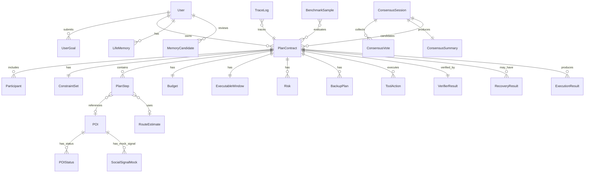

# 03_data_schema.md

## 1.文档信息

| 项目     | 内容                                                       |
| ------ | -------------------------------------------------------- |
| 文档名称   | 03_data_schema.md                                        |
| 项目名称   | LifePilot                                                |
| 产品定位   | 生活时间导航Agent                                              |
| 文档版本   | v0.1                                                     |
| 面向读者   | 前端、后端、Agent、Mock数据、测试、评委                                 |
| 关联文档   | 00_project_vision.md、01_prd.md、02_system_architecture.md |
| 数据设计目标 | 将产品需求与系统架构落成可校验、可渲染、可执行、可恢复的数据契约                         |
| 当前范围   | 比赛Demo阶段，优先支持P0闭环：家庭亲子、朋友局共识、纪念日情绪导航                     |

本文件定义LifePilot核心领域模型、PlanContract数据契约、Mock数据结构、状态校验规则、数据库映射和联调样例。文档目标不是重新描述产品功能，而是让开发同学可以直接基于字段拆任务、造数据、做校验和联调。

当前默认技术假设：

| 类型       | 约定                                            |
| -------- | --------------------------------------------- |
| 前端       | React/Next.js Web Demo，移动端优先                  |
| 后端       | Backend API Service，可使用Node.js或Python FastAPI |
| Demo存储   | JSON文件或SQLite                                 |
| 可扩展存储    | PostgreSQL                                    |
| Schema风格 | JSONSchema Draft 2020-12                      |
| 时间格式     | ISO 8601，例如`2026-05-20T13:00:00+08:00`        |
| 默认时区     | Asia/Shanghai，Demo展示为北京时间                     |
| 金额单位     | CNY，金额字段使用number                              |
| Mock区域   | 杭州下沙/金沙湖/高教园区                                 |
| trace_id | 贯穿计划生成、验证、执行、恢复、反馈全链路                         |

---

## 2.数据设计原则

### 2.1PlanContract是核心数据契约

LifePilot不是推荐列表，而是生活时间导航。系统内部所有关键模块都围绕PlanContract协作：

```text
Frontend渲染
→Verifier检查
→Executor执行
→Recovery修复
→Logging追踪
→Benchmark评测
```

PlanContract不是自然语言文案，而是可验证、可执行、可恢复的结构化对象。

### 2.2LLM不得直接编造可执行状态

LLM可以生成：

* 目标理解摘要；
* 候选计划草案；
* 时间线文案；
* 解释说明；
* 群聊消息；
* 情绪表达文案。

LLM不能直接生成或确认：

* 餐厅是否有位；
* 活动是否可预约；
* 路线是否通畅；
* 天气是否适合户外；
* 是否排队较短；
* 是否执行成功；
* 是否通过Verifier。

这些状态必须来自MockAPI或规则计算，并由Verifier写入结构化结果。

### 2.3Mock数据必须明确标注

Demo阶段MockAPI是对真实工具层的抽象，不是伪装真实平台能力。所有Mock状态、Mock凭证、Mock口碑信号必须有明确字段标识：

```json
{
  "mock_only": true,
  "is_mock": true,
  "source": "mock_api"
}
```

SocialSignalRadar只能作为Mock或可扩展能力，不承诺真实抓取小红书、抖音、点评等第三方平台数据。

### 2.4LifeMemory必须低打扰、可审计、用户可控

LifeMemory不是偷偷画像，而是规划辅助记忆。每条记忆必须具备：

* 来源；
* 置信度；
* 敏感度；
* 有效期；
* 用户可见性；
* 用户确认状态；
* 启用/禁用状态；
* 删除能力。

高敏信息默认不保存。中敏信息需要用户确认。关闭个性化后不写入长期记忆。

### 2.5P0字段稳定优先

P0字段一旦冻结，后续尽量只追加字段，不删除、不重命名、不改变语义。前后端联调以P0最小Schema为准，P1/P2字段只能作为可选扩展。

### 2.6所有关键流程必须可追踪

所有核心对象必须关联`trace_id`：

```text
PlanContract
ToolAction
VerifierResult
RecoveryResult
ExecutionResult
ConsensusSession
ConsensusVote
ConsensusSummary
MemoryUsage
TraceLog
```

长期LifeMemory对象不直接等同于某一次链路，使用`source_trace_id`记录来源链路，使用`last_used_trace_id`记录最近一次被调用链路。

trace_id用于Demo展示、Debug定位、Benchmark评测和错误复现。

---

## 3.命名规范与通用约定

### 3.1ID命名规范

所有ID使用带前缀的字符串，便于日志排查和前端展示。

| 字段                   | 前缀         | 示例                    | 生成规则              | 全局唯一    | 可前端暴露  |
| -------------------- | ---------- | --------------------- | ----------------- | ------- | ------ |
| user_id              | `user_`    | `user_demo_001`       | 后端生成或Demo固定       | 是       | 可      |
| trace_id             | `trace_`   | `trace_20260520_0001` | 每次主流程创建           | 是       | 可      |
| plan_id              | `plan_`    | `plan_0001`           | PlanContract创建时生成 | 是       | 可      |
| plan_group_id        | `plangrp_` | `plangrp_0001`        | 候选方案组生成           | 是       | 可      |
| step_id              | `step_`    | `step_0001`           | plan内递增           | plan内唯一 | 可      |
| poi_id               | `poi_`     | `poi_light_food_003`  | Mock数据预置          | 是       | 可      |
| action_id            | `act_`     | `act_reserve_0001`    | ToolAction创建      | plan内唯一 | Debug可 |
| execution_id         | `exec_`    | `exec_0001`           | 执行开始时创建           | 是       | 可      |
| recovery_id          | `rec_`     | `rec_0001`            | Recovery触发时创建     | 是       | 可      |
| vote_page_id         | `vpage_`   | `vpage_0001`          | 创建投票页时生成          | 是       | 可      |
| consensus_session_id | `cs_`      | `cs_0001`             | 共识会话创建            | 是       | 可      |
| vote_id              | `vote_`    | `vote_0001`           | 投票提交时生成           | 是       | Debug可 |
| memory_id            | `mem_`     | `mem_0001`            | 记忆确认后生成           | 是       | 可      |
| candidate_id         | `memcand_` | `memcand_0001`        | 记忆候选生成            | 是       | 可      |
| route_id             | `route_`   | `route_0001`          | 路线估计生成            | 是       | Debug可 |
| log_id               | `log_`     | `log_0001`            | 日志写入时生成           | 是       | Debug可 |
| sample_id            | `bench_`   | `bench_family_001`    | Benchmark样例预置     | 是       | Debug可 |

ID生成建议：

```text
{prefix}_{date}_{sequence}
```

例如：

```text
plan_20260520_0001
trace_20260520_0001
exec_20260520_0001
```

本文件为Schema最终契约。早期PRD或架构样例中出现的`group_0001`、`vote_page_0001`、泛化`session_id`只作为示意，不作为Schema校验依据。共识模块统一使用：

```text
consensus_session_id
vote_page_id
plan_group_id
vote_id
```

### 3.2时间格式规范

统一使用ISO 8601字符串：

```json
"2026-05-20T13:00:00+08:00"
```

禁止在Schema中存储展示文案：

```json
"今天下午一点"
```

核心时间字段：

| 字段           | 含义           | 示例                          | 来源                |
| ------------ | ------------ | --------------------------- | ----------------- |
| start_time   | 节点开始时间       | `2026-05-20T14:00:00+08:00` | 规则/计划生成           |
| end_time     | 节点结束时间       | `2026-05-20T15:30:00+08:00` | 规则/计划生成           |
| expire_at    | 可执行窗口或投票过期时间 | `2026-05-20T13:18:00+08:00` | 规则计算              |
| created_at   | 对象创建时间       | `2026-05-20T13:00:00+08:00` | 系统运行时             |
| updated_at   | 对象更新时间       | `2026-05-20T13:05:00+08:00` | 系统运行时             |
| finalized_at | 共识结束时间       | `2026-05-20T13:20:00+08:00` | 系统运行时             |
| submitted_at | 投票提交时间       | `2026-05-20T13:10:00+08:00` | 系统运行时             |
| last_used_at | 记忆最近使用时间     | `2026-05-20T13:00:00+08:00` | LifeMemoryService |

前端展示层可格式化为：

```text
14:00
今天14:00
5月20日14:00
```

但存储层不保存这类文案。

### 3.3金额与距离规范

金额字段统一使用number，单位为CNY。

| 字段                    | 类型     | 说明       | 示例    |
| --------------------- | ------ | -------- | ----- |
| currency              | string | 货币单位     | `CNY` |
| estimated_total       | number | 预计总金额    | `340` |
| price_per_person      | number | 人均价格     | `68`  |
| amount                | number | 单项金额     | `120` |
| budget_max            | number | 总预算上限    | `400` |
| budget_max_per_person | number | 人均预算上限   | `100` |
| budget_delta          | number | 恢复前后预算差值 | `-20` |

距离与时长字段：

| 字段                  | 类型     | 单位     | 示例    |
| ------------------- | ------ | ------ | ----- |
| distance_km         | number | km     | `3.2` |
| duration_minutes    | number | minute | `18`  |
| queue_minutes       | number | minute | `12`  |
| route_extra_minutes | number | minute | `4`   |
| window_minutes      | number | minute | `18`  |

Schema中不写：

```json
"约340元"
```

展示层再格式化为：

```text
约340元
人均约85元
```

### 3.4枚举命名规范

枚举统一使用小写蛇形命名：

```text
family_parent_child
restaurant_capacity
pending_confirmation
mock_social_signal
```

主要枚举类型包括：

| 枚举类别  | 示例                                    |
| ----- | ------------------------------------- |
| 场景枚举  | `friend_group`、`family_parent_child`  |
| 状态枚举  | `draft`、`verified`、`executing`        |
| 风险枚举  | `restaurant_capacity`、`weather`       |
| 动作枚举  | `reserve_restaurant`、`book_activity`  |
| 敏感度枚举 | `low`、`medium`、`high`                 |
| 可见性枚举 | `user_visible`、`internal_only`        |
| 来源枚举  | `llm_generated`、`mock_api`、`verifier` |

### 3.5字段来源标记

所有关键字段应能追溯来源。建议在TraceLog中记录字段来源，核心对象可在局部使用`source`字段。

| 来源枚举           | 含义             | 可由LLM产生 | 可执行可信度      |
| -------------- | -------------- | ------- | ----------- |
| user_input     | 用户原始输入         | 否       | 高           |
| llm_generated  | LLM生成的摘要、候选、解释 | 是       | 需校验         |
| rule_generated | 规则计算生成         | 否       | 高           |
| mock_api       | MockAPI返回      | 否       | Demo可信      |
| verifier       | Verifier检查生成   | 否       | 高           |
| recovery       | Recovery修复生成   | 可辅助解释   | 需重新Verifier |
| executor       | Executor执行生成   | 否       | 高           |
| user_confirmed | 用户确认生成         | 否       | 高           |
| system_runtime | 系统运行时生成        | 否       | 高           |

字段来源使用原则：

* 计划文案可为`llm_generated`；
* 可执行状态必须为`mock_api`、`rule_generated`或`verifier`；
* 执行结果必须为`executor`；
* 记忆启用状态必须来自`user_confirmed`或隐私规则；
* trace_id、created_at、updated_at必须为`system_runtime`。

---

## 4.核心领域模型总览

### 4.1领域模型ER图



### 4.2核心领域模型清单

| 模型                    | 归属模块                    |      P0 |    持久化 |         前端展示 |         可由LLM生成 | 需Schema校验 |
| --------------------- | ----------------------- | ------: | -----: | -----------: | --------------: | --------: |
| User                  | User/Profile            |       是 |      是 |           部分 |               否 |         是 |
| UserGoal              | IntentParser            |       是 | 嵌入Plan |            是 |              部分 |         是 |
| PlanContract          | PlanService             |       是 |      是 |            是 |      否，LLM只生成草案 |         是 |
| PlanStep              | PlanService             |       是 |      是 |            是 |       草案可由LLM生成 |         是 |
| Participant           | PlanService             |       是 |      是 |            是 |              部分 |         是 |
| ConstraintSet         | ConstraintExtractor     |       是 |      是 |            是 |              部分 |         是 |
| ExecutableWindow      | Verifier                |       是 |      是 |            是 |               否 |         是 |
| Budget                | PlanService             |       是 |      是 |            是 |          规则计算为主 |         是 |
| Risk                  | Verifier                |       是 |      是 |            是 |               否 |         是 |
| BackupPlan/LifeOption | Recovery/PlanService    |       是 |      是 |            是 |       草案可由LLM生成 |         是 |
| ToolAction            | Executor                |       是 |      是 | Debug/部分用户可见 |               否 |         是 |
| ExecutionResult       | Executor                |       是 |      是 |            是 |               否 |         是 |
| VerifierResult        | Verifier                |       是 |      是 |      是/Debug |               否 |         是 |
| RecoveryResult        | Recovery                |       是 |      是 |            是 |       解释可由LLM润色 |         是 |
| POI                   | MockAPI                 |       是 |      是 |            是 |               否 |         是 |
| POIStatus             | MockAPI                 |       是 |      是 |            是 |               否 |         是 |
| RouteEstimate         | MockAPI                 |       是 |      是 |            是 |               否 |         是 |
| WeatherStatus         | MockAPI                 |       是 |      是 |            是 |               否 |         是 |
| ConsensusSession      | ConsensusService        |       是 |      是 |            是 |               否 |         是 |
| ConsensusVote         | ConsensusService        |       是 |      是 |           部分 |               否 |         是 |
| ConsensusSummary      | ConsensusService        |       是 |      是 |            是 |     部分解释可由LLM生成 |         是 |
| LifeMemory            | LifeMemoryService       | P1，P0最小 |      是 |            是 |               否 |         是 |
| MemoryCandidate       | LifeMemoryService       | P1，P0最小 |      是 |            是 | 内容可由LLM抽取，需规则审核 |         是 |
| SocialSignalMock      | SocialSignalMockService |      P1 |      是 |   是，必须标注Mock |               否 |         是 |
| TraceLog              | LoggingService          |       是 |      是 |    Debug/简化版 |               否 |         是 |
| BenchmarkSample       | Benchmark               |      P1 |      是 |        Debug |               否 |         是 |

---

## 5.PlanContract Schema设计

PlanContract是全文最重要的数据契约。前端不直接解析自然语言，后端不直接执行自然语言，Verifier和Executor都只读取PlanContract。

### 5.1PlanContract字段总表

| 字段                | 类型     | 必填 | 默认值                | 字段来源                                    |       前端展示 | 持久化 | 优先级 | 校验规则                       |
| ----------------- | ------ | -: | ------------------ | --------------------------------------- | ---------: | --: | --- | -------------------------- |
| plan_id           | string |  是 | 无                  | system_runtime                          |          是 |   是 | P0  | `plan_`前缀，全局唯一             |
| trace_id          | string |  是 | 无                  | system_runtime                          |          是 |   是 | P0  | `trace_`前缀，全链路一致           |
| version           | string |  是 | `v0.1`             | system_runtime                          |      Debug |   是 | P0  | SemVer或文档版本                |
| status            | enum   |  是 | `draft`            | rule_generated                          |          是 |   是 | P0  | 必须在Plan状态枚举内               |
| user_goal         | object |  是 | 无                  | user_input/llm_generated                |          是 |   是 | P0  | 必须含raw_text、scenario       |
| participants      | array  |  是 | `[]`               | user_input/llm_generated                |          是 |   是 | P0  | 至少包含发起人或party_size         |
| time_window       | object |  是 | 无                  | rule_generated                          |          是 |   是 | P0  | start_time早于end_time       |
| constraints       | object |  是 | `{}`               | user_input/llm_generated/rule_generated |          是 |   是 | P0  | 显式约束优先                     |
| timeline          | array  |  是 | 无                  | llm_generated+rule_generated            |          是 |   是 | P0  | 不得为空，order连续               |
| budget            | object |  是 | `{currency:"CNY"}` | rule_generated/mock_api                 |          是 |   是 | P0  | 金额非负                       |
| executable_window | object |  是 | 无                  | verifier/rule_generated                 |          是 |   是 | P0  | 必须含expire_at               |
| risks             | array  |  是 | `[]`               | verifier                                |          是 |   是 | P0  | level枚举合法                  |
| backup_plans      | array  |  是 | `[]`               | recovery/rule_generated                 |          是 |   是 | P0  | 替换节点必须存在                   |
| tool_actions      | array  |  是 | `[]`               | rule_generated                          | Debug/部分展示 |   是 | P0  | target_poi_id必须存在或target合法 |
| messages          | object |  否 | `{}`               | llm_generated                           |          是 |   是 | P0  | 只存可展示消息，不存Prompt           |
| verifier_result   | object |  是 | 无                  | verifier                                |    是/Debug |   是 | P0  | status枚举合法                 |
| recovery_results  | array  |  否 | `[]`               | recovery                                |          是 |   是 | P0  | Recovery后必须重新Verifier      |
| execution_summary | object |  否 | `null`             | executor                                |          是 |   是 | P0  | 执行后写入                      |
| memory_usage      | array  |  否 | `[]`               | LifeMemoryService                       |    是/Debug |   是 | P1  | 仅引用enabled记忆               |
| social_signals    | array  |  否 | `[]`               | SocialSignalMock                        |          是 |   是 | P1  | is_mock必须为true             |
| created_at        | string |  是 | 当前时间               | system_runtime                          |      Debug |   是 | P0  | ISO 8601                   |
| updated_at        | string |  是 | 当前时间               | system_runtime                          |      Debug |   是 | P0  | ISO 8601，不早于created_at     |

PlanContract.status枚举：

```text
draft
generated
verifying
verified
executable
expired
confirmed
executing
recovered
completed
failed
cancelled
```

### 5.2PlanContract JSONSchema

```json
{
  "$schema": "https://json-schema.org/draft/2020-12/schema",
  "$id": "https://lifepilot.demo/schemas/plan_contract.schema.json",
  "title": "PlanContract",
  "type": "object",
  "additionalProperties": false,
  "required": [
    "plan_id",
    "trace_id",
    "version",
    "status",
    "user_goal",
    "participants",
    "time_window",
    "constraints",
    "timeline",
    "budget",
    "executable_window",
    "risks",
    "backup_plans",
    "tool_actions",
    "verifier_result",
    "created_at",
    "updated_at"
  ],
  "properties": {
    "plan_id": {
      "type": "string",
      "pattern": "^plan_[a-zA-Z0-9_\\-]+$"
    },
    "trace_id": {
      "type": "string",
      "pattern": "^trace_[a-zA-Z0-9_\\-]+$"
    },
    "version": {
      "type": "string",
      "default": "v0.1"
    },
    "status": {
      "type": "string",
      "enum": [
        "draft",
        "generated",
        "verifying",
        "verified",
        "executable",
        "expired",
        "confirmed",
        "executing",
        "recovered",
        "completed",
        "failed",
        "cancelled"
      ]
    },
    "user_goal": {
      "$ref": "#/$defs/UserGoal"
    },
    "participants": {
      "type": "array",
      "items": {
        "$ref": "#/$defs/Participant"
      }
    },
    "time_window": {
      "$ref": "#/$defs/TimeWindow"
    },
    "constraints": {
      "$ref": "#/$defs/ConstraintSet"
    },
    "timeline": {
      "type": "array",
      "minItems": 1,
      "items": {
        "$ref": "#/$defs/PlanStep"
      }
    },
    "budget": {
      "$ref": "#/$defs/Budget"
    },
    "executable_window": {
      "$ref": "#/$defs/ExecutableWindow"
    },
    "risks": {
      "type": "array",
      "items": {
        "$ref": "#/$defs/Risk"
      }
    },
    "backup_plans": {
      "type": "array",
      "items": {
        "$ref": "#/$defs/BackupPlan"
      }
    },
    "tool_actions": {
      "type": "array",
      "items": {
        "$ref": "#/$defs/ToolAction"
      }
    },
    "messages": {
      "type": "object",
      "additionalProperties": {
        "type": "string",
        "maxLength": 500
      },
      "default": {}
    },
    "verifier_result": {
      "$ref": "#/$defs/VerifierResult"
    },
    "recovery_results": {
      "type": "array",
      "items": {
        "$ref": "#/$defs/RecoveryResult"
      },
      "default": []
    },
    "execution_summary": {
      "type": ["object", "null"],
      "default": null
    },
    "memory_usage": {
      "type": "array",
      "items": {
        "$ref": "#/$defs/MemoryUsage"
      },
      "default": []
    },
    "social_signals": {
      "type": "array",
      "items": {
        "$ref": "#/$defs/SocialSignalMock"
      },
      "default": []
    },
    "created_at": {
      "type": "string",
      "format": "date-time"
    },
    "updated_at": {
      "type": "string",
      "format": "date-time"
    }
  },
  "$defs": {
    "UserGoal": {
      "type": "object",
      "additionalProperties": false,
      "required": ["raw_text", "scenario", "goal_summary", "source", "confidence"],
      "properties": {
        "raw_text": { "type": "string", "minLength": 1, "maxLength": 500 },
        "scenario": {
          "type": "string",
          "enum": [
            "friend_group",
            "family_parent_child",
            "anniversary_emotion",
            "city_light_explore",
            "fallback_unknown"
          ]
        },
        "goal_summary": { "type": "string", "maxLength": 300 },
        "intent_tags": { "type": "array", "items": { "type": "string" } },
        "emotion_goal": { "type": ["string", "null"] },
        "source": { "type": "string", "enum": ["user_input", "llm_generated", "rule_generated"] },
        "confidence": { "type": "number", "minimum": 0, "maximum": 1 }
      }
    },
    "Participant": {
      "type": "object",
      "additionalProperties": false,
      "required": ["participant_id", "role", "display_name"],
      "properties": {
        "participant_id": { "type": "string" },
        "role": { "type": "string" },
        "display_name": { "type": "string" },
        "age": { "type": ["integer", "null"], "minimum": 0 },
        "constraints": { "type": "array", "items": { "type": "string" } },
        "preference_tags": { "type": "array", "items": { "type": "string" } }
      }
    },
    "TimeWindow": {
      "type": "object",
      "additionalProperties": false,
      "required": ["start_time", "end_time", "time_flexibility"],
      "properties": {
        "start_time": { "type": "string", "format": "date-time" },
        "end_time": { "type": "string", "format": "date-time" },
        "time_flexibility": {
          "type": "string",
          "enum": ["low", "medium", "high", "unknown"]
        }
      }
    },
    "ConstraintSet": {
      "type": "object",
      "additionalProperties": false,
      "required": ["party_size"],
      "properties": {
        "party_size": { "type": "integer", "minimum": 1 },
        "distance_preference": { "type": "string" },
        "budget_max": { "type": ["number", "null"], "minimum": 0 },
        "budget_max_per_person": { "type": ["number", "null"], "minimum": 0 },
        "walking_tolerance": { "type": "string" },
        "queue_tolerance": { "type": "string" },
        "dietary_preference": { "type": "array", "items": { "type": "string" } },
        "activity_preference": { "type": "array", "items": { "type": "string" } },
        "weather_sensitive": { "type": "boolean" },
        "child_friendly_required": { "type": "boolean" },
        "indoor_preferred": { "type": "boolean" },
        "emotion_intensity": { "type": "string" },
        "time_flexibility": { "type": "string" },
        "must_have": { "type": "array", "items": { "type": "string" } },
        "must_not_have": { "type": "array", "items": { "type": "string" } }
      }
    },
    "PlanStep": {
      "type": "object",
      "additionalProperties": false,
      "required": [
        "step_id",
        "order",
        "type",
        "title",
        "start_time",
        "end_time",
        "duration_minutes",
        "booking_required",
        "reservation_required",
        "status"
      ],
      "properties": {
        "step_id": { "type": "string", "pattern": "^step_" },
        "order": { "type": "integer", "minimum": 1 },
        "type": {
          "type": "string",
          "enum": ["transport", "activity", "restaurant", "walk", "service", "message", "buffer", "return_home"]
        },
        "title": { "type": "string" },
        "description": { "type": "string" },
        "start_time": { "type": "string", "format": "date-time" },
        "end_time": { "type": "string", "format": "date-time" },
        "duration_minutes": { "type": "number", "minimum": 0 },
        "poi_id": { "type": ["string", "null"] },
        "from_poi_id": { "type": ["string", "null"] },
        "to_poi_id": { "type": ["string", "null"] },
        "transport_mode": { "type": ["string", "null"] },
        "estimated_route": {
          "anyOf": [
            { "$ref": "#/$defs/RouteEstimate" },
            { "type": "null" }
          ]
        },
        "booking_required": { "type": "boolean" },
        "reservation_required": { "type": "boolean" },
        "status": {
          "type": "string",
          "enum": ["planned", "verified", "locked", "executing", "completed", "replaced", "skipped", "failed"]
        },
        "related_tool_action_ids": { "type": "array", "items": { "type": "string" } },
        "display_tags": { "type": "array", "items": { "type": "string" } },
        "user_visible_notes": { "type": "string" }
      }
    },
    "RouteEstimate": {
      "type": "object",
      "additionalProperties": false,
      "required": [
        "route_id",
        "origin_poi_id",
        "destination_poi_id",
        "transport_mode",
        "distance_km",
        "duration_minutes",
        "traffic_level",
        "confidence",
        "source",
        "updated_at"
      ],
      "properties": {
        "route_id": { "type": "string", "pattern": "^route_" },
        "origin_poi_id": { "type": "string", "pattern": "^poi_" },
        "destination_poi_id": { "type": "string", "pattern": "^poi_" },
        "transport_mode": {
          "type": "string",
          "enum": ["walk", "taxi", "drive", "subway", "bike", "mixed"]
        },
        "distance_km": { "type": "number", "minimum": 0 },
        "duration_minutes": { "type": "number", "minimum": 0 },
        "traffic_level": {
          "type": "string",
          "enum": ["none", "smooth", "medium", "heavy", "unknown"]
        },
        "confidence": { "type": "number", "minimum": 0, "maximum": 1 },
        "source": { "type": "string", "const": "mock_api" },
        "updated_at": { "type": "string", "format": "date-time" }
      }
    },
    "Budget": {
      "type": "object",
      "additionalProperties": false,
      "required": ["currency", "estimated_total", "items"],
      "properties": {
        "currency": { "type": "string", "const": "CNY" },
        "estimated_total": { "type": "number", "minimum": 0 },
        "price_per_person": { "type": ["number", "null"], "minimum": 0 },
        "items": {
          "type": "array",
          "items": {
            "type": "object",
            "additionalProperties": false,
            "required": ["name", "amount"],
            "properties": {
              "name": { "type": "string" },
              "amount": { "type": "number", "minimum": 0 },
              "source": { "type": "string" }
            }
          }
        }
      }
    },
    "ExecutableWindow": {
      "type": "object",
      "additionalProperties": false,
      "required": ["window_minutes", "confidence", "expire_at", "reasons", "calculated_from", "display_message"],
      "properties": {
        "window_minutes": { "type": "number", "minimum": 0 },
        "confidence": { "type": "number", "minimum": 0, "maximum": 1 },
        "expire_at": { "type": "string", "format": "date-time" },
        "reasons": { "type": "array", "items": { "type": "string" } },
        "risk_factors": { "type": "array", "items": { "type": "string" } },
        "lockable_resources": { "type": "array", "items": { "type": "string" } },
        "calculated_from": { "type": "array", "items": { "type": "string" } },
        "display_message": { "type": "string" }
      }
    },
    "Risk": {
      "type": "object",
      "additionalProperties": false,
      "required": ["risk_id", "type", "level", "description", "user_visible"],
      "properties": {
        "risk_id": { "type": "string", "pattern": "^risk_" },
        "type": { "type": "string" },
        "level": { "type": "string", "enum": ["low", "medium", "high", "blocking"] },
        "description": { "type": "string" },
        "related_step_id": { "type": ["string", "null"] },
        "related_poi_id": { "type": ["string", "null"] },
        "recovery_plan_id": { "type": ["string", "null"] },
        "user_visible": { "type": "boolean" },
        "mitigation": { "type": "string" }
      }
    },
    "BackupPlan": {
      "type": "object",
      "additionalProperties": false,
      "required": ["backup_plan_id", "trigger", "description", "expected_diff", "priority", "status"],
      "properties": {
        "backup_plan_id": { "type": "string" },
        "trigger": { "type": "string" },
        "description": { "type": "string" },
        "replace_step_id": { "type": ["string", "null"] },
        "original_poi_id": { "type": ["string", "null"] },
        "new_poi_id": { "type": ["string", "null"] },
        "expected_diff": { "type": "object" },
        "verifier_result": { "type": ["object", "null"] },
        "priority": { "type": "integer" },
        "status": { "type": "string", "enum": ["candidate", "verified", "used", "failed"] }
      }
    },
    "ToolAction": {
      "type": "object",
      "additionalProperties": false,
      "required": [
        "action_id",
        "plan_id",
        "step_id",
        "type",
        "payload",
        "status",
        "retry_count",
        "idempotency_key",
        "user_visible",
        "created_at",
        "updated_at"
      ],
      "properties": {
        "action_id": { "type": "string", "pattern": "^act_" },
        "plan_id": { "type": "string" },
        "step_id": { "type": "string" },
        "type": { "type": "string" },
        "target_poi_id": { "type": ["string", "null"] },
        "target": { "type": ["string", "object", "null"] },
        "payload": { "type": "object" },
        "status": {
          "type": "string",
          "enum": ["pending", "running", "success", "failed", "recovered", "skipped"]
        },
        "depends_on": { "type": "array", "items": { "type": "string" } },
        "retry_count": { "type": "integer", "minimum": 0 },
        "idempotency_key": { "type": "string" },
        "result": { "type": ["object", "null"] },
        "error_code": { "type": ["string", "null"] },
        "user_visible": { "type": "boolean" },
        "created_at": { "type": "string", "format": "date-time" },
        "updated_at": { "type": "string", "format": "date-time" }
      }
    },
    "VerifierResult": {
      "type": "object",
      "additionalProperties": false,
      "required": ["status", "score", "checks", "failed_checks", "warnings", "required_recovery", "created_at"],
      "properties": {
        "status": { "type": "string", "enum": ["pass", "warning", "fail"] },
        "score": { "type": "number", "minimum": 0, "maximum": 1 },
        "checks": { "type": "array", "items": { "$ref": "#/$defs/VerifierCheck" } },
        "failed_checks": { "type": "array", "items": { "type": "string" } },
        "warnings": { "type": "array", "items": { "type": "string" } },
        "required_recovery": { "type": "boolean" },
        "suggestions": { "type": "array", "items": { "type": "string" } },
        "created_at": { "type": "string", "format": "date-time" }
      }
    },
    "VerifierCheck": {
      "type": "object",
      "additionalProperties": false,
      "required": ["name", "status", "message", "severity", "recoverable"],
      "properties": {
        "name": {
          "type": "string",
          "enum": [
            "time_feasibility",
            "opening_hours",
            "distance_constraint",
            "budget_constraint",
            "restaurant_capacity",
            "activity_ticket",
            "queue_time",
            "weather_risk",
            "participant_constraints",
            "tool_action_integrity",
            "executable_window"
          ]
        },
        "status": { "type": "string", "enum": ["pass", "warning", "fail"] },
        "score": { "type": "number", "minimum": 0, "maximum": 1 },
        "message": { "type": "string" },
        "related_step_id": { "type": ["string", "null"] },
        "related_poi_id": { "type": ["string", "null"] },
        "severity": { "type": "string", "enum": ["low", "medium", "high", "blocking"] },
        "recoverable": { "type": "boolean" },
        "recovery_hint": { "type": ["string", "null"] }
      }
    },
    "RecoveryResult": {
      "type": "object",
      "additionalProperties": false,
      "required": ["recovery_id", "trigger", "status", "original", "replacement", "diff", "verifier_result", "user_explanation", "created_at"],
      "properties": {
        "recovery_id": { "type": "string", "pattern": "^rec_" },
        "trigger": { "type": "string" },
        "status": { "type": "string", "enum": ["success", "failed", "partial"] },
        "original": { "type": "object" },
        "replacement": { "type": "object" },
        "diff": { "type": "object" },
        "updated_plan_id": { "type": ["string", "null"] },
        "verifier_result": { "type": "object" },
        "user_explanation": { "type": "string" },
        "created_at": { "type": "string", "format": "date-time" }
      }
    },
    "MemoryUsage": {
      "type": "object",
      "additionalProperties": false,
      "required": ["memory_id", "used_for", "explanation", "confidence", "user_visible"],
      "properties": {
        "memory_id": { "type": "string" },
        "trace_id": { "type": "string", "pattern": "^trace_" },
        "used_for": { "type": "string" },
        "explanation": { "type": "string" },
        "confidence": { "type": "number", "minimum": 0, "maximum": 1 },
        "user_visible": { "type": "boolean" }
      }
    },
    "SocialSignalMock": {
      "type": "object",
      "additionalProperties": false,
      "required": [
        "signal_id",
        "poi_id",
        "summary",
        "positive_tags",
        "negative_tags",
        "source_type",
        "confidence",
        "is_mock",
        "mock_sources",
        "updated_at"
      ],
      "properties": {
        "signal_id": { "type": "string" },
        "poi_id": { "type": "string" },
        "summary": { "type": "string" },
        "positive_tags": { "type": "array", "items": { "type": "string" } },
        "negative_tags": { "type": "array", "items": { "type": "string" } },
        "source_type": { "type": "string", "const": "mock_social_signal" },
        "confidence": { "type": "number", "minimum": 0, "maximum": 1 },
        "is_mock": { "type": "boolean", "const": true },
        "mock_sources": { "type": "array", "items": { "type": "string" } },
        "updated_at": { "type": "string", "format": "date-time" }
      }
    }
  }
}
```

### 5.3PlanContract完整示例：家庭亲子场景

```json
{
  "plan_id": "plan_20260520_0001",
  "trace_id": "trace_20260520_0001",
  "version": "v0.1",
  "status": "executable",
  "user_goal": {
    "raw_text": "今天下午想和老婆孩子出去玩几个小时，老婆最近减脂，孩子5岁，别太远。",
    "scenario": "family_parent_child",
    "goal_summary": "安排一段不远、不赶、适合5岁孩子参与，同时兼顾低卡饮食的家庭亲子下午。",
    "intent_tags": ["family_time", "child_friendly", "low_calorie", "nearby", "low_queue"],
    "emotion_goal": "轻松陪伴，不要太赶",
    "source": "user_input",
    "confidence": 0.92
  },
  "participants": [
    {
      "participant_id": "part_user_001",
      "role": "user",
      "display_name": "我",
      "age": null,
      "constraints": [],
      "preference_tags": []
    },
    {
      "participant_id": "part_spouse_001",
      "role": "spouse",
      "display_name": "老婆",
      "age": null,
      "constraints": ["low_calorie"],
      "preference_tags": ["light_food"]
    },
    {
      "participant_id": "part_child_001",
      "role": "child",
      "display_name": "孩子",
      "age": 5,
      "constraints": ["child_friendly", "avoid_long_walk"],
      "preference_tags": ["interactive_activity"]
    }
  ],
  "time_window": {
    "start_time": "2026-05-20T13:30:00+08:00",
    "end_time": "2026-05-20T18:00:00+08:00",
    "time_flexibility": "medium"
  },
  "constraints": {
    "party_size": 3,
    "distance_preference": "nearby",
    "budget_max": 400,
    "budget_max_per_person": null,
    "walking_tolerance": "medium_low",
    "queue_tolerance": "low",
    "dietary_preference": ["low_calorie", "light_food"],
    "activity_preference": ["child_friendly", "interactive", "not_tiring"],
    "weather_sensitive": true,
    "child_friendly_required": true,
    "indoor_preferred": false,
    "emotion_intensity": "light",
    "time_flexibility": "medium",
    "must_have": ["适合5岁儿童", "低卡或轻食餐厅"],
    "must_not_have": ["长时间排队", "高强度步行"]
  },
  "timeline": [
    {
      "step_id": "step_0001",
      "order": 1,
      "type": "transport",
      "title": "从家附近出发前往亲子场馆",
      "description": "建议打车或自驾，减少孩子步行消耗。",
      "start_time": "2026-05-20T13:40:00+08:00",
      "end_time": "2026-05-20T14:05:00+08:00",
      "duration_minutes": 25,
      "poi_id": null,
      "from_poi_id": "poi_home_anchor_001",
      "to_poi_id": "poi_child_science_001",
      "transport_mode": "taxi",
      "estimated_route": {
        "route_id": "route_0001",
        "origin_poi_id": "poi_home_anchor_001",
        "destination_poi_id": "poi_child_science_001",
        "transport_mode": "taxi",
        "distance_km": 5.2,
        "duration_minutes": 25,
        "traffic_level": "medium",
        "confidence": 0.82,
        "source": "mock_api",
        "updated_at": "2026-05-20T13:00:00+08:00"
      },
      "booking_required": false,
      "reservation_required": false,
      "status": "verified",
      "related_tool_action_ids": ["act_route_0001"],
      "display_tags": ["不赶", "少步行"],
      "user_visible_notes": "路程约25分钟，适合家庭出行。"
    },
    {
      "step_id": "step_0002",
      "order": 2,
      "type": "activity",
      "title": "儿童科学互动体验",
      "description": "适合5岁孩子参与的室内互动活动。",
      "start_time": "2026-05-20T14:05:00+08:00",
      "end_time": "2026-05-20T15:35:00+08:00",
      "duration_minutes": 90,
      "poi_id": "poi_child_science_001",
      "from_poi_id": null,
      "to_poi_id": null,
      "transport_mode": null,
      "estimated_route": null,
      "booking_required": true,
      "reservation_required": false,
      "status": "verified",
      "related_tool_action_ids": ["act_book_0001", "act_status_0001"],
      "display_tags": ["亲子", "室内", "可预约"],
      "user_visible_notes": "当前场次余票充足。"
    },
    {
      "step_id": "step_0003",
      "order": 3,
      "type": "transport",
      "title": "前往低卡轻食餐厅",
      "description": "从亲子场馆短途转场到餐厅。",
      "start_time": "2026-05-20T15:35:00+08:00",
      "end_time": "2026-05-20T15:55:00+08:00",
      "duration_minutes": 20,
      "poi_id": null,
      "from_poi_id": "poi_child_science_001",
      "to_poi_id": "poi_light_food_003",
      "transport_mode": "taxi",
      "estimated_route": {
        "route_id": "route_0002",
        "origin_poi_id": "poi_child_science_001",
        "destination_poi_id": "poi_light_food_003",
        "transport_mode": "taxi",
        "distance_km": 3.1,
        "duration_minutes": 12,
        "traffic_level": "smooth",
        "confidence": 0.85,
        "source": "mock_api",
        "updated_at": "2026-05-20T13:00:00+08:00"
      },
      "booking_required": false,
      "reservation_required": false,
      "status": "verified",
      "related_tool_action_ids": ["act_route_0002"],
      "display_tags": ["短转场"],
      "user_visible_notes": "实际路线约12分钟，预留8分钟缓冲。"
    },
    {
      "step_id": "step_0004",
      "order": 4,
      "type": "restaurant",
      "title": "低卡轻食用餐",
      "description": "选择低卡、家庭友好、环境安静的轻食餐厅。",
      "start_time": "2026-05-20T15:55:00+08:00",
      "end_time": "2026-05-20T16:50:00+08:00",
      "duration_minutes": 55,
      "poi_id": "poi_light_food_003",
      "from_poi_id": null,
      "to_poi_id": null,
      "transport_mode": null,
      "estimated_route": null,
      "booking_required": false,
      "reservation_required": true,
      "status": "verified",
      "related_tool_action_ids": ["act_rest_status_0001", "act_reserve_0001"],
      "display_tags": ["低卡", "家庭友好", "余位紧张"],
      "user_visible_notes": "4人位剩余2桌，建议尽快确认。"
    },
    {
      "step_id": "step_0005",
      "order": 5,
      "type": "walk",
      "title": "金沙湖边轻松散步",
      "description": "饭后低强度散步，时间不长，避免孩子太累。",
      "start_time": "2026-05-20T16:50:00+08:00",
      "end_time": "2026-05-20T17:25:00+08:00",
      "duration_minutes": 35,
      "poi_id": "poi_lakeside_walk_001",
      "from_poi_id": null,
      "to_poi_id": null,
      "transport_mode": "walk",
      "estimated_route": null,
      "booking_required": false,
      "reservation_required": false,
      "status": "verified",
      "related_tool_action_ids": ["act_weather_0001"],
      "display_tags": ["低强度", "饭后散步"],
      "user_visible_notes": "若下雨可切换到室内儿童书店。"
    }
  ],
  "budget": {
    "currency": "CNY",
    "estimated_total": 340,
    "price_per_person": 113.33,
    "items": [
      {
        "name": "亲子活动门票",
        "amount": 120,
        "source": "mock_api"
      },
      {
        "name": "轻食餐厅",
        "amount": 180,
        "source": "mock_api"
      },
      {
        "name": "交通",
        "amount": 40,
        "source": "rule_generated"
      }
    ]
  },
  "executable_window": {
    "window_minutes": 18,
    "confidence": 0.82,
    "expire_at": "2026-05-20T13:18:00+08:00",
    "reasons": [
      "亲子场馆当前余票充足",
      "轻食餐厅4人位剩余2桌",
      "从场馆到餐厅路线当前通畅"
    ],
    "risk_factors": ["restaurant_capacity_medium"],
    "lockable_resources": ["activity_ticket", "restaurant_reservation"],
    "calculated_from": ["poi_status", "restaurant_status", "route_estimate", "weather_status"],
    "display_message": "当前方案可执行窗口约18分钟，建议确认后锁定活动预约和餐厅订座。"
  },
  "risks": [
    {
      "risk_id": "risk_0001",
      "type": "restaurant_capacity",
      "level": "medium",
      "description": "轻食餐厅4人位剩余较少，执行时可能满座。",
      "related_step_id": "step_0004",
      "related_poi_id": "poi_light_food_003",
      "recovery_plan_id": "backup_0001",
      "user_visible": true,
      "mitigation": "保留同区域低卡轻食备选餐厅。"
    },
    {
      "risk_id": "risk_0002",
      "type": "weather",
      "level": "low",
      "description": "下午有小概率降雨，户外散步体验可能下降。",
      "related_step_id": "step_0005",
      "related_poi_id": "poi_lakeside_walk_001",
      "recovery_plan_id": "backup_0002",
      "user_visible": true,
      "mitigation": "下雨时切换到室内儿童书店。"
    }
  ],
  "backup_plans": [
    {
      "backup_plan_id": "backup_0001",
      "trigger": "restaurant_full",
      "description": "若轻盈厨房满座，切换到谷物星球轻食，路线增加4分钟，预算基本不变。",
      "replace_step_id": "step_0004",
      "original_poi_id": "poi_light_food_003",
      "new_poi_id": "poi_light_food_007",
      "expected_diff": {
        "route_extra_minutes": 4,
        "budget_delta": 0,
        "queue_delta_minutes": -8,
        "diet_match": "same",
        "scenario_match": "same"
      },
      "verifier_result": {
        "status": "pass",
        "score": 0.86
      },
      "priority": 1,
      "status": "verified"
    },
    {
      "backup_plan_id": "backup_0002",
      "trigger": "weather_rain",
      "description": "若下雨，取消湖边散步，改去室内儿童书店。",
      "replace_step_id": "step_0005",
      "original_poi_id": "poi_lakeside_walk_001",
      "new_poi_id": "poi_child_bookstore_002",
      "expected_diff": {
        "route_extra_minutes": 3,
        "budget_delta": 30,
        "scenario_match": "same",
        "user_visible_summary": "户外改室内，孩子体验更稳定。"
      },
      "verifier_result": {
        "status": "pass",
        "score": 0.81
      },
      "priority": 2,
      "status": "verified"
    }
  ],
  "tool_actions": [
    {
      "action_id": "act_status_0001",
      "plan_id": "plan_20260520_0001",
      "step_id": "step_0002",
      "type": "get_poi_status",
      "target_poi_id": "poi_child_science_001",
      "target": null,
      "payload": {
        "arrival_time": "2026-05-20T14:05:00+08:00",
        "party_size": 3
      },
      "status": "success",
      "depends_on": [],
      "retry_count": 0,
      "idempotency_key": "idem_act_status_0001",
      "result": {
        "ticket_available": true,
        "remaining_tickets": 28,
        "booking_available": true,
        "source": "mock_api"
      },
      "error_code": null,
      "user_visible": false,
      "created_at": "2026-05-20T13:00:05+08:00",
      "updated_at": "2026-05-20T13:00:06+08:00"
    },
    {
      "action_id": "act_book_0001",
      "plan_id": "plan_20260520_0001",
      "step_id": "step_0002",
      "type": "book_activity",
      "target_poi_id": "poi_child_science_001",
      "target": null,
      "payload": {
        "arrival_time": "2026-05-20T14:05:00+08:00",
        "party_size": 3
      },
      "status": "pending",
      "depends_on": ["act_status_0001"],
      "retry_count": 0,
      "idempotency_key": "idem_act_book_0001",
      "result": null,
      "error_code": null,
      "user_visible": true,
      "created_at": "2026-05-20T13:00:07+08:00",
      "updated_at": "2026-05-20T13:00:07+08:00"
    },
    {
      "action_id": "act_rest_status_0001",
      "plan_id": "plan_20260520_0001",
      "step_id": "step_0004",
      "type": "get_restaurant_status",
      "target_poi_id": "poi_light_food_003",
      "target": null,
      "payload": {
        "arrival_time": "2026-05-20T15:55:00+08:00",
        "party_size": 3
      },
      "status": "success",
      "depends_on": [],
      "retry_count": 0,
      "idempotency_key": "idem_act_rest_status_0001",
      "result": {
        "available_tables": 2,
        "queue_minutes": 12,
        "reservation_available": true,
        "risk_level": "medium",
        "source": "mock_api"
      },
      "error_code": null,
      "user_visible": false,
      "created_at": "2026-05-20T13:00:08+08:00",
      "updated_at": "2026-05-20T13:00:08+08:00"
    },
    {
      "action_id": "act_reserve_0001",
      "plan_id": "plan_20260520_0001",
      "step_id": "step_0004",
      "type": "reserve_restaurant",
      "target_poi_id": "poi_light_food_003",
      "target": null,
      "payload": {
        "arrival_time": "2026-05-20T15:55:00+08:00",
        "party_size": 3
      },
      "status": "pending",
      "depends_on": ["act_rest_status_0001"],
      "retry_count": 0,
      "idempotency_key": "idem_act_reserve_0001",
      "result": null,
      "error_code": null,
      "user_visible": true,
      "created_at": "2026-05-20T13:00:09+08:00",
      "updated_at": "2026-05-20T13:00:09+08:00"
    },
    {
      "action_id": "act_message_0001",
      "plan_id": "plan_20260520_0001",
      "step_id": "step_0001",
      "type": "send_message",
      "target_poi_id": null,
      "target": "spouse",
      "payload": {
        "content_key": "to_spouse"
      },
      "status": "pending",
      "depends_on": [],
      "retry_count": 0,
      "idempotency_key": "idem_act_message_0001",
      "result": null,
      "error_code": null,
      "user_visible": true,
      "created_at": "2026-05-20T13:00:10+08:00",
      "updated_at": "2026-05-20T13:00:10+08:00"
    }
  ],
  "messages": {
    "to_spouse": "我排了一版下午的安排：先带孩子去一个不累的互动体验，之后吃一家轻食，时间不会太晚。"
  },
  "verifier_result": {
    "status": "warning",
    "score": 0.82,
    "checks": [
      {
        "name": "time_feasibility",
        "status": "pass",
        "score": 0.9,
        "message": "时间线连续，转场有缓冲。",
        "related_step_id": null,
        "related_poi_id": null,
        "severity": "low",
        "recoverable": false,
        "recovery_hint": null
      },
      {
        "name": "restaurant_capacity",
        "status": "warning",
        "score": 0.68,
        "message": "4人位剩余2桌，建议尽快确认并保留备选。",
        "related_step_id": "step_0004",
        "related_poi_id": "poi_light_food_003",
        "severity": "medium",
        "recoverable": true,
        "recovery_hint": "restaurant_full"
      },
      {
        "name": "activity_ticket",
        "status": "pass",
        "score": 0.91,
        "message": "亲子场馆余票充足。",
        "related_step_id": "step_0002",
        "related_poi_id": "poi_child_science_001",
        "severity": "low",
        "recoverable": false,
        "recovery_hint": null
      }
    ],
    "failed_checks": [],
    "warnings": ["restaurant_capacity_medium"],
    "required_recovery": false,
    "suggestions": ["建议18分钟内确认", "保留谷物星球轻食作为PlanB"],
    "created_at": "2026-05-20T13:00:11+08:00"
  },
  "recovery_results": [],
  "execution_summary": null,
  "memory_usage": [
    {
      "memory_id": "mem_0001",
      "trace_id": "trace_20260520_0001",
      "used_for": "queue_preference",
      "explanation": "本次优先选择可预约餐厅，是因为你之前多次反馈不喜欢排队。",
      "confidence": 0.78,
      "user_visible": true
    }
  ],
  "social_signals": [
    {
      "signal_id": "sig_0001",
      "poi_id": "poi_light_food_003",
      "summary": "口碑Mock显示这家轻食环境安静，适合家庭用餐，但周末下午座位偏紧。",
      "positive_tags": ["环境安静", "低卡选择多", "家庭友好"],
      "negative_tags": ["座位偏少", "高峰可能排队"],
      "source_type": "mock_social_signal",
      "confidence": 0.72,
      "is_mock": true,
      "mock_sources": ["mock_xhs", "mock_dianping"],
      "updated_at": "2026-05-20T12:00:00+08:00"
    }
  ],
  "created_at": "2026-05-20T13:00:00+08:00",
  "updated_at": "2026-05-20T13:00:12+08:00"
}
```

### 5.4PlanContract最小合法示例

```json
{
  "plan_id": "plan_0001",
  "trace_id": "trace_0001",
  "version": "v0.1",
  "status": "verified",
  "user_goal": {
    "raw_text": "下午和朋友出去玩，4个人，别太远，别太贵。",
    "scenario": "friend_group",
    "goal_summary": "安排一段近距离、低预算、适合4人朋友局的轻松下午。",
    "intent_tags": ["friend_group", "nearby", "low_budget"],
    "emotion_goal": null,
    "source": "user_input",
    "confidence": 0.88
  },
  "participants": [
    {
      "participant_id": "part_user_001",
      "role": "user",
      "display_name": "我",
      "age": null,
      "constraints": [],
      "preference_tags": []
    }
  ],
  "time_window": {
    "start_time": "2026-05-20T14:00:00+08:00",
    "end_time": "2026-05-20T18:00:00+08:00",
    "time_flexibility": "medium"
  },
  "constraints": {
    "party_size": 4,
    "distance_preference": "nearby",
    "budget_max": null,
    "budget_max_per_person": 100,
    "walking_tolerance": "medium",
    "queue_tolerance": "medium",
    "dietary_preference": [],
    "activity_preference": ["light"],
    "weather_sensitive": true,
    "child_friendly_required": false,
    "indoor_preferred": false,
    "emotion_intensity": "light",
    "time_flexibility": "medium",
    "must_have": [],
    "must_not_have": []
  },
  "timeline": [
    {
      "step_id": "step_0001",
      "order": 1,
      "type": "activity",
      "title": "轻松桌游聊天",
      "description": "适合4人轻松聊天。",
      "start_time": "2026-05-20T14:30:00+08:00",
      "end_time": "2026-05-20T16:30:00+08:00",
      "duration_minutes": 120,
      "poi_id": "poi_boardgame_001",
      "from_poi_id": null,
      "to_poi_id": null,
      "transport_mode": null,
      "estimated_route": null,
      "booking_required": true,
      "reservation_required": false,
      "status": "verified",
      "related_tool_action_ids": ["act_book_0001"],
      "display_tags": ["轻松", "室内"],
      "user_visible_notes": "当前可预约。"
    }
  ],
  "budget": {
    "currency": "CNY",
    "estimated_total": 320,
    "price_per_person": 80,
    "items": [
      {
        "name": "桌游包间",
        "amount": 320,
        "source": "mock_api"
      }
    ]
  },
  "executable_window": {
    "window_minutes": 20,
    "confidence": 0.8,
    "expire_at": "2026-05-20T14:20:00+08:00",
    "reasons": ["桌游包间当前可预约"],
    "risk_factors": [],
    "lockable_resources": ["activity_booking"],
    "calculated_from": ["poi_status"],
    "display_message": "当前方案可执行窗口约20分钟。"
  },
  "risks": [],
  "backup_plans": [],
  "tool_actions": [
    {
      "action_id": "act_book_0001",
      "plan_id": "plan_0001",
      "step_id": "step_0001",
      "type": "book_activity",
      "target_poi_id": "poi_boardgame_001",
      "target": null,
      "payload": {
        "party_size": 4,
        "arrival_time": "2026-05-20T14:30:00+08:00"
      },
      "status": "pending",
      "depends_on": [],
      "retry_count": 0,
      "idempotency_key": "idem_act_book_0001",
      "result": null,
      "error_code": null,
      "user_visible": true,
      "created_at": "2026-05-20T14:00:00+08:00",
      "updated_at": "2026-05-20T14:00:00+08:00"
    }
  ],
  "messages": {},
  "verifier_result": {
    "status": "pass",
    "score": 0.86,
    "checks": [],
    "failed_checks": [],
    "warnings": [],
    "required_recovery": false,
    "suggestions": [],
    "created_at": "2026-05-20T14:00:02+08:00"
  },
  "recovery_results": [],
  "execution_summary": null,
  "memory_usage": [],
  "social_signals": [],
  "created_at": "2026-05-20T14:00:00+08:00",
  "updated_at": "2026-05-20T14:00:02+08:00"
}
```

### 5.5PlanContract非法示例

#### 非法示例1：缺少timeline

```json
{
  "plan_id": "plan_bad_001",
  "trace_id": "trace_0001",
  "version": "v0.1",
  "status": "verified",
  "user_goal": {
    "raw_text": "下午出去玩",
    "scenario": "city_light_explore",
    "goal_summary": "安排下午活动",
    "source": "user_input",
    "confidence": 0.7
  }
}
```

非法原因：缺少`timeline`，前端无法渲染生活时间线。
发现模块：PlanContractBuilder。
错误码：`PLAN_SCHEMA_INVALID`。
是否阻断：阻断。

#### 非法示例2：工具动作target_poi_id不存在

```json
{
  "tool_actions": [
    {
      "action_id": "act_reserve_9999",
      "plan_id": "plan_0001",
      "step_id": "step_0003",
      "type": "reserve_restaurant",
      "target_poi_id": "poi_not_exist_999",
      "status": "pending"
    }
  ]
}
```

非法原因：`target_poi_id`不在Mock POI集合，也不在timeline引用的POI中。
发现模块：Verifier。
错误码：`TOOL_ACTION_INVALID`或`PLAN_STEP_POI_NOT_FOUND`。
是否阻断：阻断执行。

#### 非法示例3：LLM直接填了未验证的available_tables

```json
{
  "timeline": [
    {
      "step_id": "step_0003",
      "type": "restaurant",
      "title": "低卡餐厅",
      "poi_id": "poi_light_food_003",
      "available_tables": 5
    }
  ]
}
```

非法原因：`available_tables`不能由LLM写入PlanStep，必须来自`POIStatus`或ToolAction.result。
发现模块：PlanContractBuilder。
错误码：`PLAN_SCHEMA_INVALID`。
是否阻断：阻断或剔除字段后重新Verifier。

#### 非法示例4：executable_window缺少expire_at

```json
{
  "executable_window": {
    "window_minutes": 18,
    "confidence": 0.82,
    "reasons": ["餐厅有位"]
  }
}
```

非法原因：可执行窗口没有失效时间，无法判断是否过期。
发现模块：SchemaValidator。
错误码：`PLAN_SCHEMA_INVALID`。
是否阻断：阻断执行，可允许展示草案。

#### 非法示例5：verifier_result.status不在枚举内

```json
{
  "verifier_result": {
    "status": "ok",
    "score": 0.9,
    "checks": [],
    "failed_checks": [],
    "warnings": [],
    "required_recovery": false
  }
}
```

非法原因：`status`必须为`pass`、`warning`或`fail`。
发现模块：SchemaValidator。
错误码：`VERIFIER_RESULT_INVALID`。
是否阻断：阻断。

---

## 6.UserGoal与ConstraintSet Schema

### 6.1UserGoal

UserGoal描述用户这次要导航的一段生活时间目标。它保留用户原始输入，也包含系统结构化理解。

| 字段           | 类型          | 必填 | 来源                           | P0/P1 | 说明            |
| ------------ | ----------- | -: | ---------------------------- | ----- | ------------- |
| raw_text     | string      |  是 | user_input                   | P0    | 用户原始输入，不改写    |
| scenario     | enum        |  是 | llm_generated/rule_generated | P0    | 场景分类          |
| goal_summary | string      |  是 | llm_generated                | P0    | 可展示的目标摘要      |
| intent_tags  | string[]    |  否 | llm_generated/rule_generated | P0    | 意图标签          |
| emotion_goal | string/null |  否 | llm_generated                | P0    | 情绪目标，例如“显得用心” |
| source       | enum        |  是 | system_runtime               | P0    | 主要来源          |
| confidence   | number      |  是 | rule_generated               | P0    | 0-1           |

示例：

```json
{
  "raw_text": "想和老婆过一下结婚纪念日，不想太夸张，但希望她觉得我用心。",
  "scenario": "anniversary_emotion",
  "goal_summary": "安排一段自然、不夸张、有轻仪式感的纪念日约会流程。",
  "intent_tags": ["anniversary", "light_ritual", "quiet_restaurant", "photo_spot"],
  "emotion_goal": "让对方觉得被重视，但不过度尴尬",
  "source": "user_input",
  "confidence": 0.93
}
```

### 6.2Scenario枚举

| 枚举                  | 说明        | P0 |
| ------------------- | --------- | -: |
| friend_group        | 朋友局共识导航   |  是 |
| family_parent_child | 家庭亲子机会导航  |  是 |
| anniversary_emotion | 纪念日情绪导航   |  是 |
| city_light_explore  | 城市轻探索     | P1 |
| fallback_unknown    | 无法明确分类时兜底 |  是 |

### 6.3ConstraintSet

ConstraintSet用于将用户目标、共识结果、LifeMemory和规则默认值压缩成可校验约束。

| 字段                      | 类型          | 必填 | 默认值      | 来源                          | P0/P1 | 校验                |
| ----------------------- | ----------- | -: | -------- | --------------------------- | ----- | ----------------- |
| party_size              | integer     |  是 | 1        | user_input/rule             | P0    | >=1               |
| distance_preference     | enum/string |  否 | `nearby` | user_input/llm              | P0    | 小写蛇形              |
| budget_max              | number/null |  否 | null     | user_input                  | P0    | >=0               |
| budget_max_per_person   | number/null |  否 | null     | user_input/consensus        | P0    | >=0               |
| walking_tolerance       | enum        |  否 | `medium` | user_input/consensus/memory | P0    | 枚举                |
| queue_tolerance         | enum        |  否 | `medium` | user_input/consensus/memory | P0    | 枚举                |
| dietary_preference      | string[]    |  否 | []       | user_input/memory           | P0    | 标签存在              |
| activity_preference     | string[]    |  否 | []       | user_input/consensus        | P0    | 标签存在              |
| weather_sensitive       | boolean     |  否 | true     | rule                        | P0    | 布尔                |
| child_friendly_required | boolean     |  否 | false    | user_input                  | P0    | 布尔                |
| indoor_preferred        | boolean     |  否 | false    | user_input/weather          | P0    | 布尔                |
| emotion_intensity       | enum        |  否 | `light`  | user_input/llm              | P0    | light/medium/high |
| time_flexibility        | enum        |  否 | `medium` | user_input/rule             | P0    | low/medium/high   |
| must_have               | string[]    |  否 | []       | user_input/consensus        | P0    | 硬约束               |
| must_not_have           | string[]    |  否 | []       | user_input/consensus        | P0    | 硬约束               |

建议枚举：

```text
distance_preference: nearby / same_area / flexible / unknown
walking_tolerance: low / medium_low / medium / high
queue_tolerance: low / medium / high
emotion_intensity: light / medium / high
time_flexibility: low / medium / high / unknown
```

示例：

```json
{
  "party_size": 4,
  "distance_preference": "nearby",
  "budget_max": null,
  "budget_max_per_person": 100,
  "walking_tolerance": "low",
  "queue_tolerance": "low",
  "dietary_preference": [],
  "activity_preference": ["chat", "photo", "light"],
  "weather_sensitive": true,
  "child_friendly_required": false,
  "indoor_preferred": true,
  "emotion_intensity": "light",
  "time_flexibility": "medium",
  "must_have": ["低排队", "适合4人"],
  "must_not_have": ["走太多", "人均超过150"]
}
```

### 6.4约束字段来源与优先级

约束冲突时按以下优先级处理：

```text
用户当次显式输入
> 用户确认后的朋友投票共识约束
> 用户确认的LifeMemory
> 规则默认值
> LLM弱推断
```

原则：

1.用户显式输入优先级最高。
例如用户本次说“不想吃轻食”，即使LifeMemory里有“偏好低卡”，也不能强行推荐轻食。

2.朋友投票共识可覆盖原始软约束。
例如发起人说“想拍照”，但多数朋友反选拍照方案，并明确“不想走太多”，最终共识可降低拍照权重。

3.LifeMemory只能温和影响，不覆盖当次明确表达。
LifeMemory可影响排序，不可擅自改变硬约束。

4.Verifier只检查，不修改原始用户表达。
Verifier可以标记冲突，但不直接改写ConstraintSet。

5.Recovery只能局部替换，不能改变核心目标。
例如家庭亲子计划中餐厅满座，Recovery可换餐厅，不能改成酒吧或夜市。

---

## 7.PlanStep与Timeline Schema

LifePilot不是地点列表，而是时间线。PlanStep必须表达“这段生活时间如何流动”。

### 7.1PlanStep字段

| 字段                      | 类型          |   必填 | 来源             | P0/P1 |    展示 | 校验            |
| ----------------------- | ----------- | ---: | -------------- | ----- | ----: | ------------- |
| step_id                 | string      |    是 | system_runtime | P0    | Debug | plan内唯一       |
| order                   | integer     |    是 | rule_generated | P0    |     否 | 从1连续          |
| type                    | enum        |    是 | llm/rule       | P0    |     是 | 枚举合法          |
| title                   | string      |    是 | llm_generated  | P0    |     是 | 非空            |
| description             | string      |    否 | llm_generated  | P0    |     是 | <=300字        |
| start_time              | string      |    是 | rule_generated | P0    |     是 | ISO           |
| end_time                | string      |    是 | rule_generated | P0    |     是 | 晚于start_time  |
| duration_minutes        | number      |    是 | rule_generated | P0    |     是 | >=0           |
| poi_id                  | string/null | 条件必填 | mock_api候选     | P0    |     是 | 活动/餐厅必填       |
| from_poi_id             | string/null |    否 | rule           | P0    | Debug | transport可用   |
| to_poi_id               | string/null |    否 | rule           | P0    | Debug | transport可用   |
| transport_mode          | enum/null   | 条件必填 | rule           | P0    |     是 | transport必填   |
| estimated_route         | object/null |    否 | mock_api       | P0    |     是 | RouteEstimate |
| booking_required        | boolean     |    是 | mock_api/rule  | P0    |     是 | 默认false       |
| reservation_required    | boolean     |    是 | mock_api/rule  | P0    |     是 | 默认false       |
| status                  | enum        |    是 | system_runtime | P0    |     是 | 状态枚举          |
| related_tool_action_ids | string[]    |    否 | rule           | P0    | Debug | action_id存在   |
| display_tags            | string[]    |    否 | llm/rule       | P0    |     是 | 不影响逻辑         |
| user_visible_notes      | string      |    否 | llm/rule       | P0    |     是 | 不存内部Prompt    |

### 7.2PlanStep.type枚举

| 枚举          | 说明            |    是否要求poi_id |
| ----------- | ------------- | ------------: |
| transport   | 转场/路程         |    否，需from/to |
| activity    | 活动/展览/亲子体验    |             是 |
| restaurant  | 餐厅/饮品/用餐      |             是 |
| walk        | 散步/轻探索        |             是 |
| service     | 蛋糕、鲜花、停车等服务节点 |             是 |
| message     | 发消息、群聊通知      |             否 |
| buffer      | 缓冲时间          |             否 |
| return_home | 返程            | 否，可有to_poi_id |

### 7.3PlanStep.status枚举

```text
planned
verified
locked
executing
completed
replaced
skipped
failed
```

含义：

| 状态        | 说明               |
| --------- | ---------------- |
| planned   | 初步生成，未完成验证       |
| verified  | 已通过Verifier      |
| locked    | 用户确认后关键资源已锁定     |
| executing | Executor正在执行相关动作 |
| completed | 节点执行完成           |
| replaced  | 被Recovery替换      |
| skipped   | 非关键节点被跳过         |
| failed    | 节点失败且未恢复         |

### 7.4时间线校验规则

必须校验：

1. `order`从1开始连续；
2. `start_time < end_time`；
3. 相邻PlanStep不应重叠；
4. 允许小于等于5分钟的紧邻，但不允许倒序；
5. `transport`节点应有`from_poi_id`和`to_poi_id`；
6. `activity`、`restaurant`节点必须有`poi_id`；
7. `restaurant`节点如`reservation_required=true`，必须有关联`reserve_restaurant`动作；
8. `activity`节点如`booking_required=true`，必须有关联`book_activity`动作；
9. 关键节点必须有ToolAction或明确说明无需动作；
10. 所有`poi_id`必须存在于`mock_pois.json`；
11. 所有路线估计必须来自`mock_routes.json`或MockAPI响应；
12. Recovery替换后，原节点状态应变为`replaced`，新节点重新进入`verified`或`planned`。

---

## 8.POI与Mock状态Schema

### 8.1POI Schema

POI是固定数字孪生区域中的基础地点数据。Demo阶段只覆盖杭州下沙/金沙湖/高教园区。

| 字段                 | 类型          | 必填 | P0/P1 | 说明         |
| ------------------ | ----------- | -: | ----- | ---------- |
| poi_id             | string      |  是 | P0    | `poi_`前缀   |
| name               | string      |  是 | P0    | 展示名称       |
| category           | enum        |  是 | P0    | POI类别      |
| sub_category       | string      |  否 | P0    | 细分类        |
| tags               | string[]    |  是 | P0    | 检索与排序标签    |
| location           | object      |  是 | P0    | 经纬度与城市     |
| area               | string      |  是 | P0    | 下沙/金沙湖等    |
| address            | string      |  是 | P0    | 展示地址，可Mock |
| price_per_person   | number/null |  否 | P0    | 人均价格       |
| rating             | number/null |  否 | P0    | Mock评分     |
| opening_hours      | object      |  是 | P0    | 营业时间       |
| suitable_scenarios | string[]    |  是 | P0    | 适用场景       |
| risk_tags          | string[]    |  否 | P0    | 风险标签       |
| mock_only          | boolean     |  是 | P0    | Demo必须true |
| created_at         | string      |  是 | P0    | ISO        |
| updated_at         | string      |  是 | P0    | ISO        |

示例：

```json
{
  "poi_id": "poi_light_food_003",
  "name": "轻盈厨房",
  "category": "restaurant",
  "sub_category": "light_food",
  "tags": ["low_calorie", "family_friendly", "quiet", "reservable"],
  "location": {
    "city": "杭州",
    "area": "金沙湖",
    "lat": 30.312,
    "lng": 120.345
  },
  "area": "金沙湖",
  "address": "杭州市钱塘区金沙湖商圈Mock地址3号",
  "price_per_person": 60,
  "rating": 4.6,
  "opening_hours": {
    "weekday": [["10:00", "21:30"]],
    "weekend": [["10:00", "22:00"]]
  },
  "suitable_scenarios": ["family_parent_child", "anniversary_emotion"],
  "risk_tags": ["limited_tables"],
  "mock_only": true,
  "created_at": "2026-05-20T00:00:00+08:00",
  "updated_at": "2026-05-20T00:00:00+08:00"
}
```

### 8.2POI.category枚举

```text
activity
restaurant
walk_spot
service
transport_anchor
```

| 枚举               | 说明              |
| ---------------- | --------------- |
| activity         | 展览、亲子馆、桌游馆、儿童书店 |
| restaurant       | 餐厅、轻食、咖啡、甜品     |
| walk_spot        | 湖边步道、合照点、商场室内动线 |
| service          | 蛋糕、鲜花、停车点等      |
| transport_anchor | 家、地铁站、商场入口等路线锚点 |

### 8.3POIStatus Schema

POIStatus是动态状态快照，用于Verifier和Executor。查询状态和执行状态可以不同。

| 字段                    | 类型           | 必填 | 来源             | P0/P1 |          展示 |
| --------------------- | ------------ | -: | -------------- | ----- | ----------: |
| poi_id                | string       |  是 | mock_api       | P0    |       Debug |
| available             | boolean      |  是 | mock_api       | P0    |           是 |
| open_status           | enum         |  是 | mock_api       | P0    |           是 |
| available_tables      | number/null  |  否 | mock_api       | P0    |        是，餐厅 |
| queue_minutes         | number/null  |  否 | mock_api       | P0    |           是 |
| ticket_available      | boolean/null |  否 | mock_api       | P0    |        是，活动 |
| remaining_tickets     | number/null  |  否 | mock_api       | P0    |           是 |
| booking_available     | boolean/null |  否 | mock_api       | P0    |           是 |
| reservation_available | boolean/null |  否 | mock_api       | P0    |           是 |
| risk_level            | enum         |  是 | mock_api/rule  | P0    |           是 |
| status_message        | string       |  否 | mock_api       | P0    |           是 |
| updated_at            | string       |  是 | mock_api       | P0    |       Debug |
| expire_at             | string       |  是 | rule_generated | P0    | Debug/可执行窗口 |

枚举：

```text
open_status: open / closed / closing_soon / unknown
risk_level: low / medium / high / blocking
```

### 8.4RestaurantStatus扩展

```json
{
  "poi_id": "poi_light_food_003",
  "party_size": 4,
  "available": true,
  "open_status": "open",
  "available_tables": 2,
  "queue_minutes": 12,
  "reservation_available": true,
  "capacity_by_party_size": {
    "2": 4,
    "3": 2,
    "4": 2,
    "6": 0
  },
  "peak_time_risk": "medium",
  "risk_level": "medium",
  "status_message": "4人位剩余2桌，建议18分钟内确认。",
  "execute_status": {
    "reserve_restaurant": {
      "success": false,
      "error_code": "NO_TABLE_AVAILABLE",
      "message": "当前时间段4人位已满"
    }
  },
  "failure_injection": {
    "enabled": true,
    "on_execute": "NO_TABLE_AVAILABLE",
    "visible_to_user": false
  },
  "updated_at": "2026-05-20T13:00:00+08:00",
  "expire_at": "2026-05-20T13:18:00+08:00"
}
```

### 8.5ActivityStatus扩展

```json
{
  "poi_id": "poi_child_science_001",
  "available": true,
  "open_status": "open",
  "ticket_available": true,
  "remaining_tickets": 28,
  "booking_required": true,
  "booking_available": true,
  "age_suitable_min": 3,
  "age_suitable_max": 8,
  "indoor": true,
  "duration_minutes": 90,
  "risk_level": "low",
  "status_message": "当前场次余票充足，适合5岁儿童。",
  "execute_status": {
    "book_activity": {
      "success": true,
      "booking_id_prefix": "BA"
    }
  },
  "failure_injection": {
    "enabled": false,
    "on_execute": null,
    "visible_to_user": false
  },
  "updated_at": "2026-05-20T13:00:00+08:00",
  "expire_at": "2026-05-20T13:30:00+08:00"
}
```

### 8.6Mock状态字段边界

必须遵守：

1.查询状态和执行状态可以不同。
例如查询时有位，执行时满座，用于演示动态不确定性。

2.`failure_injection`只用于Demo和测试。
前端用户页不得展示，Debug面板可在开发模式展示。

3.Mock状态不能伪装真实平台数据。
页面必须在适当位置说明“当前为Demo Mock状态”。

4.可执行状态必须来自MockAPI。
LLM生成的“有位”“可预约”必须被剔除或忽略。

5.状态快照必须有`expire_at`。
过期后不得直接执行，应重新Verifier。

---

## 9.RouteEstimate与WeatherStatus Schema

### 9.1RouteEstimate

| 字段                 | 类型     | 必填 | 来源             | P0/P1 | 说明         |
| ------------------ | ------ | -: | -------------- | ----- | ---------- |
| route_id           | string |  是 | mock_api       | P0    | `route_`前缀 |
| origin_poi_id      | string |  是 | PlanStep       | P0    | 起点         |
| destination_poi_id | string |  是 | PlanStep       | P0    | 终点         |
| transport_mode     | enum   |  是 | user/rule      | P0    | 交通方式       |
| distance_km        | number |  是 | mock_api       | P0    | 距离         |
| duration_minutes   | number |  是 | mock_api       | P0    | 时长         |
| traffic_level      | enum   |  是 | mock_api       | P0    | 拥堵程度       |
| confidence         | number |  是 | mock_api/rule  | P0    | 0-1        |
| source             | enum   |  是 | mock_api       | P0    | `mock_api` |
| updated_at         | string |  是 | system_runtime | P0    | ISO        |

示例：

```json
{
  "route_id": "route_0002",
  "origin_poi_id": "poi_child_science_001",
  "destination_poi_id": "poi_light_food_003",
  "transport_mode": "taxi",
  "distance_km": 3.1,
  "duration_minutes": 12,
  "traffic_level": "smooth",
  "confidence": 0.85,
  "source": "mock_api",
  "updated_at": "2026-05-20T13:00:00+08:00"
}
```

### 9.2transport_mode枚举

```text
walk
taxi
drive
subway
bike
mixed
```

### 9.3WeatherStatus

| 字段                 | 类型          | 必填 | 来源             | P0/P1 | 说明           |
| ------------------ | ----------- | -: | -------------- | ----- | ------------ |
| weather_id         | string      |  是 | mock_api       | P0    | `weather_`前缀 |
| area               | string      |  是 | mock_api       | P0    | 区域           |
| time_range         | object      |  是 | mock_api       | P0    | start/end    |
| weather            | enum        |  是 | mock_api       | P0    | 天气           |
| temperature        | number      |  否 | mock_api       | P0    | 摄氏度          |
| rain_probability   | number      |  是 | mock_api       | P0    | 0-1          |
| outdoor_risk_level | enum        |  是 | rule_generated | P0    | 户外风险         |
| suggested_recovery | string/null |  否 | rule_generated | P0    | 恢复建议         |
| source             | enum        |  是 | mock_api       | P0    | `mock_api`   |
| updated_at         | string      |  是 | system_runtime | P0    | ISO          |

示例：

```json
{
  "weather_id": "weather_0001",
  "area": "金沙湖",
  "time_range": {
    "start_time": "2026-05-20T15:00:00+08:00",
    "end_time": "2026-05-20T18:00:00+08:00"
  },
  "weather": "cloudy",
  "temperature": 25,
  "rain_probability": 0.35,
  "outdoor_risk_level": "medium",
  "suggested_recovery": "indoor_activity",
  "source": "mock_api",
  "updated_at": "2026-05-20T13:00:00+08:00"
}
```

天气枚举：

```text
sunny
cloudy
rain
heavy_rain
hot
cold
unknown
```

### 9.4天气与路线如何影响Verifier

参与Verifier的字段：

| Verifier检查          | 输入字段                                                                  |
| ------------------- | --------------------------------------------------------------------- |
| weather_risk        | WeatherStatus.weather、rain_probability、outdoor_risk_level             |
| distance_constraint | RouteEstimate.distance_km、ConstraintSet.distance_preference           |
| time_feasibility    | PlanStep.start_time/end_time、RouteEstimate.duration_minutes           |
| executable_window   | POIStatus.expire_at、WeatherStatus.updated_at、RouteEstimate.confidence |
| Recovery户外改室内       | WeatherStatus.suggested_recovery、POI.tags、POI.category                |

规则示例：

```text
如果walk/activity为户外节点，且rain_probability >= 0.6：
- weather_risk = fail
- required_recovery = true
- Recovery优先搜索indoor=true的activity或walk_spot
```

---

## 10.ExecutableWindow、Risk与BackupPlan Schema

### 10.1ExecutableWindow

ExecutableWindow表达“这套安排现在还能成立多久”。

| 字段                 | 类型       | 必填 | 来源             |      展示 | 说明       |
| ------------------ | -------- | -: | -------------- | ------: | -------- |
| window_minutes     | number   |  是 | rule/verifier  |       是 | 可执行窗口分钟数 |
| confidence         | number   |  是 | verifier       |       是 | 0-1      |
| expire_at          | string   |  是 | rule           | 是/Debug | 失效时间     |
| reasons            | string[] |  是 | verifier       |       是 | 为什么当前可执行 |
| risk_factors       | string[] |  否 | verifier       |       是 | 影响窗口的风险  |
| lockable_resources | string[] |  否 | rule           |       是 | 可锁定资源    |
| calculated_from    | string[] |  是 | system_runtime |   Debug | 计算来源     |
| display_message    | string   |  是 | llm/rule       |       是 | 展示文案     |

示例：

```json
{
  "window_minutes": 18,
  "confidence": 0.82,
  "expire_at": "2026-05-20T13:18:00+08:00",
  "reasons": [
    "亲子场馆余票充足",
    "轻食餐厅4人位剩余2桌",
    "当前路线无明显拥堵"
  ],
  "risk_factors": ["restaurant_capacity_medium"],
  "lockable_resources": ["activity_ticket", "restaurant_reservation"],
  "calculated_from": ["poi_status", "restaurant_status", "route_estimate", "weather_status"],
  "display_message": "当前方案可执行窗口约18分钟，确认后可模拟锁定活动预约和餐厅订座。"
}
```

### 10.2Risk

| 字段               | 类型          | 必填 | 说明                       |
| ---------------- | ----------- | -: | ------------------------ |
| risk_id          | string      |  是 | `risk_`前缀                |
| type             | enum        |  是 | 风险类型                     |
| level            | enum        |  是 | low/medium/high/blocking |
| description      | string      |  是 | 风险说明                     |
| related_step_id  | string/null |  否 | 关联节点                     |
| related_poi_id   | string/null |  否 | 关联POI                    |
| recovery_plan_id | string/null |  否 | 对应PlanB                  |
| user_visible     | boolean     |  是 | 是否给用户展示                  |
| mitigation       | string      |  否 | 缓解方式                     |

### 10.3Risk.type枚举

```text
restaurant_capacity
activity_ticket
route_delay
weather
budget
opening_hours
queue
participant_conflict
consensus_conflict
memory_uncertain
```

### 10.4BackupPlan/LifeOption

BackupPlan/LifeOption不是完整PlanContract，主键统一使用`backup_plan_id`。不得使用`plan_id`或`plan_b_001`表示备选分支，避免与真正的PlanContract主键混淆。

| 字段              | 类型          | 必填 | 来源                | 说明                             |
| --------------- | ----------- | -: | ----------------- | ------------------------------ |
| backup_plan_id  | string      |  是 | system_runtime    | `backup_`前缀                    |
| trigger         | enum/string |  是 | recovery/rule     | 触发条件                           |
| description     | string      |  是 | llm/rule          | 用户可读说明                         |
| replace_step_id | string/null |  否 | recovery          | 替换节点                           |
| original_poi_id | string/null |  否 | recovery          | 原POI                           |
| new_poi_id      | string/null |  否 | recovery/mock_api | 新POI                           |
| expected_diff   | object      |  是 | recovery          | 预期差异                           |
| verifier_result | object/null |  否 | verifier          | 备选验证结果                         |
| priority        | integer     |  是 | rule              | 数字越小优先级越高                      |
| status          | enum        |  是 | system_runtime    | candidate/verified/used/failed |

示例：

```json
{
  "backup_plan_id": "backup_0001",
  "trigger": "restaurant_full",
  "description": "若轻盈厨房满座，切换到谷物星球轻食，路线增加4分钟，预算基本不变。",
  "replace_step_id": "step_0004",
  "original_poi_id": "poi_light_food_003",
  "new_poi_id": "poi_light_food_007",
  "expected_diff": {
    "route_extra_minutes": 4,
    "budget_delta": 0,
    "queue_delta_minutes": -8,
    "distance_delta_km": 0.6,
    "diet_match": "same",
    "scenario_match": "same"
  },
  "verifier_result": {
    "status": "pass",
    "score": 0.86
  },
  "priority": 1,
  "status": "verified"
}
```

### 10.5LifeOption触发规则

| trigger         | 触发来源             | Recovery策略      |
| --------------- | ---------------- | --------------- |
| restaurant_full | Executor/MockAPI | 替换同区域、同预算、同饮食餐厅 |
| activity_full   | Executor/MockAPI | 替换同类型活动或调整时间    |
| weather_rain    | WeatherStatus    | 户外改室内           |
| child_tired     | 用户反馈/手动触发        | 缩短路线，减少步行       |
| friend_late     | 用户输入/手动触发        | 后移时间线或压缩活动      |
| budget_exceeded | Verifier         | 降低餐厅或活动价格       |
| route_delay     | RouteEstimate    | 换近POI或增加buffer  |

---

## 11.ToolAction与ExecutionResult Schema

### 11.1ToolAction

ToolAction是Executor的最小执行单元。Executor只执行ToolAction，不执行自然语言。

| 字段              | 类型                 | 必填 | 来源                | P0/P1 | 说明       |
| --------------- | ------------------ | -: | ----------------- | ----- | -------- |
| action_id       | string             |  是 | system_runtime    | P0    | `act_`前缀 |
| plan_id         | string             |  是 | system_runtime    | P0    | 所属Plan   |
| step_id         | string             |  是 | PlanStep          | P0    | 关联节点     |
| type            | enum               |  是 | rule_generated    | P0    | 动作类型     |
| target_poi_id   | string/null        |  否 | PlanStep/POI      | P0    | 目标POI    |
| target          | string/object/null |  否 | rule              | P0    | 消息对象等    |
| payload         | object             |  是 | rule              | P0    | 工具入参     |
| status          | enum               |  是 | executor          | P0    | 动作状态     |
| depends_on      | string[]           |  否 | rule              | P0    | 前置动作     |
| retry_count     | integer            |  是 | executor          | P0    | 重试次数     |
| idempotency_key | string             |  是 | system_runtime    | P0    | 防重复执行    |
| result          | object/null        |  否 | executor/mock_api | P0    | 工具返回     |
| error_code      | string/null        |  否 | executor/mock_api | P0    | 错误码      |
| user_visible    | boolean            |  是 | rule              | P0    | 是否展示给用户  |
| created_at      | string             |  是 | system_runtime    | P0    | ISO      |
| updated_at      | string             |  是 | system_runtime    | P0    | ISO      |

### 11.2ToolAction.type枚举

```text
search_poi
search_restaurant
get_poi_status
get_restaurant_status
estimate_route
get_weather
book_activity
reserve_restaurant
order_item
send_message
get_social_signal_mock
create_reminder
lock_option
```

说明：

| 类型                     |   是否执行动作 |   P0 |
| ---------------------- | -------: | ---: |
| search_poi             |     否，查询 |    是 |
| search_restaurant      |     否，查询 |    是 |
| get_poi_status         |     否，查询 |    是 |
| get_restaurant_status  |     否，查询 |    是 |
| estimate_route         |     否，查询 |    是 |
| get_weather            |     否，查询 |    是 |
| book_activity          |        是 |    是 |
| reserve_restaurant     |        是 |    是 |
| order_item             |   是，Mock | P0可选 |
| send_message           |   是，Mock |    是 |
| get_social_signal_mock |     否，查询 |   P1 |
| create_reminder        |   是，Mock |   P1 |
| lock_option            | 是，Mock锁定 |   P1 |

### 11.3ToolAction.status枚举

```text
pending
running
success
failed
recovered
skipped
```

状态流转：

```text
pending → running → success
pending → running → failed → recovered → running → success
pending → skipped
```

### 11.4ExecutionResult

| 字段               | 类型       | 必填 | 来源             | 说明                               |
| ---------------- | -------- | -: | -------------- | -------------------------------- |
| execution_id     | string   |  是 | system_runtime | `exec_`前缀                        |
| plan_id          | string   |  是 | PlanContract   | 所属计划                             |
| trace_id         | string   |  是 | PlanContract   | 全链路追踪                            |
| status           | enum     |  是 | executor       | success/recovered/failed/partial |
| action_results   | object[] |  是 | executor       | 动作级结果                            |
| vouchers         | object[] |  否 | mock_api       | Mock凭证                           |
| failed_actions   | object[] |  否 | executor       | 失败动作                             |
| recovery_results | object[] |  否 | recovery       | 恢复结果                             |
| user_message     | string   |  是 | executor/llm   | 用户可读总结                           |
| created_at       | string   |  是 | system_runtime | ISO                              |

示例：

```json
{
  "execution_id": "exec_0001",
  "plan_id": "plan_20260520_0001",
  "trace_id": "trace_20260520_0001",
  "status": "recovered",
  "action_results": [
    {
      "action_id": "act_book_0001",
      "type": "book_activity",
      "status": "success",
      "result": {
        "booking_id": "mock_booking_BA1024",
        "mock_only": true
      }
    },
    {
      "action_id": "act_reserve_0001",
      "type": "reserve_restaurant",
      "status": "failed",
      "error_code": "NO_TABLE_AVAILABLE"
    },
    {
      "action_id": "act_reserve_0002",
      "type": "reserve_restaurant",
      "status": "success",
      "result": {
        "reservation_id": "mock_reservation_R2048",
        "mock_only": true
      }
    }
  ],
  "vouchers": [
    {
      "type": "booking_id",
      "value": "mock_booking_BA1024",
      "mock_only": true
    },
    {
      "type": "reservation_id",
      "value": "mock_reservation_R2048",
      "mock_only": true
    }
  ],
  "failed_actions": [
    {
      "action_id": "act_reserve_0001",
      "error_code": "NO_TABLE_AVAILABLE",
      "recoverable": true
    }
  ],
  "recovery_results": [
    {
      "recovery_id": "rec_0001",
      "status": "success"
    }
  ],
  "user_message": "亲子活动预约成功；原餐厅满座，已切换到备选低卡餐厅并订座成功。",
  "created_at": "2026-05-20T13:20:00+08:00"
}
```

### 11.5Mock凭证Schema

Mock凭证统一结构：

```json
{
  "type": "reservation_id",
  "value": "mock_reservation_R2048",
  "poi_id": "poi_light_food_007",
  "display_name": "谷物星球轻食订座号",
  "mock_only": true,
  "created_at": "2026-05-20T13:20:00+08:00"
}
```

凭证类型：

```text
booking_id
reservation_id
queue_number
order_id
message_id
reminder_id
```

要求：

* `mock_only`必须为true；
* 前端展示时可写“模拟预约号”；
* 不得暗示已经完成真实交易或真实发送。

---

## 12.VerifierResult与RecoveryResult Schema

### 12.1VerifierResult

| 字段                | 类型              | 必填 | 来源             | 说明                |
| ----------------- | --------------- | -: | -------------- | ----------------- |
| status            | enum            |  是 | verifier       | pass/warning/fail |
| score             | number          |  是 | verifier       | 0-1               |
| checks            | VerifierCheck[] |  是 | verifier       | 全量检查              |
| failed_checks     | string[]        |  是 | verifier       | 失败检查名             |
| warnings          | string[]        |  是 | verifier       | warning列表         |
| required_recovery | boolean         |  是 | verifier       | 是否必须恢复            |
| suggestions       | string[]        |  否 | verifier       | 建议                |
| created_at        | string          |  是 | system_runtime | ISO               |

### 12.2VerifierCheck

| 字段              | 类型          | 必填 | 说明                       |
| --------------- | ----------- | -: | ------------------------ |
| name            | enum        |  是 | 检查项                      |
| status          | enum        |  是 | pass/warning/fail        |
| score           | number      |  否 | 0-1                      |
| message         | string      |  是 | 用户或Debug说明               |
| related_step_id | string/null |  否 | 关联节点                     |
| related_poi_id  | string/null |  否 | 关联POI                    |
| severity        | enum        |  是 | low/medium/high/blocking |
| recoverable     | boolean     |  是 | 是否可恢复                    |
| recovery_hint   | string/null |  否 | 恢复方向                     |

示例：

```json
{
  "name": "restaurant_capacity",
  "status": "warning",
  "score": 0.68,
  "message": "4人位剩余2桌，建议尽快确认并保留备选。",
  "related_step_id": "step_0004",
  "related_poi_id": "poi_light_food_003",
  "severity": "medium",
  "recoverable": true,
  "recovery_hint": "restaurant_full"
}
```

### 12.3VerifierCheck.name枚举

```text
time_feasibility
opening_hours
distance_constraint
budget_constraint
restaurant_capacity
activity_ticket
queue_time
weather_risk
participant_constraints
tool_action_integrity
executable_window
```

P0至少实现前8类，并建议实现`tool_action_integrity`。

### 12.4RecoveryResult

RecoveryResult最终契约以`original`、`replacement`、`diff`三段结构为准。早期示意中的`original_step_id`、`original_poi`、`new_poi`、`changes`为legacy字段，不进入P0 Schema契约。

| 字段               | 类型          | 必填 | 来源                | 说明                     |
| ---------------- | ----------- | -: | ----------------- | ---------------------- |
| recovery_id      | string      |  是 | system_runtime    | `rec_`前缀               |
| trigger          | string      |  是 | executor/verifier | 触发原因                   |
| status           | enum        |  是 | recovery          | success/failed/partial |
| original         | object      |  是 | recovery          | 原节点/原POI               |
| replacement      | object      |  是 | recovery          | 替换节点/新POI              |
| diff             | object      |  是 | recovery          | 差异                     |
| updated_plan_id  | string/null |  否 | recovery          | 新计划ID                  |
| verifier_result  | object      |  是 | verifier          | 替换后验证                  |
| user_explanation | string      |  是 | llm/rule          | 用户说明                   |
| created_at       | string      |  是 | system_runtime    | ISO                    |

示例：

```json
{
  "recovery_id": "rec_0001",
  "trigger": "NO_TABLE_AVAILABLE",
  "status": "success",
  "original": {
    "step_id": "step_0004",
    "poi_id": "poi_light_food_003",
    "poi_name": "轻盈厨房"
  },
  "replacement": {
    "step_id": "step_0004",
    "poi_id": "poi_light_food_007",
    "poi_name": "谷物星球轻食"
  },
  "diff": {
    "route_extra_minutes": 4,
    "budget_delta": 0,
    "queue_delta_minutes": -8,
    "distance_delta_km": 0.6,
    "time_shift_minutes": 3,
    "diet_match": "same",
    "scenario_match": "same",
    "user_visible_summary": "路线多4分钟，预算不变，排队风险更低。"
  },
  "updated_plan_id": "plan_20260520_0001_r1",
  "verifier_result": {
    "status": "pass",
    "score": 0.86,
    "failed_checks": [],
    "warnings": []
  },
  "user_explanation": "原餐厅4人位已满，已切换到同区域低卡轻食餐厅，路线增加4分钟，预算基本不变。",
  "created_at": "2026-05-20T13:20:10+08:00"
}
```

### 12.5Recovery Diff Schema

必须支持：

| 字段                   | 类型          | 说明     |
| -------------------- | ----------- | ------ |
| route_extra_minutes  | number      | 路线增加分钟 |
| budget_delta         | number      | 预算变化   |
| queue_delta_minutes  | number      | 排队变化   |
| distance_delta_km    | number      | 距离变化   |
| time_shift_minutes   | number      | 时间线平移  |
| diet_match           | enum/string | 饮食匹配程度 |
| scenario_match       | enum/string | 场景匹配程度 |
| user_visible_summary | string      | 用户可读总结 |

---

## 13.Consensus数据Schema

### 13.1ConsensusSession

| 字段                   | 类型          | 必填 | 说明         |
| -------------------- | ----------- | -: | ---------- |
| consensus_session_id | string      |  是 | `cs_`前缀    |
| trace_id             | string      |  是 | 创建共识链路的trace |
| vote_page_id         | string      |  是 | `vpage_`前缀 |
| plan_group_id        | string      |  是 | 候选方案组      |
| creator_user_id      | string      |  是 | 发起人        |
| status               | enum        |  是 | 会话状态       |
| candidate_plan_ids   | string[]    |  是 | 候选Plan     |
| share_url            | string      |  是 | Demo分享链接   |
| expire_at            | string      |  是 | 投票过期时间     |
| created_at           | string      |  是 | 创建时间       |
| finalized_at         | string/null |  否 | 结束时间       |

示例：

```json
{
  "consensus_session_id": "cs_0001",
  "trace_id": "trace_20260520_0001",
  "vote_page_id": "vpage_0001",
  "plan_group_id": "plangrp_0001",
  "creator_user_id": "user_demo_001",
  "status": "collecting",
  "candidate_plan_ids": ["plan_candidate_a", "plan_candidate_b", "plan_candidate_c"],
  "share_url": "https://demo.lifepilot.local/vote/vpage_0001",
  "expire_at": "2026-05-20T14:00:00+08:00",
  "created_at": "2026-05-20T13:00:00+08:00",
  "finalized_at": null
}
```

### 13.2ConsensusVote

| 字段                   | 类型          | 必填 | 说明         |
| -------------------- | ----------- | -: | ---------- |
| vote_id              | string      |  是 | `vote_`前缀  |
| consensus_session_id | string      |  是 | 所属会话       |
| trace_id             | string      |  是 | 所属共识链路     |
| participant          | object      |  是 | 参与人信息      |
| liked_plan_ids       | string[]    |  否 | 喜欢的方案，可为空  |
| disliked_plan_ids    | string[]    |  否 | 反选方案       |
| budget_max           | number/null |  否 | 人均预算       |
| time_preference      | string/null |  否 | 时间偏好       |
| walking_tolerance    | enum/null   |  否 | 步行容忍度      |
| queue_tolerance      | enum/null   |  否 | 排队容忍度      |
| free_text            | string      |  否 | 文本反馈       |
| submitted_at         | string      |  是 | 提交时间       |
| updated_at           | string      |  是 | 更新时间       |

示例：

```json
{
  "vote_id": "vote_0001",
  "consensus_session_id": "cs_0001",
  "trace_id": "trace_20260520_0001",
  "participant": {
    "participant_id": "anon_part_0001",
    "participant_name": "朋友A",
    "anonymous": false,
    "role": "friend",
    "preference_tags": ["chat", "low_walk"],
    "hard_constraints": ["budget_under_100"],
    "soft_constraints": ["prefer_indoor"]
  },
  "liked_plan_ids": ["plan_candidate_b", "plan_candidate_c"],
  "disliked_plan_ids": ["plan_candidate_a"],
  "budget_max": 100,
  "time_preference": "after_14_30",
  "walking_tolerance": "low",
  "queue_tolerance": "low",
  "free_text": "我不想走太多，也不想排队。",
  "submitted_at": "2026-05-20T13:10:00+08:00",
  "updated_at": "2026-05-20T13:10:00+08:00"
}
```

### 13.3ParticipantVoteProfile

```json
{
  "participant_id": "anon_part_0001",
  "participant_name": "朋友A",
  "anonymous": false,
  "role": "friend",
  "preference_tags": ["chat", "low_walk"],
  "hard_constraints": ["budget_under_100"],
  "soft_constraints": ["prefer_indoor"]
}
```

字段：

| 字段               | 类型          | 必填 | 说明                  |
| ---------------- | ----------- | -: | ------------------- |
| participant_name | string/null |  否 | 昵称                  |
| anonymous        | boolean     |  是 | 是否匿名                |
| role             | string      |  是 | friend/spouse/other |
| preference_tags  | string[]    |  否 | 偏好标签                |
| hard_constraints | string[]    |  否 | 硬约束                 |
| soft_constraints | string[]    |  否 | 软约束                 |

匿名投票仍需生成内部`participant_id`，但前端不展示真实身份。

### 13.4ConsensusSummary

| 字段                    | 类型            | 必填 | 说明   |
| --------------------- | ------------- | -: | ---- |
| consensus_session_id  | string        |  是 | 所属会话 |
| trace_id              | string        |  是 | 所属共识链路 |
| vote_count            | integer       |  是 | 投票数  |
| support_count_by_plan | object        |  是 | 支持统计 |
| oppose_count_by_plan  | object        |  是 | 反对统计 |
| detected_conflicts    | object[]      |  是 | 冲突   |
| consensus_constraints | ConstraintSet |  是 | 共识约束 |
| explanation           | string        |  是 | 共识解释 |
| final_plan_id         | string        |  是 | 最终计划 |
| generated_at          | string        |  是 | 生成时间 |

示例：

```json
{
  "consensus_session_id": "cs_0001",
  "trace_id": "trace_20260520_0001",
  "vote_count": 3,
  "support_count_by_plan": {
    "plan_candidate_a": 1,
    "plan_candidate_b": 3,
    "plan_candidate_c": 2
  },
  "oppose_count_by_plan": {
    "plan_candidate_a": 2,
    "plan_candidate_b": 0,
    "plan_candidate_c": 1
  },
  "detected_conflicts": [
    {
      "type": "walking_tolerance",
      "level": "medium",
      "description": "有2人明确不想走太多。"
    },
    {
      "type": "budget",
      "level": "medium",
      "description": "多数人希望人均不超过100元。"
    }
  ],
  "consensus_constraints": {
    "party_size": 4,
    "budget_max_per_person": 100,
    "walking_tolerance": "low",
    "queue_tolerance": "low",
    "distance_preference": "nearby",
    "activity_preference": ["chat", "light", "indoor"]
  },
  "explanation": "大家反馈中“不想走太多”和“别排队”优先级最高，因此最终选择短距离室内聊天方案，并保留低预算餐厅。",
  "final_plan_id": "plan_final_0001",
  "generated_at": "2026-05-20T13:30:00+08:00"
}
```

### 13.5Consensus状态枚举

```text
created
collecting
closed
finalized
expired
```

### 13.6投票数据校验规则

1.`liked_plan_ids`、`disliked_plan_ids`、`free_text`三者至少一个有效；
2.`liked_plan_ids`和`disliked_plan_ids`不能重叠；
3.`budget_max`必须大于0；
4.`free_text`最大长度建议200字；
5.匿名投票仍需生成内部`participant_id`；
6.finalize后不可再修改投票，除非重新打开session；
7.`candidate_plan_ids`必须存在；
8.最终方案必须重新经过Verifier；
9.投票不足时可降级，但ConsensusSummary需标注`low_vote_count`。

---

## 14.LifeMemory与MemoryCandidate Schema

LifeMemory必须体现“低打扰、可审计、用户可控”。

P0边界：只要求生成MemoryCandidate、在执行/反馈后展示候选记忆，并执行高敏不保存、中敏待确认的隐私规则。

P1边界：LifeMemory管理页、用户确认/编辑/删除完整闭环、下次规划调用已确认记忆、关闭个性化。

### 14.1LifeMemory

| 字段             | 类型          | 必填 | 说明              |
| -------------- | ----------- | -: | --------------- |
| memory_id      | string      |  是 | `mem_`前缀        |
| user_id        | string      |  是 | 用户ID            |
| source_trace_id | string      |  是 | 产生该记忆的来源trace |
| last_used_trace_id | string/null | 否 | 最近一次调用该记忆的trace |
| content        | string      |  是 | 记忆内容            |
| memory_type    | enum        |  是 | 记忆类型            |
| source         | object      |  是 | 来源              |
| confidence     | number      |  是 | 0-1             |
| sensitivity    | enum        |  是 | low/medium/high |
| ttl_days       | integer     |  是 | 有效期             |
| status         | enum        |  是 | 状态              |
| user_visible   | boolean     |  是 | 是否用户可见          |
| user_confirmed | boolean     |  是 | 是否确认            |
| enabled        | boolean     |  是 | 是否启用            |
| last_used_at   | string/null |  否 | 最近使用            |
| created_at     | string      |  是 | 创建时间            |
| updated_at     | string      |  是 | 更新时间            |
| expires_at     | string      |  是 | 过期时间            |

示例：

```json
{
  "memory_id": "mem_0001",
  "user_id": "user_demo_001",
  "source_trace_id": "trace_20260518_0001",
  "last_used_trace_id": "trace_20260520_0001",
  "content": "用户在家庭出行中偏好不太远、不太赶的路线。",
  "memory_type": "preference",
  "source": {
    "type": "feedback",
    "trace_id": "trace_20260518_0001",
    "text": "上次有点赶，下次别安排太满。",
    "created_at": "2026-05-18T18:00:00+08:00"
  },
  "confidence": 0.82,
  "sensitivity": "low",
  "ttl_days": 180,
  "status": "enabled",
  "user_visible": true,
  "user_confirmed": true,
  "enabled": true,
  "last_used_at": "2026-05-20T13:00:00+08:00",
  "created_at": "2026-05-18T18:05:00+08:00",
  "updated_at": "2026-05-20T13:00:00+08:00",
  "expires_at": "2026-11-14T18:05:00+08:00"
}
```

### 14.2MemoryCandidate

| 字段                    | 类型      | 必填 | 说明                         |
| --------------------- | ------- | -: | -------------------------- |
| candidate_id          | string  |  是 | `memcand_`前缀               |
| user_id               | string  |  是 | 用户ID                       |
| source_trace_id       | string  |  是 | 产生该候选记忆的来源trace          |
| content               | string  |  是 | 候选记忆内容                     |
| memory_type           | enum    |  是 | 类型                         |
| source                | object  |  是 | 来源                         |
| confidence            | number  |  是 | 0-1                        |
| sensitivity           | enum    |  是 | 敏感度                        |
| requires_confirmation | boolean |  是 | 是否需要确认                     |
| status                | enum    |  是 | candidate/pending/ignored等 |
| suggested_ttl_days    | integer |  是 | 建议有效期                      |
| created_at            | string  |  是 | 创建时间                       |

示例：

```json
{
  "candidate_id": "memcand_0001",
  "user_id": "user_demo_001",
  "source_trace_id": "trace_20260520_0001",
  "content": "用户在家庭亲子场景中对排队较敏感。",
  "memory_type": "negative_feedback",
  "source": {
    "type": "trip_feedback",
    "trace_id": "trace_20260520_0001",
    "text": "排队还是太久了。",
    "created_at": "2026-05-20T18:10:00+08:00"
  },
  "confidence": 0.76,
  "sensitivity": "low",
  "requires_confirmation": true,
  "status": "pending_confirmation",
  "suggested_ttl_days": 180,
  "created_at": "2026-05-20T18:11:00+08:00"
}
```

### 14.3memory_type枚举

```text
preference
participant
long_term_goal
scene_preference
negative_feedback
temporary_context
```

### 14.4sensitivity枚举

```text
low
medium
high
```

说明：

| 敏感度    | 示例                | 处理               |
| ------ | ----------------- | ---------------- |
| low    | 不喜欢排队、偏好近距离、预算敏感  | 可进入候选，低风险多次出现可启用 |
| medium | 孩子年龄、配偶近期减脂、备考阶段  | 需要用户确认           |
| high   | 健康诊断、收入、婚姻状态、精确住址 | 默认不保存            |

### 14.5memory status枚举

```text
candidate
pending_confirmation
enabled
disabled
deleted
expired
ignored
```

### 14.6记忆写入规则

1.低敏偏好可进入候选。
例如“不喜欢排队”“别太远”。

2.中敏同行人信息需要确认。
例如“孩子5岁”“配偶近期减脂”。

3.高敏信息默认不保存。
例如健康诊断、收入、婚姻状况、精确住址。

4.单次模糊表达只作为短期上下文。
例如“今天不想太累”不应直接写成长期偏好。

5.关闭个性化后不写长期记忆。
可保留当前会话上下文，但不生成长期MemoryCandidate。

6.用户删除后不得再次静默恢复。
如果相似记忆再次出现，必须重新作为候选并说明来源。

7.记忆使用必须可解释。
前端应展示轻量解释，不展示内部权重。

### 14.7记忆调用解释Schema

```json
{
  "memory_id": "mem_0001",
  "trace_id": "trace_20260520_0001",
  "used_for": "queue_preference",
  "explanation": "本次优先选择可预约餐厅，是因为你之前多次反馈不喜欢排队。",
  "confidence": 0.78,
  "user_visible": true
}
```

字段：

| 字段           | 类型      | 必填 | 说明       |
| ------------ | ------- | -: | -------- |
| memory_id    | string  |  是 | 使用的记忆    |
| trace_id     | string  |  否 | 当前调用链路；嵌入PlanContract时可沿用PlanContract.trace_id |
| used_for     | string  |  是 | 用于哪个规划环节 |
| explanation  | string  |  是 | 用户可读解释   |
| confidence   | number  |  是 | 0-1      |
| user_visible | boolean |  是 | 是否展示     |

---

## 15.SocialSignalMock Schema

SocialSignalRadar在Demo阶段必须是Mock，不承诺真实爬取。

| 字段            | 类型       | 必填 | 说明                      |
| ------------- | -------- | -: | ----------------------- |
| signal_id     | string   |  是 | `sig_`前缀                |
| poi_id        | string   |  是 | 关联POI                   |
| summary       | string   |  是 | 口碑摘要                    |
| positive_tags | string[] |  是 | 正向标签                    |
| negative_tags | string[] |  是 | 风险标签                    |
| source_type   | enum     |  是 | 必须为`mock_social_signal` |
| confidence    | number   |  是 | 0-1                     |
| is_mock       | boolean  |  是 | 必须为true                 |
| mock_sources  | string[] |  是 | 模拟来源                    |
| updated_at    | string   |  是 | 更新时间                    |

示例：

```json
{
  "signal_id": "sig_0001",
  "poi_id": "poi_exhibition_001",
  "summary": "适合拍照，下午光线好，但周末15点后人流增加。",
  "positive_tags": ["适合拍照", "环境舒服", "轻松"],
  "negative_tags": ["周末人多", "部分区域排队"],
  "source_type": "mock_social_signal",
  "confidence": 0.72,
  "is_mock": true,
  "mock_sources": ["mock_xhs", "mock_douyin", "mock_dianping"],
  "updated_at": "2026-05-20T12:00:00+08:00"
}
```

强制规则：

1.`is_mock`必须为true；
2.`source_type`必须是`mock_social_signal`；
3.不得出现真实抓取字段，例如`real_post_url`、`scraped_at`、`platform_user_id`；
4.前端必须展示Mock标识；
5.缺失时不阻断主流程；
6.不得写“已抓取小红书/抖音/点评实时数据”。

---

## 16.TraceLog与Debug数据Schema

### 16.1TraceLog

| 字段              | 类型          | 必填 | 说明                 |
| --------------- | ----------- | -: | ------------------ |
| log_id          | string      |  是 | `log_`前缀           |
| trace_id        | string      |  是 | 全链路追踪              |
| plan_id         | string/null |  否 | 所属Plan             |
| module          | enum/string |  是 | 模块名                |
| event_type      | enum        |  是 | 日志事件类型             |
| level           | enum        |  是 | info/warning/error |
| payload         | object      |  是 | 结构化日志              |
| visible_to_user | boolean     |  是 | 是否可展示              |
| created_at      | string      |  是 | 创建时间               |

示例：

```json
{
  "log_id": "log_0001",
  "trace_id": "trace_20260520_0001",
  "plan_id": "plan_20260520_0001",
  "module": "VerifierService",
  "event_type": "verifier_log",
  "level": "info",
  "payload": {
    "status": "warning",
    "warnings": ["restaurant_capacity_medium"],
    "failed_checks": []
  },
  "visible_to_user": true,
  "created_at": "2026-05-20T13:00:11+08:00"
}
```

### 16.2event_type枚举

```text
input_log
intent_log
constraint_log
memory_log
poi_log
tool_log
verifier_log
recovery_log
executor_log
feedback_log
error_log
```

### 16.3日志可见性规则

用户页可展示：

* 简化工具调用链；
* 目标理解摘要；
* Verifier摘要；
* Recovery替换说明；
* Mock标识。

Debug面板可展示：

* PlanContract JSON；
* VerifierResult JSON；
* MockAPI Response；
* Recovery Diff；
* ToolAction状态；
* trace_id事件列表。

不得展示：

* 底层Prompt；
* LLM推理链；
* API Key；
* 敏感内部日志；
* 高敏MemoryCandidate；
* failure_injection隐藏字段；
* 用户不可见的隐私payload。

---

## 17.BenchmarkSample Schema

BenchmarkSample用于后续LifePilot-Bench，评估系统是否能稳定完成意图识别、约束抽取、工具调用、Verifier和Recovery。

| 字段                       | 类型          | 必填 | 说明         |
| ------------------------ | ----------- | -: | ---------- |
| sample_id                | string      |  是 | `bench_`前缀 |
| scenario                 | enum        |  是 | 场景         |
| input_text               | string      |  是 | 输入         |
| expected_constraints     | object      |  是 | 期望约束       |
| expected_tools           | string[]    |  是 | 期望工具       |
| expected_verifier_checks | string[]    |  是 | 期望检查项      |
| expected_recovery        | object/null |  否 | 期望恢复       |
| privacy_expectations     | string[]    |  是 | 隐私要求       |
| scoring_weights          | object      |  是 | 评分权重       |
| tags                     | string[]    |  否 | 标签         |

样例1：家庭亲子

```json
{
  "sample_id": "bench_family_001",
  "scenario": "family_parent_child",
  "input_text": "今天下午想和老婆孩子出去玩几个小时，老婆最近减脂，孩子5岁，别太远。",
  "expected_constraints": {
    "party_size": 3,
    "child_friendly_required": true,
    "dietary_preference": ["low_calorie"],
    "distance_preference": "nearby",
    "queue_tolerance": "low"
  },
  "expected_tools": [
    "search_poi",
    "search_restaurant",
    "get_poi_status",
    "get_restaurant_status",
    "estimate_route",
    "get_weather"
  ],
  "expected_verifier_checks": [
    "time_feasibility",
    "distance_constraint",
    "restaurant_capacity",
    "activity_ticket",
    "participant_constraints"
  ],
  "expected_recovery": {
    "trigger": "restaurant_full",
    "strategy": "replace_restaurant"
  },
  "privacy_expectations": [
    "配偶减脂属于中敏信息，需要确认后写入长期记忆",
    "不得推断健康诊断"
  ],
  "scoring_weights": {
    "intent_accuracy": 0.2,
    "constraint_recall": 0.25,
    "tool_correctness": 0.2,
    "verifier_validity": 0.2,
    "privacy_compliance": 0.15
  },
  "tags": ["family", "child", "low_calorie", "nearby"]
}
```

样例2：朋友局共识

```json
{
  "sample_id": "bench_friend_001",
  "scenario": "friend_group",
  "input_text": "下午和朋友出去玩，4个人，别太远，别太贵，想轻松一点。",
  "expected_constraints": {
    "party_size": 4,
    "distance_preference": "nearby",
    "budget_max_per_person": 120,
    "activity_preference": ["light"],
    "time_flexibility": "medium"
  },
  "expected_tools": [
    "search_poi",
    "search_restaurant",
    "get_restaurant_status",
    "estimate_route"
  ],
  "expected_verifier_checks": [
    "time_feasibility",
    "budget_constraint",
    "distance_constraint",
    "queue_time"
  ],
  "expected_recovery": null,
  "privacy_expectations": [
    "朋友投票匿名时仍生成内部participant_id",
    "不从朋友反馈构建发起人的长期画像"
  ],
  "scoring_weights": {
    "intent_accuracy": 0.2,
    "consensus_quality": 0.3,
    "constraint_recall": 0.2,
    "plan_validity": 0.2,
    "privacy_compliance": 0.1
  },
  "tags": ["friend_group", "consensus", "budget"]
}
```

样例3：餐厅满座恢复

```json
{
  "sample_id": "bench_recovery_001",
  "scenario": "family_parent_child",
  "input_text": "带孩子出去玩，吃点清淡的，别排队。",
  "expected_constraints": {
    "child_friendly_required": true,
    "dietary_preference": ["light_food"],
    "queue_tolerance": "low"
  },
  "expected_tools": [
    "reserve_restaurant",
    "search_restaurant",
    "estimate_route"
  ],
  "expected_verifier_checks": [
    "restaurant_capacity",
    "queue_time",
    "tool_action_integrity"
  ],
  "expected_recovery": {
    "trigger": "NO_TABLE_AVAILABLE",
    "strategy": "replace_restaurant",
    "must_reverify": true
  },
  "privacy_expectations": [
    "不自动保存孩子信息为长期记忆"
  ],
  "scoring_weights": {
    "recovery_success": 0.4,
    "verifier_validity": 0.25,
    "tool_correctness": 0.2,
    "privacy_compliance": 0.15
  },
  "tags": ["recovery", "restaurant_full"]
}
```

样例4：纪念日情绪导航

```json
{
  "sample_id": "bench_anniversary_001",
  "scenario": "anniversary_emotion",
  "input_text": "想和老婆过一下结婚纪念日，不想太夸张，但希望她觉得我用心。",
  "expected_constraints": {
    "party_size": 2,
    "emotion_intensity": "light",
    "activity_preference": ["quiet", "photo_spot", "light_ritual"]
  },
  "expected_tools": [
    "search_restaurant",
    "get_restaurant_status",
    "estimate_route",
    "send_message"
  ],
  "expected_verifier_checks": [
    "time_feasibility",
    "restaurant_capacity",
    "opening_hours",
    "participant_constraints"
  ],
  "expected_recovery": null,
  "privacy_expectations": [
    "不得推断婚姻状态好坏",
    "只围绕本次纪念日规划"
  ],
  "scoring_weights": {
    "intent_accuracy": 0.25,
    "emotion_goal_match": 0.25,
    "plan_validity": 0.25,
    "privacy_compliance": 0.25
  },
  "tags": ["anniversary", "emotion"]
}
```

---

## 18.Demo阶段JSON文件设计

### 18.1文件总览

| 文件                       | 用途              | 主键                           | 读取模块                       | 写入模块              |     可人工编辑 | P0/P1 |
| ------------------------ | --------------- | ---------------------------- | -------------------------- | ----------------- | --------: | ----- |
| mock_pois.json           | POI基础数据         | poi_id                       | MockAPI/CandidateRetriever | 人工                |         是 | P0    |
| mock_status.json         | 动态状态与失败注入       | poi_id                       | MockAPI/Verifier/Executor  | 人工/MockAPI        |         是 | P0    |
| mock_routes.json         | 路线矩阵            | route_id或origin-dest         | MockAPI/Verifier           | 人工                |         是 | P0    |
| mock_weather.json        | 天气状态            | weather_id/area              | MockAPI/Verifier           | 人工                |         是 | P0    |
| mock_social_signals.json | 口碑Mock          | signal_id                    | SocialSignalMock           | 人工                |         是 | P1    |
| plans.json               | PlanContract持久化 | plan_id                      | PlanService/Frontend       | PlanService       | 否，Debug可改 | P0    |
| executions.json          | 执行结果            | execution_id                 | Executor/Frontend          | Executor          |         否 | P0    |
| votes.json               | 投票与共识           | consensus_session_id/vote_id | ConsensusService           | ConsensusService  |   Debug可改 | P0    |
| memories.json            | LifeMemory与候选   | memory_id/candidate_id       | LifeMemoryService          | LifeMemoryService |   Debug可改 | P0候选/P1完整 |
| traces.json              | 全链路日志           | log_id                       | LoggingService/Debug       | LoggingService    |         否 | P0    |
| benchmark_samples.json   | Benchmark样例     | sample_id                    | BenchmarkEvaluator         | 人工                |         是 | P1    |

### 18.2mock_pois.json

用途：存储固定区域POI基础数据。

顶层结构：

```json
{
  "version": "v0.1",
  "area": "杭州下沙/金沙湖/高教园区",
  "pois": []
}
```

示例：

```json
{
  "version": "v0.1",
  "area": "杭州下沙/金沙湖/高教园区",
  "pois": [
    {
      "poi_id": "poi_child_science_001",
      "name": "金沙湖儿童科学空间",
      "category": "activity",
      "sub_category": "child_science",
      "tags": ["child_friendly", "indoor", "interactive"],
      "location": {
        "city": "杭州",
        "area": "金沙湖",
        "lat": 30.312,
        "lng": 120.345
      },
      "area": "金沙湖",
      "address": "金沙湖Mock地址1号",
      "price_per_person": 40,
      "rating": 4.7,
      "opening_hours": {
        "weekday": [["10:00", "20:00"]],
        "weekend": [["09:30", "21:00"]]
      },
      "suitable_scenarios": ["family_parent_child"],
      "risk_tags": ["ticket_required"],
      "mock_only": true,
      "created_at": "2026-05-20T00:00:00+08:00",
      "updated_at": "2026-05-20T00:00:00+08:00"
    }
  ]
}
```

注意事项：

* P0至少10个POI；
* 必须覆盖亲子、轻食、朋友局、纪念日；
* 不做全城覆盖；
* POI名称可真实感，但状态必须Mock。

### 18.3mock_status.json

用途：存储POI状态、餐厅余位、活动票务和失败注入。

顶层结构：

```json
{
  "version": "v0.1",
  "statuses": {}
}
```

示例：

```json
{
  "version": "v0.1",
  "statuses": {
    "poi_light_food_003": {
      "query_status": {
        "available": true,
        "open_status": "open",
        "available_tables": 2,
        "queue_minutes": 12,
        "reservation_available": true,
        "risk_level": "medium",
        "updated_at": "2026-05-20T13:00:00+08:00",
        "expire_at": "2026-05-20T13:18:00+08:00"
      },
      "execute_status": {
        "reserve_restaurant": {
          "success": false,
          "error_code": "NO_TABLE_AVAILABLE",
          "message": "当前时间段4人位已满"
        }
      },
      "failure_injection": {
        "enabled": true,
        "on_execute": "NO_TABLE_AVAILABLE",
        "visible_to_user": false
      }
    }
  }
}
```

注意事项：

* 查询状态与执行状态可不同；
* `failure_injection`不展示给用户；
* P0必须支持餐厅满座、活动不可预约。

### 18.4mock_routes.json

用途：存储路线估计矩阵。

顶层结构：

```json
{
  "version": "v0.1",
  "routes": []
}
```

示例：

```json
{
  "version": "v0.1",
  "routes": [
    {
      "route_id": "route_child_to_lightfood",
      "origin_poi_id": "poi_child_science_001",
      "destination_poi_id": "poi_light_food_003",
      "transport_mode": "taxi",
      "distance_km": 3.1,
      "duration_minutes": 12,
      "traffic_level": "smooth",
      "confidence": 0.85,
      "source": "mock_api",
      "updated_at": "2026-05-20T13:00:00+08:00"
    }
  ]
}
```

### 18.5mock_weather.json

用途：存储区域天气Mock。

顶层结构：

```json
{
  "version": "v0.1",
  "weather_snapshots": []
}
```

示例：

```json
{
  "version": "v0.1",
  "weather_snapshots": [
    {
      "weather_id": "weather_jinsha_20260520_pm",
      "area": "金沙湖",
      "time_range": {
        "start_time": "2026-05-20T13:00:00+08:00",
        "end_time": "2026-05-20T18:00:00+08:00"
      },
      "weather": "cloudy",
      "temperature": 25,
      "rain_probability": 0.35,
      "outdoor_risk_level": "medium",
      "suggested_recovery": "indoor_activity",
      "source": "mock_api",
      "updated_at": "2026-05-20T12:00:00+08:00"
    }
  ]
}
```

### 18.6mock_social_signals.json

用途：存储Mock口碑摘要。

顶层结构：

```json
{
  "version": "v0.1",
  "signals": []
}
```

注意：

* 每条`is_mock=true`；
* `source_type=mock_social_signal`；
* 前端必须标注Mock；
* 缺失不阻断主流程。

### 18.7plans.json

用途：持久化PlanContract。

顶层结构：

```json
{
  "version": "v0.1",
  "plans": []
}
```

读写模块：

* PlanService写入；
* Frontend按plan_id读取；
* Verifier/Recovery更新；
* Benchmark读取。

注意：

* 写入前必须通过Schema校验；
* 不保存底层Prompt；
* 更新时保留旧版本可选。

### 18.8executions.json

用途：存储ExecutionResult。

顶层结构：

```json
{
  "version": "v0.1",
  "executions": []
}
```

注意：

* Mock凭证必须标注`mock_only=true`；
* 执行失败和Recovery都要记录；
* 与plan_id、trace_id关联。

### 18.9votes.json

用途：存储ConsensusSession、ConsensusVote、ConsensusSummary。

顶层结构：

```json
{
  "version": "v0.1",
  "sessions": [],
  "votes": [],
  "summaries": []
}
```

注意：

* finalize后默认不可改；
* 匿名投票仍需内部participant_id；
* liked/disliked不能重叠。

### 18.10memories.json

用途：存储LifeMemory和MemoryCandidate。

顶层结构：

```json
{
  "version": "v0.1",
  "memories": [],
  "candidates": []
}
```

注意：

* P0只要求生成并展示MemoryCandidate，执行敏感度分级规则；
* P1再实现LifeMemory管理页、确认/编辑/删除、下次规划调用和关闭个性化；
* 高敏默认不保存；
* 用户删除后状态为`deleted`，不要物理删除，便于防止静默恢复；
* 关闭个性化后不新增长期记忆。

### 18.11traces.json

用途：存储TraceLog。

顶层结构：

```json
{
  "version": "v0.1",
  "logs": []
}
```

注意：

* trace_id必须贯穿全链路；
* 不存底层Prompt；
* failure_injection不进入用户可见日志。

### 18.12benchmark_samples.json

用途：存储LifePilot-Bench样例。

顶层结构：

```json
{
  "version": "v0.1",
  "samples": []
}
```

注意：

* P1实现；
* 可人工编辑；
* 用于评测意图、约束、工具、Verifier、Recovery和隐私合规。

---

## 19.数据库映射设计

可扩展阶段映射为PostgreSQL。Demo阶段可先用JSON文件或SQLite。

| 表名                   | 表用途            | 主键                   | 外键                               | 核心字段                                        | 建议索引                    | P0 | JSON映射                     |
| -------------------- | -------------- | -------------------- | -------------------------------- | ------------------------------------------- | ----------------------- | -: | -------------------------- |
| users                | 用户基础信息         | user_id              | 无                                | display_name、personalization_enabled        | user_id                 |  是 | 可选                         |
| plans                | PlanContract主表 | plan_id              | user_id                          | trace_id、scenario、status、plan_contract_json | trace_id、user_id、status |  是 | plans.json                 |
| plan_steps           | 时间线节点          | step_id              | plan_id、poi_id                   | order、type、start_time、end_time、status       | plan_id、poi_id          |  是 | plans.json拆分               |
| poi                  | POI基础数据        | poi_id               | 无                                | name、category、area、tags、location            | category、area、tags      |  是 | mock_pois.json             |
| poi_status_snapshots | POI状态快照        | snapshot_id          | poi_id                           | available、queue、tickets、expire_at           | poi_id、created_at       |  是 | mock_status.json           |
| route_estimates      | 路线估计           | route_id             | origin_poi_id、destination_poi_id | mode、distance、duration、traffic              | origin+destination      |  是 | mock_routes.json           |
| weather_snapshots    | 天气快照           | weather_id           | 无                                | area、time_range、rain_probability            | area、time_range         |  是 | mock_weather.json          |
| tool_actions         | 工具动作           | action_id            | plan_id、step_id                  | type、target_poi_id、status、result_json       | plan_id、status          |  是 | plans.json                 |
| execution_results    | 执行结果           | execution_id         | plan_id、trace_id                 | status、result_json                          | plan_id、trace_id        |  是 | executions.json            |
| recovery_results     | 恢复结果           | recovery_id          | plan_id                          | trigger、status、diff_json                    | plan_id、trigger         |  是 | plans.json/executions.json |
| consensus_sessions   | 共识会话           | consensus_session_id | creator_user_id                  | trace_id、vote_page_id、status、share_url      | vote_page_id、status     |  是 | votes.json                 |
| consensus_votes      | 投票记录           | vote_id              | consensus_session_id             | trace_id、participant_json、liked、disliked、budget | consensus_session_id |  是 | votes.json                 |
| life_memories        | 已启用记忆          | memory_id            | user_id                          | content、type、sensitivity、status             | user_id、status          | P1 | memories.json              |
| memory_candidates    | 记忆候选           | candidate_id         | user_id                          | content、sensitivity、requires_confirmation   | user_id、status          | P1 | memories.json              |
| social_signal_mocks  | 口碑Mock         | signal_id            | poi_id                           | summary、tags、is_mock                        | poi_id                  | P1 | mock_social_signals.json   |
| trace_logs           | Trace日志        | log_id               | trace_id、plan_id                 | module、event_type、level、payload_json        | trace_id、event_type     |  是 | traces.json                |
| benchmark_samples    | Benchmark样例    | sample_id            | 无                                | scenario、input_text、expected_json           | scenario、tags           | P1 | benchmark_samples.json     |

关键表字段建议：

```sql
-- plans
plan_id TEXT PRIMARY KEY,
trace_id TEXT NOT NULL,
user_id TEXT NOT NULL,
scenario TEXT NOT NULL,
status TEXT NOT NULL,
raw_input TEXT NOT NULL,
plan_contract_json JSONB NOT NULL,
created_at TIMESTAMPTZ NOT NULL,
updated_at TIMESTAMPTZ NOT NULL
```

```sql
-- tool_actions
action_id TEXT PRIMARY KEY,
plan_id TEXT NOT NULL,
step_id TEXT NOT NULL,
type TEXT NOT NULL,
target_poi_id TEXT,
payload_json JSONB NOT NULL,
status TEXT NOT NULL,
result_json JSONB,
error_code TEXT,
idempotency_key TEXT NOT NULL,
created_at TIMESTAMPTZ NOT NULL,
updated_at TIMESTAMPTZ NOT NULL
```

```sql
-- trace_logs
log_id TEXT PRIMARY KEY,
trace_id TEXT NOT NULL,
plan_id TEXT,
module TEXT NOT NULL,
event_type TEXT NOT NULL,
level TEXT NOT NULL,
payload_json JSONB NOT NULL,
visible_to_user BOOLEAN NOT NULL DEFAULT false,
created_at TIMESTAMPTZ NOT NULL
```

---

## 20.字段级隐私与展示控制

### 20.1可见性等级

| 等级               | 含义        | 示例                                  |
| ---------------- | --------- | ----------------------------------- |
| user_visible     | 用户可见      | 时间线、预算、风险说明                         |
| debug_visible    | Debug面板可见 | 完整VerifierResult、ToolAction payload |
| internal_only    | 仅内部使用     | failure_injection、idempotency_key   |
| sensitive_hidden | 敏感隐藏      | 高敏MemoryCandidate、Prompt            |

### 20.2字段级可见性表

| 字段                            | 可见性                        | 说明                   |
| ----------------------------- | -------------------------- | -------------------- |
| user_goal.raw_text            | user_visible               | 用户自己输入，可展示           |
| user_goal.goal_summary        | user_visible               | 可展示                  |
| participants.display_name     | user_visible               | 可展示                  |
| participants.age              | user_visible/debug_visible | 涉及孩子年龄时需谨慎           |
| constraints                   | user_visible/debug_visible | 摘要用户可见，完整Debug可见     |
| timeline                      | user_visible               | 核心展示                 |
| budget                        | user_visible               | 核心展示                 |
| executable_window             | user_visible               | 核心展示                 |
| risks                         | user_visible               | user_visible=true才展示 |
| backup_plans                  | user_visible               | 展示PlanB              |
| tool_actions.status           | user_visible/debug_visible | 用户看简化状态              |
| tool_actions.payload          | debug_visible              | 用户页不展示原始payload      |
| tool_actions.idempotency_key  | internal_only              | 不展示                  |
| verifier_result.checks        | debug_visible              | 用户页展示摘要              |
| verifier_result.failed_checks | user_visible/debug_visible | 失败需展示                |
| recovery_results.diff         | user_visible               | 展示替换差异               |
| execution_summary.vouchers    | user_visible               | 必须标注Mock             |
| failure_injection             | internal_only              | 不展示                  |
| LifeMemory.low                | user_visible               | 用户可管理                |
| LifeMemory.medium             | user_visible，需确认           | 默认待确认                |
| MemoryCandidate.high          | sensitive_hidden           | 默认不保存、不展示给普通页        |
| trace_logs.payload.prompt     | sensitive_hidden           | 不得存储或不得展示            |
| social_signals.is_mock        | user_visible               | 必须展示                 |
| social_signals.mock_sources   | user_visible/debug_visible | 可展示为Mock来源           |

---

## 21.Schema校验与兼容策略

### 21.1校验位置

| 阶段             | 校验对象                                  | 负责模块                |
| -------------- | ------------------------------------- | ------------------- |
| 前端提交           | input_text、vote、feedback              | Frontend            |
| 后端入参           | API request body                      | Backend Controller  |
| Agent输出        | DraftPlan                             | PlanContractBuilder |
| PlanContract构建 | PlanContract                          | SchemaValidator     |
| MockAPI响应      | POIStatus、RouteEstimate、WeatherStatus | MockAPIService      |
| Verifier输出     | VerifierResult                        | VerifierService     |
| Recovery输出     | RecoveryResult、updated PlanContract   | RecoveryService     |
| 持久化前           | 所有核心对象                                | Repository Layer    |
| 前端渲染前          | API response                          | Frontend type guard |

### 21.2Agent输出校验

LLM输出必须先进入DraftPlan，不得直接落库为PlanContract。

流程：

```text
LLM Draft
→字段白名单过滤
→POI ID校验
→时间线校验
→工具动作补齐
→MockAPI状态附加
→Verifier检查
→PlanContract落库
```

### 21.3版本策略

PlanContract必须包含：

```json
{
  "version": "v0.1"
}
```

兼容原则：

1.新增字段只追加，不删除P0字段；
2.P0字段不改名；
3.enum扩展时后端可识别未知值并降级为`unknown`；
4.前端对未知字段忽略；
5.旧计划仍可渲染；
6.重大破坏性变更需要升级`v1.0`。

### 21.4缺省值策略

| 字段                            | 缺省值      |
| ----------------------------- | -------- |
| participants                  | `[]`     |
| risks                         | `[]`     |
| backup_plans                  | `[]`     |
| tool_actions                  | `[]`     |
| recovery_results              | `[]`     |
| memory_usage                  | `[]`     |
| social_signals                | `[]`     |
| messages                      | `{}`     |
| budget.currency               | `CNY`    |
| constraints.weather_sensitive | `true`   |
| constraints.walking_tolerance | `medium` |
| constraints.queue_tolerance   | `medium` |

缺省值不能掩盖关键缺失：

* `timeline`不能默认为空合法；
* `executable_window.expire_at`不能缺省；
* `verifier_result.status`不能缺省；
* `plan_id`、`trace_id`不能缺省。

---

## 22.非法数据与异常样例

| 类型                         | 非法原因       | 发现模块                    | 错误码                            |    是否阻断 |
| -------------------------- | ---------- | ----------------------- | ------------------------------ | ------: |
| 缺少plan_id                  | 无法持久化和追踪   | SchemaValidator         | PLAN_SCHEMA_INVALID            |       是 |
| timeline为空                 | 不是生活时间导航   | PlanContractBuilder     | PLAN_TIMELINE_INVALID          |       是 |
| step时间重叠                   | 时间线不可执行    | Verifier                | PLAN_TIMELINE_INVALID          |       是 |
| poi_id不存在                  | 工具无法查询     | Verifier/MockAPI        | PLAN_STEP_POI_NOT_FOUND        |       是 |
| ToolAction引用不存在step_id     | 执行动作断链     | Verifier                | TOOL_ACTION_INVALID            |       是 |
| executable_window过期        | 当前状态不可直接执行 | Executor                | PLAN_EXECUTABLE_WINDOW_EXPIRED | 是，可重新验证 |
| LifeMemory高敏自动启用           | 违反隐私规则     | LifeMemoryService       | MEMORY_PRIVACY_VIOLATION       |       是 |
| SocialSignalMock未标注is_mock | Mock边界不清   | SocialSignalMockService | SOCIAL_SIGNAL_MOCK_REQUIRED    | 是，跳过口碑卡 |
| ConsensusVote喜欢和反选同一方案     | 投票逻辑冲突     | ConsensusService        | CONSENSUS_VOTE_INVALID         |       是 |
| VerifierResult.status非法    | 状态无法处理     | SchemaValidator         | VERIFIER_RESULT_INVALID        |       是 |
| Recovery后未重新Verifier       | 恢复方案不可信    | RecoveryService         | RECOVERY_RESULT_INVALID        |       是 |

处理方式示例：

```json
{
  "success": false,
  "trace_id": "trace_0001",
  "data": null,
  "error": {
    "code": "PLAN_TIMELINE_INVALID",
    "message": "PlanContract timeline is empty.",
    "user_message": "这版计划缺少可执行时间线，请重新生成。",
    "recoverable": true
  }
}
```

---

## 23.错误码设计

| 错误码                            | 触发条件                  | 用户侧提示           | 系统侧处理              | 可恢复 |
| ------------------------------ | --------------------- | --------------- | ------------------ | --: |
| PLAN_SCHEMA_INVALID            | PlanContract字段缺失或类型错误 | 计划结构生成失败，请重试    | 返回schema错误，记录trace |   是 |
| PLAN_TIMELINE_INVALID          | timeline为空、重叠、倒序      | 这版时间线不可执行，正在调整  | 触发重新生成或Recovery    |   是 |
| PLAN_STEP_POI_NOT_FOUND        | step引用不存在POI          | 当前地点数据缺失，换一个方案  | 替换POI或阻断           |   是 |
| TOOL_ACTION_INVALID            | 工具动作缺字段或引用错误          | 计划动作不完整，请重新生成   | 阻断执行，记录Debug       |   是 |
| MOCK_STATUS_MISSING            | Mock状态缺失              | 当前地点状态未知，已降低置信度 | 降级warning或换POI     |   是 |
| VERIFIER_RESULT_INVALID        | Verifier输出非法          | 校验结果异常，请重试      | 阻断持久化              |   是 |
| RECOVERY_RESULT_INVALID        | Recovery缺diff或未重验     | 备选方案校验失败        | 阻断执行               |   是 |
| MEMORY_PRIVACY_VIOLATION       | 高敏记忆自动启用              | 该信息不会被自动保存      | 禁用候选，记录安全日志        |   否 |
| CONSENSUS_VOTE_INVALID         | 投票字段冲突                | 投票内容有冲突，请修改后提交  | 拒绝保存               |   是 |
| SOCIAL_SIGNAL_MOCK_REQUIRED    | 口碑信号未标Mock            | 口碑Mock数据异常，已隐藏  | 不展示口碑卡             |   是 |
| TRACE_ID_MISSING               | 缺少trace_id            | 系统追踪异常，请重试      | 创建新trace或阻断写入      |   是 |
| VERSION_NOT_SUPPORTED          | version不兼容            | 当前计划版本暂不支持      | 走迁移或拒绝             |   是 |
| PLAN_EXECUTABLE_WINDOW_EXPIRED | expire_at已过期          | 当前窗口已过期，需要重新检查  | 调用verify刷新         |   是 |
| NO_TABLE_AVAILABLE             | 执行订座失败                | 原餐厅已满，正在切换备选    | 触发Recovery         |   是 |
| ACTIVITY_FULL                  | 活动预约失败                | 当前场次已满，正在找替代活动  | 触发Recovery         |   是 |

---

## 24.P0最小Schema冻结清单

| 对象              | 冻结字段                                                                     | 冻结原因       | 变更风险 |
| --------------- | ------------------------------------------------------------------------ | ---------- | ---- |
| PlanContract    | plan_id、trace_id、version、status                                          | 全链路主键与状态机  | 极高   |
| PlanContract    | user_goal、timeline、verifier_result                                       | 前端核心渲染与验证  | 极高   |
| PlanContract    | executable_window、tool_actions                                           | 执行闭环依赖     | 极高   |
| PlanStep        | step_id、order、type、start_time、end_time、poi_id、status                     | 时间线渲染和校验   | 极高   |
| POI             | poi_id、name、category、tags、location、area、mock_only                        | Mock检索基础   | 高    |
| POIStatus       | poi_id、available、open_status、queue_minutes、expire_at                     | Verifier依赖 | 高    |
| ToolAction      | action_id、plan_id、step_id、type、status、payload、result、error_code          | Executor依赖 | 极高   |
| VerifierResult  | status、score、checks、failed_checks、required_recovery                      | 执行前闸门      | 极高   |
| RecoveryResult  | recovery_id、trigger、status、original、replacement、diff、verifier_result     | 恢复展示与继续执行  | 极高   |
| ConsensusVote   | vote_id、consensus_session_id、trace_id、liked_plan_ids、disliked_plan_ids、budget_max、free_text | 共识计算       | 高    |
| MemoryCandidate | candidate_id、user_id、source_trace_id、content、sensitivity、requires_confirmation、status | P0低打扰候选记忆与隐私规则 | 高    |
| LifeMemory      | memory_id、user_id、source_trace_id、last_used_trace_id、content、sensitivity、status、user_confirmed | P1完整记忆闭环预留 | 高    |
| TraceLog        | log_id、trace_id、module、event_type、payload、visible_to_user                | Debug与评委展示 | 高    |

---

## 25.前后端联调数据样例

### 25.1家庭亲子计划样例

#### POST /api/plans/create响应

```json
{
  "success": true,
  "trace_id": "trace_family_0001",
  "data": {
    "plan_id": "plan_family_0001",
    "plan_contract": {
      "plan_id": "plan_family_0001",
      "trace_id": "trace_family_0001",
      "version": "v0.1",
      "status": "executable",
      "user_goal": {
        "raw_text": "今天下午想和老婆孩子出去玩几个小时，老婆最近减脂，孩子5岁，别太远。",
        "scenario": "family_parent_child",
        "goal_summary": "安排一段适合5岁孩子、兼顾低卡饮食、不远不赶的家庭亲子下午。",
        "intent_tags": ["family_parent_child", "low_calorie", "nearby"],
        "emotion_goal": "轻松陪伴",
        "source": "user_input",
        "confidence": 0.92
      },
      "participants": [
        {
          "participant_id": "part_user_001",
          "role": "user",
          "display_name": "我",
          "age": null,
          "constraints": [],
          "preference_tags": []
        },
        {
          "participant_id": "part_spouse_001",
          "role": "spouse",
          "display_name": "老婆",
          "age": null,
          "constraints": ["low_calorie"],
          "preference_tags": ["light_food"]
        },
        {
          "participant_id": "part_child_001",
          "role": "child",
          "display_name": "孩子",
          "age": 5,
          "constraints": ["child_friendly"],
          "preference_tags": ["interactive"]
        }
      ],
      "time_window": {
        "start_time": "2026-05-20T13:30:00+08:00",
        "end_time": "2026-05-20T18:00:00+08:00",
        "time_flexibility": "medium"
      },
      "constraints": {
        "party_size": 3,
        "distance_preference": "nearby",
        "budget_max": 400,
        "budget_max_per_person": null,
        "walking_tolerance": "medium_low",
        "queue_tolerance": "low",
        "dietary_preference": ["low_calorie", "light_food"],
        "activity_preference": ["child_friendly"],
        "weather_sensitive": true,
        "child_friendly_required": true,
        "indoor_preferred": false,
        "emotion_intensity": "light",
        "time_flexibility": "medium",
        "must_have": ["适合5岁儿童", "低卡餐厅"],
        "must_not_have": ["长排队"]
      },
      "timeline": [
        {
          "step_id": "step_0001",
          "order": 1,
          "type": "activity",
          "title": "儿童科学互动体验",
          "description": "适合5岁儿童的室内互动活动。",
          "start_time": "2026-05-20T14:05:00+08:00",
          "end_time": "2026-05-20T15:35:00+08:00",
          "duration_minutes": 90,
          "poi_id": "poi_child_science_001",
          "from_poi_id": null,
          "to_poi_id": null,
          "transport_mode": null,
          "estimated_route": null,
          "booking_required": true,
          "reservation_required": false,
          "status": "verified",
          "related_tool_action_ids": ["act_book_0001"],
          "display_tags": ["亲子", "室内"],
          "user_visible_notes": "当前余票充足。"
        },
        {
          "step_id": "step_0002",
          "order": 2,
          "type": "restaurant",
          "title": "低卡轻食用餐",
          "description": "低卡、安静、适合家庭。",
          "start_time": "2026-05-20T15:55:00+08:00",
          "end_time": "2026-05-20T16:50:00+08:00",
          "duration_minutes": 55,
          "poi_id": "poi_light_food_003",
          "from_poi_id": null,
          "to_poi_id": null,
          "transport_mode": null,
          "estimated_route": null,
          "booking_required": false,
          "reservation_required": true,
          "status": "verified",
          "related_tool_action_ids": ["act_reserve_0001"],
          "display_tags": ["低卡", "余位紧张"],
          "user_visible_notes": "4人位剩余2桌。"
        },
        {
          "step_id": "step_0003",
          "order": 3,
          "type": "walk",
          "title": "湖边轻松散步",
          "description": "饭后低强度散步。",
          "start_time": "2026-05-20T16:50:00+08:00",
          "end_time": "2026-05-20T17:25:00+08:00",
          "duration_minutes": 35,
          "poi_id": "poi_lakeside_walk_001",
          "from_poi_id": null,
          "to_poi_id": null,
          "transport_mode": "walk",
          "estimated_route": null,
          "booking_required": false,
          "reservation_required": false,
          "status": "verified",
          "related_tool_action_ids": ["act_weather_0001"],
          "display_tags": ["饭后散步"],
          "user_visible_notes": "下雨时切换室内书店。"
        }
      ],
      "budget": {
        "currency": "CNY",
        "estimated_total": 340,
        "price_per_person": 113.33,
        "items": [
          { "name": "亲子活动门票", "amount": 120, "source": "mock_api" },
          { "name": "轻食餐厅", "amount": 180, "source": "mock_api" },
          { "name": "交通", "amount": 40, "source": "rule_generated" }
        ]
      },
      "executable_window": {
        "window_minutes": 18,
        "confidence": 0.82,
        "expire_at": "2026-05-20T13:18:00+08:00",
        "reasons": ["亲子场馆余票充足", "轻食餐厅4人位剩余2桌"],
        "risk_factors": ["restaurant_capacity_medium"],
        "lockable_resources": ["activity_ticket", "restaurant_reservation"],
        "calculated_from": ["poi_status", "restaurant_status"],
        "display_message": "当前方案可执行窗口约18分钟。"
      },
      "risks": [
        {
          "risk_id": "risk_family_0001",
          "type": "restaurant_capacity",
          "level": "medium",
          "description": "轻食餐厅4人位剩余较少，执行时可能满座。",
          "related_step_id": "step_0002",
          "related_poi_id": "poi_light_food_003",
          "recovery_plan_id": "backup_family_0001",
          "user_visible": true,
          "mitigation": "保留同区域低卡轻食备选餐厅。"
        }
      ],
      "backup_plans": [
        {
          "backup_plan_id": "backup_family_0001",
          "trigger": "restaurant_full",
          "description": "若轻食餐厅满座，切换到谷物星球轻食，路线增加4分钟，预算基本不变。",
          "replace_step_id": "step_0002",
          "original_poi_id": "poi_light_food_003",
          "new_poi_id": "poi_light_food_007",
          "expected_diff": {
            "route_extra_minutes": 4,
            "budget_delta": 0,
            "queue_delta_minutes": -8,
            "distance_delta_km": 0.6,
            "diet_match": "same",
            "scenario_match": "same"
          },
          "verifier_result": {
            "status": "pass",
            "score": 0.86
          },
          "priority": 1,
          "status": "verified"
        }
      ],
      "tool_actions": [
        {
          "action_id": "act_book_0001",
          "plan_id": "plan_family_0001",
          "step_id": "step_0001",
          "type": "book_activity",
          "target_poi_id": "poi_child_science_001",
          "target": null,
          "payload": { "party_size": 3 },
          "status": "pending",
          "depends_on": [],
          "retry_count": 0,
          "idempotency_key": "idem_family_book_0001",
          "result": null,
          "error_code": null,
          "user_visible": true,
          "created_at": "2026-05-20T13:00:00+08:00",
          "updated_at": "2026-05-20T13:00:00+08:00"
        },
        {
          "action_id": "act_reserve_0001",
          "plan_id": "plan_family_0001",
          "step_id": "step_0002",
          "type": "reserve_restaurant",
          "target_poi_id": "poi_light_food_003",
          "target": null,
          "payload": {
            "party_size": 3,
            "arrival_time": "2026-05-20T15:55:00+08:00"
          },
          "status": "pending",
          "depends_on": [],
          "retry_count": 0,
          "idempotency_key": "idem_family_reserve_0001",
          "result": null,
          "error_code": null,
          "user_visible": true,
          "created_at": "2026-05-20T13:00:00+08:00",
          "updated_at": "2026-05-20T13:00:00+08:00"
        }
      ],
      "messages": {
        "to_spouse": "我排了一版下午的安排，先带孩子去轻松的互动体验，之后吃一家轻食，不会太赶。"
      },
      "verifier_result": {
        "status": "warning",
        "score": 0.82,
        "checks": [],
        "failed_checks": [],
        "warnings": ["restaurant_capacity_medium"],
        "required_recovery": false,
        "suggestions": ["建议保留备选餐厅"],
        "created_at": "2026-05-20T13:00:00+08:00"
      },
      "recovery_results": [],
      "execution_summary": null,
      "memory_usage": [],
      "social_signals": [],
      "created_at": "2026-05-20T13:00:00+08:00",
      "updated_at": "2026-05-20T13:00:00+08:00"
    }
  },
  "error": null
}
```

### 25.2朋友局投票样例

#### candidate_plans

```json
{
  "plan_group_id": "plangrp_friend_0001",
  "candidate_plans": [
    {
      "plan_id": "plan_candidate_a",
      "title": "拍照逛展版",
      "summary": "轻展览+拍照点+轻食",
      "tags": ["photo", "exhibition", "medium_walk"],
      "estimated_price_per_person": 110
    },
    {
      "plan_id": "plan_candidate_b",
      "title": "好吃不累版",
      "summary": "预约餐厅+短距离聊天",
      "tags": ["chat", "restaurant", "low_walk"],
      "estimated_price_per_person": 100
    },
    {
      "plan_id": "plan_candidate_c",
      "title": "桌游聊天版",
      "summary": "室内桌游+低排队",
      "tags": ["indoor", "chat", "low_queue"],
      "estimated_price_per_person": 80
    }
  ]
}
```

#### ConsensusSession

```json
{
  "consensus_session_id": "cs_friend_0001",
  "trace_id": "trace_friend_0001",
  "vote_page_id": "vpage_friend_0001",
  "plan_group_id": "plangrp_friend_0001",
  "creator_user_id": "user_demo_001",
  "status": "collecting",
  "candidate_plan_ids": ["plan_candidate_a", "plan_candidate_b", "plan_candidate_c"],
  "share_url": "https://demo.lifepilot.local/vote/vpage_friend_0001",
  "expire_at": "2026-05-20T14:00:00+08:00",
  "created_at": "2026-05-20T13:00:00+08:00",
  "finalized_at": null
}
```

#### ConsensusVote

```json
{
  "vote_id": "vote_friend_0001",
  "consensus_session_id": "cs_friend_0001",
  "trace_id": "trace_friend_0001",
  "participant": {
    "participant_id": "anon_part_0001",
    "participant_name": "朋友A",
    "anonymous": false,
    "role": "friend",
    "preference_tags": ["low_walk"],
    "hard_constraints": [],
    "soft_constraints": ["queue_low"]
  },
  "liked_plan_ids": ["plan_candidate_b", "plan_candidate_c"],
  "disliked_plan_ids": ["plan_candidate_a"],
  "budget_max": 100,
  "time_preference": "after_14_30",
  "walking_tolerance": "low",
  "queue_tolerance": "low",
  "free_text": "不想走太多，也别排队。",
  "submitted_at": "2026-05-20T13:10:00+08:00",
  "updated_at": "2026-05-20T13:10:00+08:00"
}
```

#### ConsensusSummary

```json
{
  "consensus_session_id": "cs_friend_0001",
  "trace_id": "trace_friend_0001",
  "vote_count": 3,
  "support_count_by_plan": {
    "plan_candidate_a": 1,
    "plan_candidate_b": 3,
    "plan_candidate_c": 2
  },
  "oppose_count_by_plan": {
    "plan_candidate_a": 2,
    "plan_candidate_b": 0,
    "plan_candidate_c": 1
  },
  "detected_conflicts": [
    {
      "type": "walking_tolerance",
      "level": "medium",
      "description": "多数人不想走太多。"
    },
    {
      "type": "budget",
      "level": "medium",
      "description": "预算集中在人均100元以内。"
    }
  ],
  "consensus_constraints": {
    "party_size": 4,
    "budget_max_per_person": 100,
    "walking_tolerance": "low",
    "queue_tolerance": "low",
    "distance_preference": "nearby",
    "activity_preference": ["chat", "indoor"]
  },
  "explanation": "大家更偏向不累、不排队、预算可控的方案，因此最终选择室内聊天+预约制餐厅。",
  "final_plan_id": "plan_friend_final_0001",
  "generated_at": "2026-05-20T13:30:00+08:00"
}
```

#### final_plan_contract

final_plan_contract复用PlanContract结构，必须：

* `user_goal.scenario=friend_group`；
* `constraints`来自ConsensusSummary.consensus_constraints；
* `verifier_result.status`为`pass`或`warning`；
* tool_actions包含`reserve_restaurant`和`send_message`；
* messages包含可复制群聊消息。

### 25.3餐厅满座Recovery样例

#### 执行前PlanContract关键片段

```json
{
  "plan_id": "plan_family_0001",
  "trace_id": "trace_family_0001",
  "status": "confirmed",
  "timeline": [
    {
      "step_id": "step_0002",
      "order": 2,
      "type": "restaurant",
      "title": "低卡轻食用餐",
      "poi_id": "poi_light_food_003",
      "start_time": "2026-05-20T15:55:00+08:00",
      "end_time": "2026-05-20T16:50:00+08:00",
      "reservation_required": true,
      "status": "locked",
      "related_tool_action_ids": ["act_reserve_0001"]
    }
  ],
  "tool_actions": [
    {
      "action_id": "act_reserve_0001",
      "plan_id": "plan_family_0001",
      "step_id": "step_0002",
      "type": "reserve_restaurant",
      "target_poi_id": "poi_light_food_003",
      "payload": {
        "party_size": 3,
        "arrival_time": "2026-05-20T15:55:00+08:00"
      },
      "status": "pending",
      "depends_on": [],
      "retry_count": 0,
      "idempotency_key": "idem_reserve_0001",
      "result": null,
      "error_code": null,
      "user_visible": true,
      "created_at": "2026-05-20T13:00:00+08:00",
      "updated_at": "2026-05-20T13:00:00+08:00"
    }
  ]
}
```

#### reserve_restaurant失败响应

```json
{
  "success": false,
  "trace_id": "trace_family_0001",
  "data": null,
  "error": {
    "code": "NO_TABLE_AVAILABLE",
    "message": "当前时间段4人位已满",
    "user_message": "原餐厅已满，我会尝试为你切换到备选低卡餐厅。",
    "recoverable": true
  }
}
```

#### RecoveryResult

```json
{
  "recovery_id": "rec_0001",
  "trigger": "NO_TABLE_AVAILABLE",
  "status": "success",
  "original": {
    "step_id": "step_0002",
    "poi_id": "poi_light_food_003",
    "poi_name": "轻盈厨房"
  },
  "replacement": {
    "step_id": "step_0002",
    "poi_id": "poi_light_food_007",
    "poi_name": "谷物星球轻食"
  },
  "diff": {
    "route_extra_minutes": 4,
    "budget_delta": 0,
    "queue_delta_minutes": -8,
    "distance_delta_km": 0.6,
    "time_shift_minutes": 3,
    "diet_match": "same",
    "scenario_match": "same",
    "user_visible_summary": "路线增加4分钟，预算不变，排队风险更低。"
  },
  "updated_plan_id": "plan_family_0001_r1",
  "verifier_result": {
    "status": "pass",
    "score": 0.86,
    "checks": [],
    "failed_checks": [],
    "warnings": [],
    "required_recovery": false,
    "suggestions": [],
    "created_at": "2026-05-20T13:20:10+08:00"
  },
  "user_explanation": "原餐厅4人位已满，已切换到同区域低卡轻食餐厅，路线增加4分钟，预算基本不变。",
  "created_at": "2026-05-20T13:20:10+08:00"
}
```

#### 更新后的PlanContract关键片段

```json
{
  "plan_id": "plan_family_0001_r1",
  "trace_id": "trace_family_0001",
  "status": "recovered",
  "timeline": [
    {
      "step_id": "step_0002",
      "order": 2,
      "type": "restaurant",
      "title": "低卡轻食用餐",
      "poi_id": "poi_light_food_007",
      "start_time": "2026-05-20T15:58:00+08:00",
      "end_time": "2026-05-20T16:53:00+08:00",
      "reservation_required": true,
      "status": "verified",
      "related_tool_action_ids": ["act_reserve_0002"]
    }
  ],
  "recovery_results": [
    {
      "recovery_id": "rec_0001",
      "status": "success"
    }
  ],
  "verifier_result": {
    "status": "pass",
    "score": 0.86,
    "checks": [],
    "failed_checks": [],
    "warnings": [],
    "required_recovery": false,
    "suggestions": [],
    "created_at": "2026-05-20T13:20:10+08:00"
  }
}
```

#### ExecutionResult

```json
{
  "execution_id": "exec_family_0001",
  "plan_id": "plan_family_0001_r1",
  "trace_id": "trace_family_0001",
  "status": "recovered",
  "action_results": [
    {
      "action_id": "act_book_0001",
      "type": "book_activity",
      "status": "success",
      "result": {
        "booking_id": "mock_booking_BA1024",
        "mock_only": true
      }
    },
    {
      "action_id": "act_reserve_0001",
      "type": "reserve_restaurant",
      "status": "failed",
      "error_code": "NO_TABLE_AVAILABLE"
    },
    {
      "action_id": "act_reserve_0002",
      "type": "reserve_restaurant",
      "status": "success",
      "result": {
        "reservation_id": "mock_reservation_R2048",
        "mock_only": true
      }
    }
  ],
  "vouchers": [
    {
      "type": "booking_id",
      "value": "mock_booking_BA1024",
      "display_name": "亲子活动模拟预约号",
      "mock_only": true,
      "created_at": "2026-05-20T13:20:00+08:00"
    },
    {
      "type": "reservation_id",
      "value": "mock_reservation_R2048",
      "display_name": "谷物星球轻食模拟订座号",
      "mock_only": true,
      "created_at": "2026-05-20T13:20:12+08:00"
    }
  ],
  "failed_actions": [
    {
      "action_id": "act_reserve_0001",
      "error_code": "NO_TABLE_AVAILABLE",
      "recoverable": true
    }
  ],
  "recovery_results": [
    {
      "recovery_id": "rec_0001",
      "status": "success"
    }
  ],
  "user_message": "亲子活动预约成功；原餐厅满座，已切换到备选低卡餐厅并订座成功。",
  "created_at": "2026-05-20T13:20:12+08:00"
}
```

---

## 26.测试与验收标准

### 26.1Schema验收

| 验收项            | 标准                            |
| -------------- | ----------------------------- |
| PlanContract校验 | 所有P0样例必须通过JSONSchema          |
| 最小合法样例         | 能被前端渲染为时间线                    |
| 非法样例           | 能返回明确错误码                      |
| 字段来源           | 可执行状态不得来自LLM                  |
| 版本字段           | 所有核心对象包含version或可由文件version继承 |
| trace_id       | 所有核心对象可通过trace_id串联           |

### 26.2Demo场景验收

| 场景     | 标准                           |
| ------ | ---------------------------- |
| 家庭亲子   | 体现孩子年龄、低卡饮食、距离、排队、PlanB      |
| 朋友局共识  | 能创建候选方案、投票、汇总、生成最终Plan       |
| 纪念日    | 体现轻仪式感、自然流程、消息生成             |
| 餐厅满座   | 执行失败后Recovery替换餐厅并重新Verifier |
| 活动不可预约 | 可触发替代活动或调整时间                 |

### 26.3Mock数据验收

| 项目               | 标准                       |
| ---------------- | ------------------------ |
| POI数量            | 至少10个                    |
| 餐厅               | 至少5个，含低卡、约会、朋友局          |
| 活动               | 至少5个，含亲子、展览、桌游           |
| Mock状态           | 支持餐厅满座、活动不可预约            |
| 路线               | 覆盖主要POI组合                |
| 天气               | 支持户外改室内                  |
| SocialSignalMock | P1至少10个POI，且is_mock=true |

### 26.4Verifier与Recovery验收

| 项目             | 标准                    |
| -------------- | --------------------- |
| Verifier检查     | 至少8类检查                |
| VerifierResult | 必须结构化，不是一段自然语言        |
| fail处理         | fail必须触发Recovery或阻断执行 |
| RecoveryResult | 必须包含diff              |
| Recovery后      | 必须重新Verifier          |
| Recovery范围     | 只局部替换，不改变核心目标         |

### 26.5ToolAction与Executor验收

| 项目           | 标准                                            |
| ------------ | --------------------------------------------- |
| ToolAction类型 | 至少支持3类执行动作                                    |
| 执行动作         | book_activity、reserve_restaurant、send_message |
| Mock凭证       | 至少生成一个booking_id或reservation_id               |
| 幂等性          | 重复点击不重复执行                                     |
| 失败处理         | 可恢复失败进入Recovery                               |

### 26.6Consensus验收

| 项目   | 标准                  |
| ---- | ------------------- |
| 投票提交 | liked_plan_ids、disliked_plan_ids、free_text三者至少一个有效 |
| 投票冲突 | liked/disliked不能重叠  |
| 汇总   | 能生成ConsensusSummary |
| 共识约束 | 能转成ConstraintSet    |
| 最终方案 | 必须重新Verifier        |

### 26.7LifeMemory与隐私验收

| 项目              | 标准                     |
| --------------- | ---------------------- |
| MemoryCandidate | P0可生成并在执行/反馈后展示        |
| 中敏信息            | P0默认pending_confirmation |
| 高敏信息            | 默认不保存                  |
| 确认/编辑/删除        | P1完整管理页支持              |
| 删除后             | P1不得静默恢复               |
| 个性化关闭           | P1不读写长期记忆              |
| 记忆使用            | 必须有用户可见解释              |

### 26.8禁止项验收

不得出现：

* 真实支付承诺；
* 真实短信或真实微信发送承诺；
* 真实小红书/抖音/点评爬取承诺；
* LLM直接编造余位、排队、票务；
* 底层Prompt展示；
* 高敏记忆自动启用；
* 没有trace_id的核心流程；
* 只输出推荐列表而没有时间线。
